# 磁盘存储

硬盘（Hard Disk
Drive，简称HDD）是电脑上使用坚硬的旋转盘片为基础的不挥发性存储设备，它在平整的磁性表面存储和检索数字数据，信息通过距离磁性表面很近的磁头，由电磁流来改变极性的方式被电磁流写到磁盘上，信息可以通过相反的方式读取，例如读取头经过纪录数据的上方时磁场导致线圈中电气信号的改变。硬盘的读写是采用随机存取的方式，因此可以以任意顺序读取硬盘中的数据。

硬盘是由IBM在1956年9月13日开始使用的，即IBM 305 RAMAC（Random Access Method of Accounting and Control）计算机系统的IBM
350磁盘单元，是现代硬盘的最早雏形。在1960年代初成为通用式电脑中主要的辅助存放设备，随着技术的进步，硬盘也成为服务器及个人电脑的主要组件。

早期的硬盘存储介质是可替换的，不过今日典型的硬盘采用的是固定的存储介质，盘片与磁头被封装在机身里（除了一个有过滤的气孔，用来平衡工作时产生的热量导致的气压差）。

## 1、硬盘接口类型

并行：

- IDE：133MB/s
- SCSI：640MB/s

串口：

- SATA：6Gbps
- SAS：6Gbps
- USB：480MB/s


## 2、机械硬盘和固态硬盘

**机械硬盘（HDD）**：Hard Disk
Drive，即是传统普通硬盘，主要由：盘片，磁头，盘片转轴及控制电机，磁头控制器，数据转换器，接口，缓存等几个部分组成。机械硬盘中所有的盘片都装在一个旋转轴上，每张盘片之间是平行的，在每个盘片的存储面上有一个磁头，磁头与盘片之间的距离比头发丝的直径还小，所有的磁头联在一个磁头控制器上，由磁头控制器负责各个磁头的运动。磁头可沿盘片的半径方向运动，加上盘片每分钟几千转的高速旋转，磁头就可以定位在盘片的指定位置上进行数据的读写操作。数据通过磁头由电磁流来改变极性方式被电磁流写到磁盘上，也可以通过相反方式读取。硬盘为精密设备，进入硬盘的空气必须过滤

**固态硬盘（SSD）**：Solid State
Drive，用固态电子存储芯片阵列而制成的硬盘，由控制单元和存储单元（FLASH芯片、DRAM芯片）组成。固态硬盘在接口的规范和定义、功能及使用方法上与普通硬盘的完全相同，在产品外形和尺寸上也与普通硬盘一致

相较于HDD，SSD在防震抗摔、传输速率、功耗、重量、噪音上有明显优势，SSD传输速率性能是HDD的2倍

相较于SSD，HDD在价格、容量占有绝对优势

硬盘有价，数据无价，目前SSD不能完全取代HHD

## 3、硬盘存储术语

- head：磁头
- track：磁道
- cylinder：柱面
- sector：扇区，512bytes

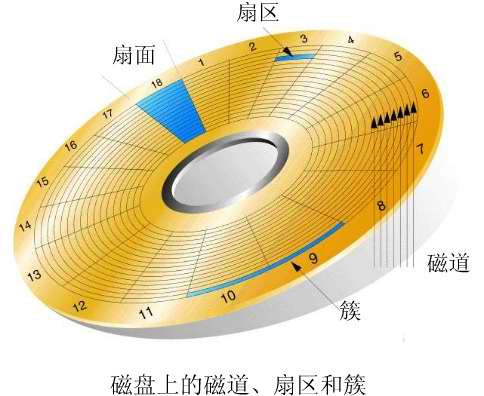

## 4、区位记录磁盘扇区结构

ZBR（Zoned Bit Recording）


## 5、机械硬盘结构


## 6、固态硬盘（SSD）和机械硬盘（HDD）

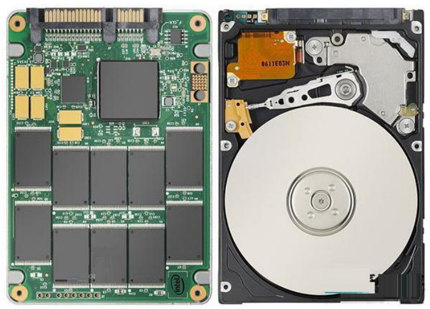

## 7、CHS和LBA

CHS

- 采用24bit位寻址
- 其中前10位表示cylinder，中间8位表示head，后面6位表示sector
- 最大寻址空间8GB

LBA（logical block addressing）

- LBA是一个整数，通过转换成CHS格式完成磁盘具体寻址
- ATA-1规范中定义了28位寻址模式，以每扇区512位组来计算，ATA-1所定义的28位LBA上限达到128 GiB。2002年ATA-6规范采用48位LBA，同样以每扇区512位组计算容量上限可达128 Petabytes

由于CHS寻址方式的寻址空间在大概8GB以内，所以在磁盘容量小于大概8GB时，可以使用CHS寻址方式或是LBA寻址方式；在磁盘容量大于大概8GB时，则只能使用LBA寻址方式

## 8、设备文件

I/O Ports: I/O设备地址

一切皆文件：open(), read(), write(), close()

设备类型：

- 块设备：block，存取单位“块”，随机访问，一般为物理设备，如磁盘
- 字符设备：char，存取单位“字符”，顺序访问，一般为逻辑设备，如/dev/null

设备文件：关联至一个设备驱动程序，进而能够跟与之对应硬件设备进行通信

设备号码：

- 主设备号：major number, 标识设备类型
- 次设备号：minor number, 标识同一类型下的不同设备

磁盘设备的设备文件命名：/dev/DEV_FILE

- SCSI, SATA, SAS, IDE,USB: /dev/sd
- 虚拟磁盘：/dev/vd 、/dev/xvd

不同磁盘标识：a-z,aa,ab…

- /dev/sda, /dev/sdb, ...

同一设备上的不同分区：1,2, ...

- /dev/sda1, /dev/sda5

## 9、磁盘分区

为什么分区

- 优化I/O性能
- 实现磁盘空间配额限制
- 提高修复速度
- 隔离系统和程序
- 安装多个OS
- 采用不同文件系统

两种分区方式：MBR，GPT

### 9.1、MBR分区方案

自1982年以来,主启动记录(MBR)分区方案指定了在运行BI0S固件的系统上应如何对磁盘进行分区。此方案支持最多四个主分区。在
Linux系统上,管理员可以使用扩展分区和逻辑分区来创建最多15个分区。由于分区大小数据以32位值存储,使用MBR方案分区时,最大磁盘和分区大小限制为2TiB

随着硬盘驱动器容量的不断增长,老旧的MBR分区方案的2TiB磁盘和分区大小限制已不再是理论上的限制,而是在生产环境中越来越经常遇到的实际问题。因此,新的GUID分区表(GPT)正在取代传统的MBR方案进行磁盘分区。

如何分区：按柱面

0磁道0扇区：512bytes

- 446bytes: boot loader
- 64bytes：分区表，其中每16bytes标识一个分区
- 2bytes: 55AA

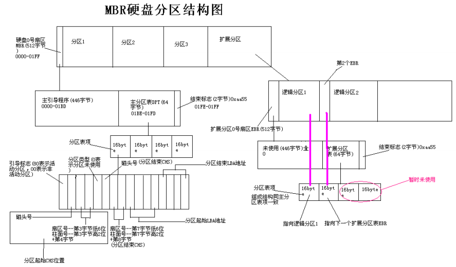

MBR分区中一块硬盘最多有4个主分区，也可以3主分区+1扩展(N个逻辑分区)

硬盘主引导记录MBR由4个部分组成

- 主引导程序（偏移地址0000H--0088H），它负责从活动分区中装载，并运行系统引导程序
- 出错信息数据区，偏移地址0089H--00E1H为出错信息，00E2H--01BDH全为0字节
- 分区表（DPT,Disk Partition Table）含4个分区项，偏移地址01BEH--01FDH,每个分区表项长16个字节，共64字节为分区项1、分区项2、分区项3、分区项4
- 结束标志字，偏移地址01FE--01FF的2个字节值为结束标志55AA

MBR结构

| 0000-0088 | Master Boot Record | 主引导程序 |
| --------- | ------------------ | ---------- |
| 0089-01BD | 出错信息数据区     | 数据区     |
| 00BE-01CD | 分区1（16字节）    | 分区表     |
| 00CE-01DD | 分区2（16字节）    | 分区表     |
| 00DE-01ED | 分区3（16字节）    | 分区表     |
| 00EE-01FD | 分区4（16字节）    | 分区表     |
| 01FE      | 55                 | 结束标志   |
| 01FF      | AA                 | 结束标志   |

MBR中DPT结构

| 存储字节位           | 内容及含义                                                   |
| -------------------- | ------------------------------------------------------------ |
| 第1字节              | 引导标志。若值为80H表示活动分区，若值为00H表示非活动分区。   |
| 第2、3、4字节        | 本分区的起始磁头号、扇区号、柱面号。其中：<br />  磁头号--第2字节；<br />  扇区号--第3字节的低6位；<br />  柱面号--为第3字节高2位+第4字节8位 |
| 第5字节              | 分区类型符：  <br />  00H--表示该分区未用（即没有指定）；<br />  06H--FAT16基本分区；<br />  0BH--FAT32基本分区；<br />  05H--扩展分区；<br />  07H--NTFS分区；<br />  0FH--（LBA模式）扩展分区；<br />  83H为Linux分区等。 |
| 第6、7、8字节        | 本分区的结束磁头号、扇区号、柱面号。其中：<br />  磁头号--第6字节；<br />  扇区号--第7字节的低6位；<br />  柱面号--为第7字节高2位+第8字节8位 |
| 第9、10、11、12字节  | 本分区之前已用了的扇区数。                                   |
| 第13、14、15、16字节 | 本分区的总扇区数。                                           |

### 5.2、GPT分区方案

对于运行统一可扩展固件接口(UEFI)
固件的系统,GPT是在物理硬盘上布置分区表的标准。GPT是UEFI标准的一部分,可以解决原有基于MBR的方案所带来的许多限制。根据UEFI规范,GPT默认情况下支持最多128个分区。MBR使用32位来存储逻辑块地址和大小信息;与此不同,GPT为逻辑块地址分配64位。这就使得GPT可支持最多8泽字节(
ZiB),即80亿太字节的分区和磁盘

除解决MBR分区方案的限制以外，GPT还可提供一些其他功能特性和优势。正如其名，GPT使用128位GUID来唯一识别每个磁盘和分区。与MBR存在单一故障点不同，GPT提供分区表信息的冗余。主GPT位于磁盘头部，而备份副本（次要GPT）位于磁盘尾部。此外，GPT采用CRC校验和来检测GPT头和分区表中的错误与损坏。

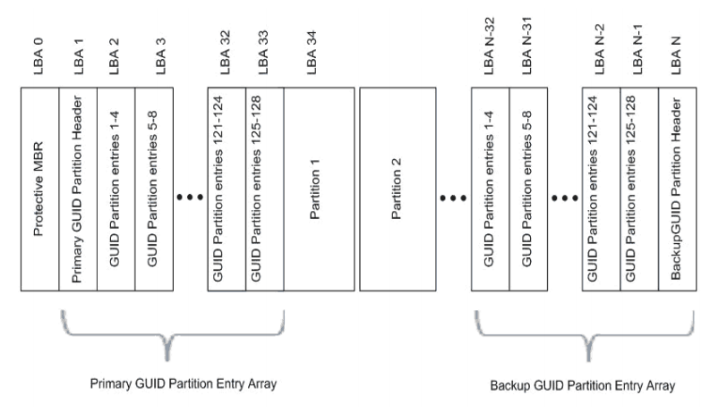

EFI部分又可以分为4个区域：EFI信息区(GPT头)、分区表、GPT分区、备份区域

## 10、BIOS+MBR与UEFI+GPT

传统BIOS运行流程

- 开机 --> BIOS初始化 --> BIOS自检 --> 引导操作系统 --> 进入系统

UEFI运行流程

- 开机 --> UEFI初始化 --> 引导操作系统 --> 进入系统

## 11、管理分区

查看MBR记录

```shell
hexdump -C -n 512 -v /dev/sda
```

列出块设备

- lsblk

创建分区使用：

- fdisk 创建MBR分区
- gdisk 创建GPT分区
- parted 高级分区操作

重新设置内存中的内核分区表版本

- partprobe

### 11.1、parted命令

parted的操作都是实时生效的，小心使用

```shell
用法：parted [选项]... [设备 [命令 [参数]...]...]
  parted /dev/sdb mklabel gpt|msdos
  parted /dev/sdb print
  parted /dev/sdb mkpart primary 1 200 （默认M）
  parted /dev/sdb rm 1
  parted –l 列出分区信息
```

### 11.2、分区工具fdisk和gdisk

```shell
gdisk /dev/sdb 类fdisk 的GPT分区工具
fdisk -l [-u] [device...] 查看分区
fdisk /dev/sdb 管理分区

子命令：
  p 分区列表
  t 更改分区类型
  n 创建新分区
  d 删除分区
  v 校验分区
  u 转换单位
  w 保存并退出
  q 不保存并退出
```

### 11.3、同步分区表

查看内核是否已经识别新的分区

```shell
cat /proc/partations
```

centos6通知内核重新读取硬盘分区表

- 新增分区用

```shell
partx -a /dev/DEVICE
kpartx -a /dev/DEVICE -f: force
```

- 删除分区用

```shell
partx -d --nr M-N /dev/DEVICE
```

CentOS 5，7: 使用partprobe

```shell
partprobe [/dev/DEVICE]
```

# 文件系统

文件系统是操作系统用于明确存储设备或分区上的文件的方法和数据结构；即在存储设备上组织文件的方法。操作系统中负责管理和存储文件信息的软件结构称为文件管理系统，简称文件系统

从系统角度来看，文件系统是对文件存储设备的空间进行组织和分配，负责文件存储并对存入的文件进行保护和检索的系统。具体地说，它负责为用户建立文件，存入、读出、修改、转储文件，控制文件的存取，安全控制，日志，压缩，加密等

- 支持的文件系统：/lib/modules/`uname –r`/kernel/fs

各种文件系统：https://en.wikipedia.org/wiki/Comparison_of_file_systems

## 1、文件系统类型

Linux文件系统：

- ext2(Extended file system) :适用于那些分区容量不是太大，更新也不频繁的情况，例如 /boot 分区
- ext3:是 ext2 的改进版本，其支持日志功能，能够帮助系统从非正常关机导致的异常中恢复。它通常被用作通用的文件系统
- ext4:是 ext 文件系统的最新版。提供了很多新的特性，包括纳秒级时间戳、创建和使用巨型文件(16TB)、最大1EB的文件系统，以及速度的提升
- xfs：SGI，支持最大8EB的文件系统
- btrfs（Oracle）, reiserfs, jfs（AIX）, swap

光盘：iso9660

Windows：FAT32, exFAT,NTFS

Unix: FFS（fast）, UFS（unix）, JFS2

网络文件系统：NFS, CIFS

集群文件系统：GFS2, OCFS2（oracle）  分布式文件系统： fastdfs,ceph, moosefs, mogilefs, glusterfs, Lustre RAW：未经处理或者未经格式化产生的文件系统

## 2、文件系统分类

根据其是否支持"journal"功能：

- 日志型文件系统: ext3, ext4, xfs, ...
- 非日志型文件系统: ext2, vfat

文件系统的组成部分：

- 内核中的模块：ext4, xfs, vfat
- 用户空间的管理工具：mkfs.ext4, mkfs.xfs,mkfs.vfat

Linux的虚拟文件系统：VFS

- 查前支持的文件系统：cat /proc/filesystems

## 3、VFS

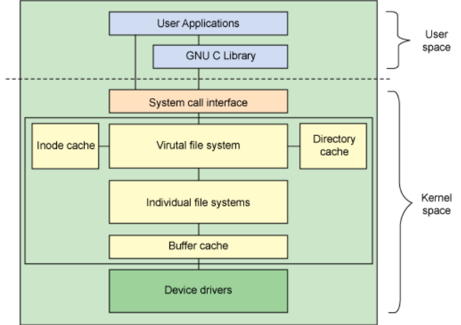

## 4、文件系统选择

| 类型        | 支持限制   | root分区 | boot分区 | 注释             |
| ----------- | ---------- | -------- | -------- | ---------------- |
| 单节点      |            |          |          |                  |
| XFS         | 500TB      | Yes      | Yes      | 默认分区格式     |
| ext4        | 50TB       | Yes      | Yes      | 兼容ext3、ext2   |
| btrfs       | 50TB       | Yes      | Yes      | 技术预览         |
| 网络/多节点 |            |          |          |                  |
| GFS2        | 2-16个节点 | Yes      | No       | 集群文件共享存储 |

## 5、创建文件系统

### 5.1、mkfs命令

```shell
(1) mkfs.FS_TYPE /dev/DEVICE
  ext4
  xfs
  btrfs
  vfat
(2) mkfs -t FS_TYPE /dev/DEVICE
  -L 'LABEL' 设定卷标
```

### 5.2、创建ext文件系统

```shell
mke2fs：ext系列文件系统专用管理工具
  -t {ext2|ext3|ext4} 指定文件系统类型
  -b {1024|2048|4096} 指定块大小
  -L ‘LABEL’ 设置卷标
  -j 相当于 -t ext3
    mkfs.ext3 = mkfs -t ext3 = mke2fs -j = mke2fs -t ext3
  -i # 为数据空间中每多少个字节创建一个inode；不应该小于block大小
  -N # 指定分区中创建多少个inode
  -I 一个inode记录占用的磁盘空间大小，128---4096
  -m # 默认5%,为管理人员预留空间占总空间的百分比
  -O FEATURE[,...] 启用指定特性
  -O ^FEATURE 关闭指定特性
```

### 5.3、文件系统标签

指向设备的另一种方法

与设备无关

```shell
blkid：块设备属性信息查看
  blkid [OPTION]... [DEVICE]
  -U UUID 根据指定的UUID来查找对应的设备
  -L LABEL 根据指定的LABEL来查找对应的设备

e2label：管理ext系列文件系统的LABEL
  e2label DEVICE [LABEL]

findfs ：查找分区
  findfs [options] LABEL=<label>
  findfs [options] UUID=<uuid>
```

### 5.4、tune2fs

```shell
tune2fs：重新设定ext系列文件系统可调整参数的值
  -l 查看指定文件系统超级块信息；super block
  -L 'LABEL’ 修改卷标
  -m # 修预留给管理员的空间百分比
  -j 将ext2升级为ext3
  -O 文件系统属性启用或禁用, –O ^has_journal
  -o 调整文件系统的默认挂载选项，–o ^acl
  -U UUID 修改UUID号
```

### 5.5、dumpe2fs

```shell
dumpe2fs：显示ext文件系统信息，将磁盘块分组管理
  -h：查看超级块信息，不显示分组信息
```

### 5.6、xfs_info

```shell
xfs_info：显示已挂载的 xfs 文件系统信息
  xfs_info mountpoint
```

## 6、超级块和INODE TABLE


## 7、文件系统检测和修复

文件系统夹故障常发生于死机或者非正常关机之后，挂载为文件系统标记为“no clean”

注意：一定不要在挂载状态下执行下面命令修复

```shell
fsck: File System Check
  fsck.FS_TYPE
  fsck -t FS_TYPE 
  注意：FS_TYPE 一定要与分区上已经文件类型相同
  -a 自动修复
  -r 交互式修复错误

e2fsck：ext系列文件专用的检测修复工具
  -y 自动回答为yes
  -f 强制修复
  -p 自动进行安全的修复文件系统问题

xfs_repair：xfs文件系统专用检测修复工具
  -f 修复文件，而设备
  -n 只检查
  -d 允许修复只读的挂载设备，在单用户下修复 / 时使用，然后立即reboot
```

## 8、挂载文件系统

挂载:将额外文件系统与根文件系统某现存的目录建立起关联关系，进而使得此目录做为其它文件访问入口的行为

卸载:为解除此关联关系的过程

把设备关联挂载点：mount Point

- mount

卸载时：可使用设备，也可以使用挂载点

- umount 设备名|挂载点

挂载点下原有文件在挂载完成后会被临时隐藏

挂载点目录一般为空

### 8.1、用mount命令挂载文件系统

挂载方法：mount DEVICE MOUNT_POINT

```shell
mount：通过查看/etc/mtab文件显示当前已挂载的所有设备
mount [-fnrsvw] [-t vfstype] [-o options] device dir
  
  device：指明要挂载的设备；
    (1) 设备文件：例如/dev/sda5
    (2) 卷标：-L 'LABEL', 例如 -L 'MYDATA'
    (3) UUID, -U 'UUID'：例如 -U '0c50523c-43f1-45e7-  85c0-a126711d406e'
    (4) 伪文件系统名称：proc, sysfs, devtmpfs, configfs
  
  dir：挂载点
    事先存在，建议使用空目录
    进程正在使用中的设备无法被卸载
```

### 8.2、mount常用命令选项

```shell
用法：
 mount [-lhV]
 mount -a [选项]
 mount [选项] [--source] <源> | [--target] <目录>
 mount [选项] <源> <目录>
 mount <操作> <挂载点> [<目标>]

选项：
  -t vsftype 指定要挂载的设备上的文件系统类型
  -r readonly，只读挂载
  -w read and write, 读写挂载
  -n 不更新/etc/mtab，mount不可见
  -a 自动挂载所有支持自动挂载的设备(定义在了/etc/fstab文件中，且挂载选项中有auto功能)
  -L 'LABEL' 以卷标指定挂载设备
  -U 'UUID' 以UUID指定要挂载的设备
  -B, --bind 绑定目录到另一个目录上
  -o options：(挂载文件系统的选项)，多个选项使用逗号分隔
    async 异步模式 sync 同步模式,内存更改时，同时写磁盘
    atime/noatime 包含目录和文件
    diratime/nodiratime 目录的访问时间戳
    auto/noauto 是否支持自动挂载,是否支持-a选项
    exec/noexec 是否支持将文件系统上运行应用程序
    dev/nodev 是否支持在此文件系统上使用设备文件
    suid/nosuid 是否支持suid和sgid权限
    remount 重新挂载
    ro 只读 rw 读写
    user/nouser 是否允许普通用户挂载此设备，/etc/fstab使用
    acl 启用此文件系统上的acl功能
    loop 使用loop设备,centos 6中max_loop=100内核参数控制loop设备数量，losetup -a命令可查看loop设备
  defaults：相当于rw, suid, dev, exec, auto, nouser, async
    
  查看内核追踪到的已挂载的所有设备
    cat /proc/mounts
```

### 8.3、卸载文件系统

查看挂载情况

```shell
findmnt MOUNT_POINT|device
```

查看正在访问指定文件系统的进程

```shell
lsof MOUNT_POINT
fuser -v MOUNT_POINT
```

终止所有在正访问指定的文件系统的进程

```shell
fuser -km MOUNT_POINT
```

卸载

```shell
umount DEVICE
umount MOUNT_POINT
```

### 8.4、挂载点和/etc/fstab

配置文件系统体系

被mount、fsck和其它程序使用

系统重启时保留文件系统体系

可以在设备栏使用文件系统卷标

使用mount -a 命令挂载/etc/fstab中的所有文件系统

### 8.5、文件挂载配置文件

/etc/fstab每行定义一个要挂载的文件系统

1、要挂载的设备或伪文件系统

- 设备文件
- LABEL：LABEL=""
- UUID：UUID=""
- 伪文件系统名称：proc, sysfs

2、挂载点

3、文件系统类型：ext4，xfs，iso9660，nfs，none

4、挂载选项：defaults ，acl，bind

5、转储频率：0：不做备份 1：每天转储 2：每隔一天转储

6、fsck检查的文件系统的顺序：允许的数字是0 1 2

- 0：不自检
- 1：首先自检；一般只有rootfs才用
- 2：非rootfs使用

# 交换分区

swap交换分区是系统RAM的补充，Swap 分区支持虚拟内存。当没有足够的RAM 保存系统处理的数据时会将数据写入 swap 分区

当系统缺乏 swap 空间时，内核会因 RAM 内存耗尽而终止进程。配置过多swap 空间会造成存储设备处于分配状态但闲置，造成浪费，过多 swap 空间还会掩盖内存泄露

推荐系统 swap 空间

| 系统中的RAM量 | 推荐的swap空间      | 允许休眠的建议swap空间大小 |
| ------------- | ------------------- | -------------------------- |
| 低于2GB       | RAM量的倍数         | RAM容量的三倍              |
| 2GB-8GB       | 等于RAM量           | RAM量的倍数                |
| 8GB-64GB      | 4GB到RAM容量的0.5倍 | RAM容量的1.5倍             |
| 超过64GB      | 独立负责（至少4GB） | 不建议使用休眠功能         |

## 1、挂载交换分区

基本设置包括：

- 创建交换分区或者文件
- 使用mkswap写入特殊签名
- 在/etc/fstab文件中添加适当的条目
- 使用swapon -a 激活交换空间

```shell
启用：swapon
  swapon [OPTION]... [DEVICE]
    -a：激活所有的交换分区
    -p PRIORITY：指定优先级
    /etc/fstab 在第4列中：pri=value

禁用：swapoff [OPTION]... [DEVICE]
```

## 2、SWAP的优先级

可以指定swap分区0到32767的优先级，值越大优先级越高

如果用户没有指定，那么核心会自动给swap指定一个优先级，这个优先级从-1开始，每加入一个新的没有用户指定优先级的swap，会给这个优先级减一

先添加的swap的缺省优先级比较高，除非用户自己指定一个优先级，而用户指定的优先级(是正数)永远高于核心缺省指定的优先级(是负数)

优化性能：分布存放，高性能磁盘存放

# 移动介质

挂载意味着使外来的文件系统看起来如同是主目录树的一部分

访问前，介质必须被挂载

摘除时，介质必须被卸载

按照默认设置，非根用户只能挂载某些设备（光盘、DVD、软盘、USB等等）

挂载点通常在/media 或/mnt下

# 使用光盘

在图形环境下自动启动挂载/run/media/<user>/<label>

否则就必须被手工挂载

```shell
mount /dev/cdrom /mnt/
```

操作光盘

```shell
eject 弹出光盘
eject -t 弹入光盘
```

创建ISO文件

```shell
cp /dev/cdrom /root/centos.iso
mkisofs -r -o /root/etc.iso /etc
```

刻录光盘

```shell
wodim –v –eject centos.iso
```

# 挂载USB介质

查看USB设备是否识别

- lsusb

被内核探测为SCSI设备

- /dev/sdaX、/dev/sdbX或类似的设备文件

在图形环境中自动挂载

- 图标在[计算机]窗口中创建
- 挂载在/run/media/<user>/<label>

手动挂载

- mount /dev/sdb1 /mnt

# 常见工具

文件系统空间占用等信息的查看工具

```shell
df [OPTION]... [FILE]...
  -H 以10为单位
  -T 文件系统类型
  -h human-readable
  -i inodes instead of blocks
  -P 以Posix兼容的格式输出
```

查看某目录总体空间占用状态

```shell
du [OPTION]... DIR
  -h human-readable
  -s summary 
  --max-depth=# 指定最大目录层级
```

## 1、dd

```shell
dd 命令：convert and copy a file
用法：
  dd if=/PATH/FROM/SRC of=/PATH/TO/DEST bs=# count=#
    if=file 从所命名文件读取而不是从标准输入
    of=file 写到所命名的文件而不是到标准输出
    ibs=size 一次读size个byte
    obs=size 一次写size个byte
    bs=size block size, 指定块大小（既是是ibs也是obs)
    cbs=size 一次转化size个byte
    skip=blocks 从开头忽略blocks个ibs大小的块
    seek=blocks 从开头忽略blocks个obs大小的块
    count=n 复制n个bs
    conv=conversion[,conversion...] 用指定的参数转换文件

转换参数: 
  ascii 转换 EBCDIC 为 ASCII
  ebcdic 转换 ASCII 为 EBCDIC
  lcase 把大写字符转换为小写字符
  ucase 把小写字符转换为大写字符
  nocreat 不创建输出文件
  noerror 出错时不停止
  notrunc 不截短输出文件
  sync 把每个输入块填充到ibs个字节，不足部分用空(NUL)字符补齐
  fdatasync 写完成前，物理写入输出文件
```

## 2、备份MBR

备份MBR

```shell
dd if=/dev/sda of=/tmp/mbr.bak bs=512 count=1
```

破坏MBR中的bootloader

```shell
dd if=/dev/zero of=/dev/sda bs=64 count=1 seek=446
```

有一个大与2K的二进制文件fileA。现在想从第64个字节位置开始读取，需要读取的大小是128Byts。又有fileB, 想把上面读取到的128Bytes写到第32个字节开始的位置，替换128Bytes，实现如下

```shell
dd if=fileA of=fileB bs=1 count=128 skip=63 seek=31 conv=notrunc
```

## 3、备份恢复

备份：

- 将本地的/dev/sdx整盘备份到/dev/sdy

```shell
dd if=/dev/sdx of=/dev/sdy
```

- 将/dev/sdx全盘数据备份到指定路径的image文件

```shell
dd if=/dev/sdx of=/path/to/image
```

- 备份/dev/sdx全盘数据，并利用gzip压缩，保存到指定路径

```shell
dd if=/dev/sdx | gzip >/path/to/image.gz
```

恢复：

- 将备份文件恢复到指定盘

```shell
dd if=/path/to/image of=/dev/sdx
```

- 将压缩的备份文件恢复到指定盘

```shell
gzip -dc /path/to/image.gz | dd of=/dev/sdx
```

## 4、其他

拷贝内存资料到硬盘

- 将内存里的数据拷贝到root目录下的mem.bin文件

```shell
dd if=/dev/mem of=/root/mem.bin bs=1024
```

从光盘拷贝iso镜像

- 拷贝光盘数据到root文件夹下，并保存为cd.iso文件

```shell
dd if=/dev/cdrom of=/root/cd.iso
```

销毁磁盘数据

- 利用随机的数据填充硬盘，在某些必要的场合可以用来销毁数据，执行此操作以后，/dev/sda1将无法挂载，创建和拷贝操作无法执行

```shell
dd if=/dev/urandom of=/dev/sda1
```

# RAID

## 1、什么是RAID

RAID:Redundant Arrays of Inexpensive（Independent） Disks

1988年由加利福尼亚大学伯克利分校（University of CaliforniaBerkeley） “A Case for Redundant Arrays of Inexpensive Disks”

多个磁盘合成一个“阵列”来提供更好的性能、冗余，或者两者都提供

提高IO能力

- 磁盘并行读写

提高耐用性

- 磁盘冗余来实现

级别：多块磁盘组织在一起的工作方式有所不同

RAID实现的方式

- 外接式磁盘阵列：通过扩展卡提供适配能力
- 内接式RAID：主板集成RAID控制器，安装OS前在BIOS里配置
- 软件RAID：通过OS实现

## 2、RAID级别

```shell
RAID-0：条带卷，strip
RAID-1：镜像卷，mirror
RAID-2
..
RAID-5
RAID-6
RAID-10
RAID-01
```

### 2.1、RAID-0

- 读、写性能提升
- 可用空间：N*min(S1,S2,...)
- 无容错能力
- 最少磁盘数：2, 2+


### 2.2、RAID-1

- 读性能提升、写性能略有下降
- 可用空间：1*min(S1,S2,...)
- 有冗余能力
- 最少磁盘数：2, 2N

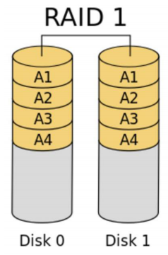

### 2.3、RAID-4

- 多块数据盘异或运算值存于专用校验盘

### 2.4、RAID-5

- 读、写性能提升
- 可用空间：(N-1)*min(S1,S2,...)
- 有容错能力：允许最多1块磁盘损坏
- 最少磁盘数：3, 3+

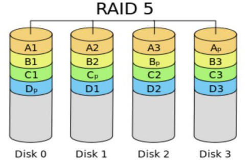

### 2.5、RAID-6

- 读、写性能提升
- 可用空间：(N-2)*min(S1,S2,...)
- 有容错能力：允许最多2块磁盘损坏
- 最少磁盘数：4, 4+

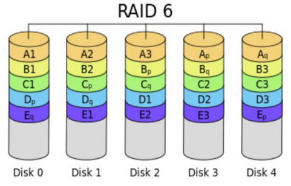

### 2.6、RAID-10

- 读、写性能提升
- 可用空间：N*min(S1,S2,...)/2
- 有容错能力：每组镜像最多只能坏一块
- 最少磁盘数：4, 4+

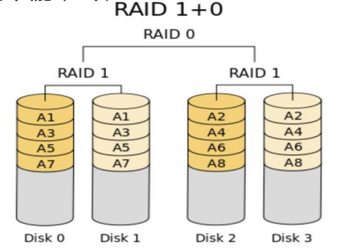

### 2.7、RAID-01

- 多块磁盘先实现RAID0,再组合成RAID1


### 2.8、RAID-50

- 多块磁盘先实现RAID5,再组合成RAID0

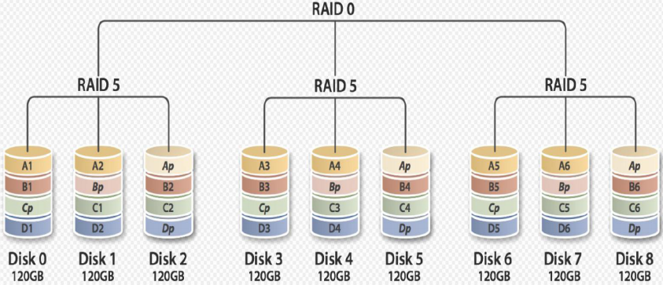

### 2.9、RAID7

- 可以理解为一个独立存储计算机，自身带有操作系统和管理工具，可以独立运行，理论上性能最高的RAID模式

### 2.10、JBOD：Just a Bunch Of Disks

- 功能：将多块磁盘的空间合并一个大的连续空间使用
- 可用空间：sum(S1,S2,...)


常用级别：

- RAID-0, RAID-1, RAID-5, RAID-10, RAID-50, JBOD

## 3、软RAID

mdadm：为软RAID提供管理界面

为空余磁盘添加冗余

结合内核中的md(multi devices)

RAID设备可命名为/dev/md0、/dev/md1、/dev/md2、/dev/md3等

### 3.1、软件RAID的实现

```shell
mdadm：模式化的工具
命令的语法格式：mdadm [mode] <raiddevice> [options] <component devices>
支持的RAID级别：LINEAR, RAID0, RAID1, RAID4, RAID5, RAID6, RAID10 

模式：
  创建：-C
  装配：-A
  监控：-F
  管理：-f, -r, -a
<raiddevice>: /dev/md#
<component-devices>: 任意块设备

-C: 创建模式
  -n #: 使用#个块设备来创建此RAID
  -l #：指明要创建的RAID的级别
  -a {yes|no}：自动创建目标RAID设备的设备文件
  -c CHUNK_SIZE: 指明块大小,单位k 
  -x #: 指明空闲盘的个数

-D：显示raid的详细信息
  mdadm -D /dev/md#

管理模式：
  -f: 标记指定磁盘为损坏
  -a: 添加磁盘
  -r: 移除磁盘

观察md的状态： cat /proc/mdstat
```

### 3.2、软RAID配置示例

```shell
使用mdadm创建并定义RAID设备
  mdadm -C /dev/md0 -a yes -l 5 -n 3 -x 1 /dev/sd{b,c,d,e}1

用文件系统对每个RAID设备进行格式化
  mkfs.xfs /dev/md0

测试RAID设备

使用mdadm检查RAID设备的状况
  mdadm --detail|D /dev/md0

增加新的成员
  mdadm –G /dev/md0 –n4 -a /dev/sdf1
```

### 3.3、软RAID测试和修复

```shell
模拟磁盘故障
  mdadm /dev/md0 -f /dev/sda1

移除磁盘
  mdadm /dev/md0 –r /dev/sda1

从软件RAID磁盘修复磁盘故障
 • 替换出故障的磁盘然后开机
 • 在备用驱动器上重建分区
 • mdadm /dev/md0 -a /dev/sda1

mdadm、/proc/mdstat及系统日志信息
```

### 3.4、软RAID管理

```shell
生成配置文件：mdadm –D –s >> /etc/mdadm.conf
停止设备：mdadm –S /dev/md0
激活设备：mdadm –A –s /dev/md0 激活
强制启动：mdadm –R /dev/md0
删除raid信息：mdadm --zero-superblock /dev/sdb1
```

# 逻辑卷管理器（LVM）

允许对卷进行方便操作的抽象层，包括重新设定文件系统的大小

允许在多个物理设备间重新组织文件系统

- 将设备指定为物理卷
- 用一个或者多个物理卷来创建一个卷组
- 物理卷是用固定大小的物理区域（Physical Extent，PE）来定义的
- 在物理卷上创建的逻辑卷是由物理区域（PE）组成
- 可以在逻辑卷上创建文件系统

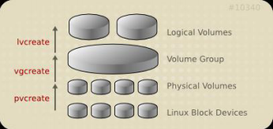

## 1、LVM介绍

LVM: Logical Volume Manager， Version 2

dm: device mapper，将一个或多个底层块设备组织成一个逻辑设备的模块

设备名：/dev/dm-#

软链接：

- /dev/mapper/VG_NAME-LV_NAME
    - /dev/mapper/vol0-root
- /dev/VG_NAME/LV_NAME
    - /dev/vol0/root

## 2、LVM更改文件系统的容量

LVM可以弹性的更改LVM的容量

- 通过交换PE来进行资料的转换，将原来LV内的PE转移到其他的设备中以降低LV的容量，或将其他设备中的PE加到LV中以加大容量

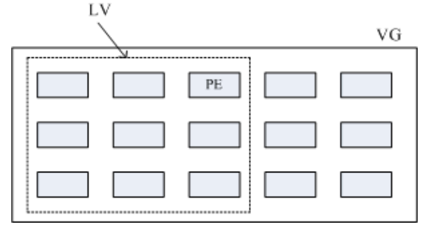

## 3、pv管理工具

显示pv信息

```shell
pvs：简要pv信息显示
pvdisplay
```

创建pv

```shell
pvcreate /dev/DEVICE
```

删除pv

```shell
pvremove /dev/DEVICE
```

## 4、vg管理工具

显示卷组

```shell
vgs
vgdisplay
```

创建卷组

```shell
vgcreate [-s #[kKmMgGtTpPeE]] VolumeGroupName PhysicalDevicePath [PhysicalDevicePath...]
```

管理卷组

```shell
vgextend VolumeGroupName PhysicalDevicePath [PhysicalDevicePath...]
vgreduce VolumeGroupName PhysicalDevicePath [PhysicalDevicePath...]
```

删除卷组

```shell
先做pvmove，再做vgremove
```

## 5、lv管理工具

显示逻辑卷

```shell
lvs
Lvdisplay
```

创建逻辑卷

```shell
lvcreate -L #[mMgGtT] -n NAME VolumeGroup
lvcreate -l 60%VG -n mylv testvg
lvcreate -l 100%FREE -n yourlv testvg
```

删除逻辑卷

```shell
lvremove /dev/VG_NAME/LV_NAME
```

重设文件系统大小

```shell
fsadm [options] resize device [new_size[BKMGTEP]]
resize2fs [-f] [-F] [-M] [-P] [-p] device [new_size]
xfs_growfs /mountpoint
```

## 6、扩展和缩减逻辑卷

扩展逻辑卷：

```shell
lvextend -L [+]#[mMgGtT] /dev/VG_NAME/LV_NAME
resize2fs /dev/VG_NAME/LV_NAME
lvresize -r -l +100%FREE /dev/VG_NAME/LV_NAME
```

缩减逻辑卷：

```shell
umount /dev/VG_NAME/LV_NAME
e2fsck -f /dev/VG_NAME/LV_NAME
resize2fs /dev/VG_NAME/LV_NAME #[mMgGtT]
lvreduce -L [-]#[mMgGtT] /dev/VG_NAME/LV_NAME
mount
```

## 7、创建逻辑卷示例

创建物理卷

```shell
pvcreate /dev/sda3
```

为卷组分配物理卷

```shell
vgcreate vg0 /dev/sda3
```

从卷组创建逻辑卷

```shell
lvcreate -L 256M -n data vg0
mkfs.xfs /dev/vg0/data
```

挂载

```shell
mount /dev/vg0/data /mnt/data
```

## 8、跨主机迁移卷组

源计算机上

```shell
1 在旧系统中，umount所有卷组上的逻辑卷
2 禁用卷组
  vgchange –a n vg0 
  lvdisplay
3 导出卷组
  vgexport vg0 
  pvscan
  vgdisplay
  拆下旧硬盘
```

在目标计算机上

```shell
4 在新系统中安装旧硬盘，并导入卷组：vgimport vg0 
5 vgchange –ay vg0 启用
6 mount所有卷组上的逻辑卷
```

## 9、逻辑卷管理器快照

快照是特殊的逻辑卷，它是在生成快照时存在的逻辑卷的准确拷贝

对于需要备份或者复制的现有数据临时拷贝以及其它操作来说，快照是最合适的选择

快照只有在它们和原来的逻辑卷不同时才会消耗空间

- 在生成快照时会分配给它一定的空间，但只有在原来的逻辑卷或者快照有所改变才会使用这些空间
- 当原来的逻辑卷中有所改变时，会将旧的数据复制到快照中
- 快照中只含有原来的逻辑卷中更改的数据或者自生成快照后的快照中更改的数据
- 建立快照的卷大小小于等于原始逻辑卷,也可以使用lvextend扩展快照

快照就是将当时的系统信息记录下来，就好像照相一般，若将来有任何数据改动了，则原始数据会被移动到快照区，没有改动的区域则由快照区和文件系统共享


由于快照区与原本的LV共用很多PE的区块，因此快照与被快照的LV必须在同一个VG中.系统恢复的时候的文件数量不能高于快照区的实际容量

### 9.1、使用LVM快照

为现有逻辑卷创建快照

```shell
lvcreate -l 64 -s -n data-snapshot -p r /dev/vg0/data
```

挂载快照

```shell
mkdir -p /mnt/snap
mount -o nouuid,ro /dev/vg0/data-snapshot /mnt/snap
```

恢复快照

```shell
umount /dev/vg0/data-snapshot
umount /dev/vg0/data
lvconvert --merge /dev/vg0/data-snapshot 
```

删除快照

```shell
umount /mnt/databackup
lvremove /dev/vg0/databackup
```