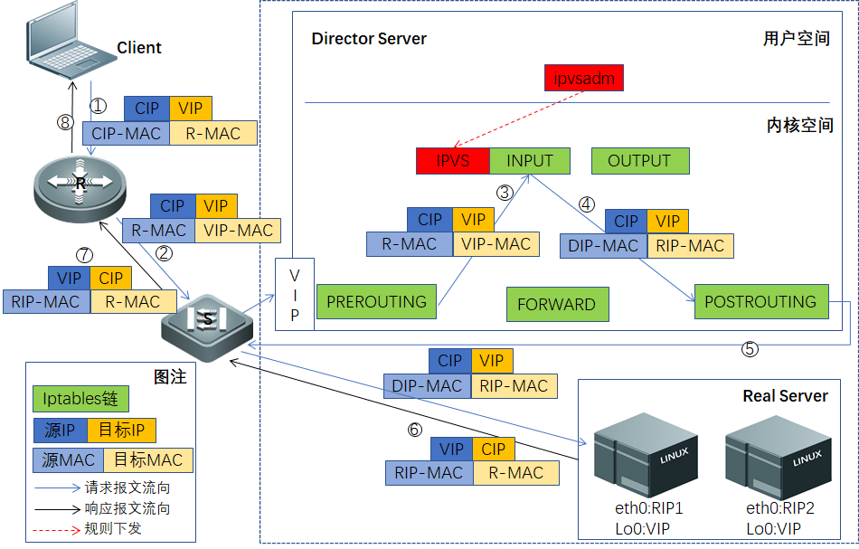
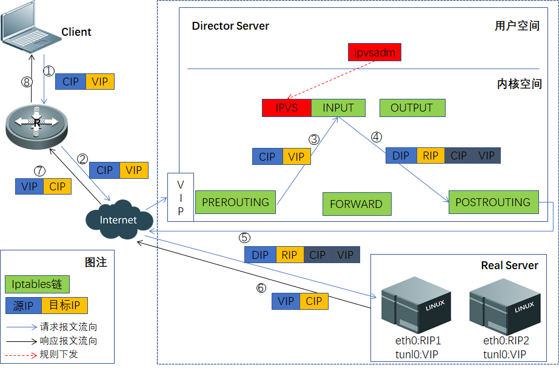
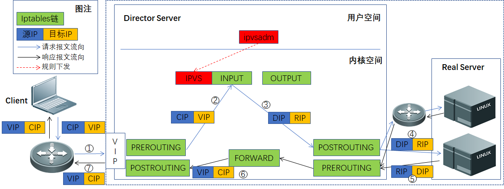

## 1、系统性能扩展

系统性能扩展方式：

- Scale UP：垂直扩展，向上扩展,增强，性能更强的计算机运行同样的服务
- Scale Out：水平扩展，向外扩展,增加设备，并行地运行多个服务调度分配问题，Cluster

垂直扩展不再提及：

- 随着计算机性能的增长，其价格会成倍增长
- 单台计算机的性能是有上限的，不可能无限制地垂直扩展
- 多核CPU意味着即使是单台计算机也可以并行的。那么，为什么不一开始就并行化技术？

## 2、Cluster概念

Cluster：集群,为解决某个特定问题将多台计算机组合起来形成的单个系统

Linux Cluster类型：

- LB：Load Balancing，负载均衡
- HA：High Availiablity，高可用，SPOF（single Point Of failure）
    - MTBF:Mean Time Between Failure 平均无故障时间
    - MTTR:Mean Time To Restoration（ repair）平均恢复前时间
    - A=MTBF/（MTBF+MTTR） (0,1)：99%, 99.5%, 99.9%, 99.99%, 99.999%
- HPC：High-performance computing，高性能 www.top500.org

分布式系统：

- 分布式存储： Ceph，GlusterFS，FastDFS，MogileFS

- 分布式计算：hadoop，Spark

### 2.1、集群和分布式

集群：同一个业务系统，部署在多台服务器上。集群中，每一台服务器实现的功能没有差别，数据和代码都是一样的

分布式：一个业务被拆成多个子业务，或者本身就是不同的业务，部署在多台服务器上。分布式中，每一台服务器实现的功能是有差别的，数据和代码也是不一样的，分布式每台服务器功能加起来，才是完整的业务

分布式是以缩短单个任务的执行时间来提升效率的，而集群则是通过提高单位时间内执行的任务数来提升效率。

对于大型网站，访问用户很多，实现一个群集，在前面部署一个负载均衡服务器，后面几台服务器完成同一业务。如果有用户进行相应业务访问时，负载均衡器根据后端哪台服务器的负载情况，决定由给哪一台去完成响应，并且一台服务器垮了，其它的服务器可以顶上来。分布式的每一个节点，都完成不同的业务，如果一个节点垮了，那这个业务可能就会失败


### 2.2、集群设计原则

可扩展性—集群的横向扩展能力

可用性—无故障时间(SLA)

性能—访问响应时间

容量—单位时间内的最大并发吞吐量(C10K 并发问题)

基础设施层面：

- 提升硬件资源性能—从入口防火墙到后端web server均使用更高性能的硬件资源
- 多域名—DNS 轮询A记录解析
- 多入口—将A记录解析到多个公网IP入口
- 多机房—同城+异地容灾
- CDN(Content Delivery Network)—基于GSLB(Global Server Load Balance)实现全局负载均衡，如DNS

业务层面：

- 分层：安全层、负载层、静态层、动态层、(缓存层、存储层)持久化与非持久化
- 分割：基于功能分割大业务为小服务
- 分布式：对于特殊场景的业务，使用分布式计算

### 2.3、分布式

分布式应用-服务按照功能拆分，使用微服务

分布式静态资源--静态资源放在不同的存储集群上

分布式数据和存储--使用key-value缓存系统

分布式计算--对特殊业务使用分布式计算，比如Hadoop集群

### 2.4、Cluster分类

LB Cluster的实现

- 硬件
    - F5 Big-IP
    - Citrix Netscaler
    - A10 A10

- 软件
    - lvs：Linux Virtual Server，阿里四层SLB (Server Load Balance)使用
    - nginx：支持七层调度，阿里七层SLB使用Tengine
    - haproxy：支持七层调度
    - ats：Apache Traffic Server，yahoo捐助给apache
    - perlbal：Perl 编写
    - pound

基于工作的协议层次划分：

- 传输层（通用）：DPORT
    - LVS：
    - nginx：stream
    - haproxy：mode tcp

- 应用层（专用）：针对特定协议，自定义的请求模型分类
    - proxy server：
    - http：nginx, httpd, haproxy(mode http), ...
    - fastcgi：nginx, httpd, ...
    - mysql：mysql-proxy, ...

会话保持：负载均衡

- (1) session sticky：同一用户调度固定服务器
    - Source IP：LVS sh算法（对某一特定服务而言）
    - Cookie
- (2) session replication：每台服务器拥有全部session
    - session multicast cluster
- (3) session server：专门的session服务器
    - Memcached，Redis

### 2.5、HA集群实现方案

keepalived：vrrp协议

Ais：应用接口规范

- heartbeat
- cman+rgmanager(RHCS)
- coresync_pacemaker

## 3、LVS

### 3.1、LVS介绍

LVS：Linux Virtual Server，负载调度器，内核集成，章文嵩（花名 正明）

- 官网：http://www.linuxvirtualserver.org/
- VS: Virtual Server，负责调度
- RS: Real Server，负责真正提供服务
- L4：四层路由器或交换机
- 阿里的四层LSB(Server Load Balance)是基于LVS+keepalived实现

工作原理：

- VS根据请求报文的目标IP和目标协议及端口将其调度转发至某RS，根据调度算法来挑选RS

### 3.2、netfilter

iptables/netfilter：

- iptables：用户空间的管理工具
- netfilter：内核空间上的框架
- 流入：PREROUTING --> INPUT
- 流出：OUTPUT --> POSTROUTING
- 转发：PREROUTING --> FORWARD --> POSTROUTING
- DNAT：目标地址转换； PREROUTING

内核支持

```
[root@ali ~]# grep -i -A 10 "IPVS" /boot/config-4.18.0-147.5.1.el8_1.x86_64 
CONFIG_NETFILTER_XT_MATCH_IPVS=m
--
# IPVS transport protocol load balancing support
#
CONFIG_IP_VS_PROTO_TCP=y
CONFIG_IP_VS_PROTO_UDP=y
CONFIG_IP_VS_PROTO_AH_ESP=y
CONFIG_IP_VS_PROTO_ESP=y
CONFIG_IP_VS_PROTO_AH=y
CONFIG_IP_VS_PROTO_SCTP=y

#
# IPVS scheduler
#
CONFIG_IP_VS_RR=m
CONFIG_IP_VS_WRR=m
CONFIG_IP_VS_LC=m
CONFIG_IP_VS_WLC=m
CONFIG_IP_VS_FO=m
CONFIG_IP_VS_OVF=m
CONFIG_IP_VS_LBLC=m
CONFIG_IP_VS_LBLCR=m
CONFIG_IP_VS_DH=m
...
```

### 3.3、LVS概念

lvs集群类型中的术语：

- VS：Virtual Server，Director Server(DS)
    - Dispatcher(调度器)，Load Balancer
- RS：Real Server(lvs), upstream server(nginx)
    - backend server(haproxy)
- CIP：Client IP
- VIP: Virtual serve IP VS外网的IP
- DIP: Director IP VS内网的IP
- RIP: Real server IP
- 访问流程：CIP <--> VIP == DIP <--> RIP


### 3.4、lvs集群的类型

lvs: ipvsadm/ipvs

- ipvsadm：用户空间的命令行工具，规则管理器
    - 用于管理集群服务及RealServer
- ipvs：工作于内核空间netfilter的INPUT钩子上的框架

lvs集群的类型：

- lvs-nat：修改请求报文的目标IP,多目标IP的DNAT
- lvs-dr：操纵封装新的MAC地址
- lvs-tun：在原请求IP报文之外新加一个IP首部
- lvs-fullnat：修改请求报文的源和目标IP

#### 3.4.1、lvs-nat模式

本质是多目标IP的DNAT，通过将请求报文中的目标地址和目标端口修改为某挑出的RS的RIP和PORT实现转发

- （1）RIP和DIP应在同一个IP网络，且应使用私网地址；RS的网关要指向DIP
- （2）请求报文和响应报文都必须经由Director转发，Director易于成为系统瓶颈
- （3）支持端口映射，可修改请求报文的目标PORT
- （4）VS必须是Linux系统，RS可以是任意OS系统


#### 3.4.2、LVS-DR模式

LVS-DR：Direct
Routing，直接路由，LVS默认模式,应用最广泛,通过为请求报文重新封装一个MAC首部进行转发，源MAC是DIP所在的接口的MAC，目标MAC是某挑选出的RS的RIP所在接口的MAC地址；源IP/PORT，以及目标IP/PORT均保持不变

- （1） Director和各RS都配置有VIP
- （2） 确保前端路由器将目标IP为VIP的请求报文发往Director
    - 在前端网关做静态绑定VIP和Director的MAC地址
    - 在RS上使用arptables工具
        - arptables -A IN -d $VIP -j DROP
        - arptables -A OUT -s $VIP -j mangle --mangle-ip-s $RIP
    - 在RS上修改内核参数以限制arp通告及应答级别
        - /proc/sys/net/ipv4/conf/all/arp_ignore
        - /proc/sys/net/ipv4/conf/all/arp_announce

- （3）RS的RIP可以使用私网地址，也可以是公网地址；RIP与DIP在同一IP网络；RIP的网关不能指向DIP，以确保响应报文不会经由Director
- （4）RS和Director要在同一个物理网络
- （5）请求报文要经由Director，但响应报文不经由Director，而由RS直接发往Client
- （6）不支持端口映射（端口不能修败）
- （7）RS可使用大多数OS系统



#### 3.4.3、lvs-tun模式

转发方式：不修改请求报文的IP首部（源IP为CIP，目标IP为VIP），而在原IP报文之外再封装一个IP首部（源IP是DIP，目标IP是RIP），将报文发往挑选出的目标RS；RS直接响应给客户端（源IP是VIP，目标IP是CIP）

- (1) DIP, VIP, RIP都应该是公网地址
- (2) RS的网关一般不能指向DIP
- (3) 请求报文要经由Director，但响应不经由Director
- (4) 不支持端口映射
- (5) RS的OS须支持隧道功能



#### 3.4.4、lvs-fullnat模式

lvs-fullnat：通过同时修改请求报文的源IP地址和目标IP地址进行转发

CIP --> DIP

VIP --> RIP

- (1) VIP是公网地址，RIP和DIP是私网地址，且通常不在同一IP网络；因此，RIP的网关一般不会指向DIP
- (2) RS收到的请求报文源地址是DIP，因此，只需响应给DIP；但Director还要将其发往Client
- (3) 请求和响应报文都经由Director
- (4) 支持端口映射
- 注意：此类型kernel默认不支持



#### 3.4.5、LVS工作模式总结

|                | VS/NAT        | VS/TUN     | VS/DR          |
| -------------- | ------------- | ---------- | -------------- |
| server         | any           | Tunneling  | Non-arp device |
| server network | private       | LAN/WAN    | LAN            |
| server number  | low(10~20)    | High(100)  | High(100)      |
| server gateway | load balancer | own router | own router     |

lvs-nat与lvs-fullnat：请求和响应报文都经由Director

- lvs-nat：RIP的网关要指向DIP
- lvs-fullnat：RIP和DIP未必在同一IP网络，但要能通信

lvs-dr与lvs-tun：请求报文要经由Director，但响应报文由RS直接发往Client

- lvs-dr：通过封装新的MAC首部实现，通过MAC网络转发
- lvs-tun：通过在原IP报文外封装新IP头实现转发，支持远距离通信

### 3.5、ipvs scheduler

ipvs scheduler：根据其调度时是否考虑各RS当前的负载状态

- 两种：静态方法和动态方法

静态方法：仅根据算法本身进行调度

- 1、RR：roundrobin，轮询
- 2、WRR：Weighted RR，加权轮询
- 3、SH：Source Hashing，实现session sticky，源IP地址hash；将来自于同一个IP地址的请求始终发往第一次挑中的RS，从而实现会话绑定
- 4、DH：Destination Hashing；目标地址哈希，第一次轮询调度至RS，后续将发往同一个目标地址的请求始终转发至第一次挑中的RS，典型使用场景是正向代理缓存场景中的负载均衡，如：宽带运营商

动态方法：主要根据每RS当前的负载状态及调度算法进行调度Overhead=value 较小的RS将被调度

- 1、LC：least connections 适用于长连接应用
    - Overhead=activeconns*256+inactiveconns
- 2、WLC：Weighted LC，**默认调度方法**
    - Overhead=(activeconns*256+inactiveconns)/weight
- 3、SED：Shortest Expection Delay,初始连接高权重优先
    - Overhead=(activeconns+1)*256/weight
- 4、NQ：Never Queue，第一轮均匀分配，后续SED
- 5、LBLC：Locality-Based LC，动态的DH算法，使用场景：根据负载状态实现正向代理
- 6、LBLCR：LBLC with Replication，带复制功能的LBLC，解决LBLC负载不均衡问题，从负载重的复制到负载轻的RS

### 3.6、ipvsadm/ipvs

ipvs：

- grep -i -A 10 "ipvs" /boot/config-VERSION-RELEASE.x86_64
- 支持的协议：TCP， UDP， AH， ESP， AH_ESP, SCTP

ipvs集群：

- 管理集群服务
- 管理服务上的RS

ipvsadm：

- 程序包：ipvsadm

- Unit File: ipvsadm.service
- 主程序：/usr/sbin/ipvsadm
- 规则保存工具：/usr/sbin/ipvsadm-save
- 规则重载工具：/usr/sbin/ipvsadm-restore
- 配置文件：/etc/sysconfig/ipvsadm-config

#### 3.6.1、ipvsadm命令

核心功能：

- 集群服务管理：增、删、改
- 集群服务的RS管理：增、删、改
- 查看

```
ipvsadm -A|E -t|u|f service-address [-s scheduler] [-p [timeout]] [-M netmask] [--pe persistence_engine] [-b sched-flags]
ipvsadm -D -t|u|f service-address 删除
ipvsadm –C 清空
ipvsadm –R 重载
ipvsadm -S [-n] 保存
ipvsadm -a|e -t|u|f service-address -r server-address [options]
ipvsadm -d -t|u|f service-address -r server-address
ipvsadm -L|l [options]
ipvsadm -Z [-t|u|f service-address]
```

**管理集群服务：增、改、删**

- 增、改：

```
ipvsadm -A|E -t|u|f service-address [-s scheduler] [-p [timeout]]
```

- 删除：

```
ipvsadm -D -t|u|f service-address
```

- service-address：
    - -t|u|f：
        - -t: TCP协议的端口，VIP:TCP_PORT
        - -u: UDP协议的端口，VIP:UDP_PORT
        - -f：firewall MARK，标记，一个数字

- [-s scheduler]：指定集群的调度算法，默认为wlc

**管理集群上的**RS：增、改、删

- 增、改：ipvsadm -a|e -t|u|f service-address -r server-address [-g|i|m] [-w weight]
- 删：ipvsadm -d -t|u|f service-address -r server-address
- server-address：
    - rip[:port] 如省略port，不作端口映射
- 选项：
    - lvs类型：
        - -g: gateway, dr类型，默认
        - -i: ipip, tun类型
        - -m: masquerade, nat类型
    - -w weight：权重

**清空定义的所有内容**：ipvsadm –C

清空计数器：ipvsadm -Z [-t|u|f service-address]

查看：ipvsadm -L|l [options]

- --numeric, -n：以数字形式输出地址和端口号
- --exact：扩展信息，精确值
- --connection，-c：当前IPVS连接输出
- --stats：统计信息
- --rate ：输出速率信息

ipvs规则：/proc/net/ip_vs

ipvs连接：/proc/net/ip_vs_conn

#### 3.6.2、保存及重载规则

保存：建议保存至/etc/sysconfig/ipvsadm

- ipvsadm-save > /PATH/TO/IPVSADM_FILE
- ipvsadm -S > /PATH/TO/IPVSADM_FILE
- systemctl stop ipvsadm.service

重载：

- ipvsadm-restore < /PATH/FROM/IPVSADM_FILE
- systemctl restart ipvsadm.service

### 3.7、LVS注意事项

负载均衡集群设计时要注意的问题

- (1) 是否需要会话保持

- (2) 是否需要共享存储

    - 共享存储：NAS， SAN， DS（分布式存储）

    - 数据同步：

#### 3.7.1、lvs-nat：

- 设计要点：
- (1) RIP与DIP在同一IP网络, RIP的网关要指向DIP
- (2) 支持端口映射
- (3) Director要打开核心转发功能

#### 3.7.2、LVS-DR

DR模型中各主机上均需要配置VIP，解决地址冲突的方式有三种：

- (1) 在前端网关做静态绑定
- (2) 在各RS使用arptables
- (3) 在各RS修改内核参数，来限制arp响应和通告的级别

限制响应级别：arp_ignore

- 0：默认值，表示可使用本地任意接口上配置的任意地址进行响应
- 1: 仅在请求的目标IP配置在本地主机的接收到请求报文的接口上时，才给予响应

限制通告级别：arp_announce

- 0：默认值，把本机所有接口的所有信息向每个接口的网络进行通告
- 1：尽量避免将接口信息向非直接连接网络进行通告
- 2：必须避免将接口信息向非本网络进行通告

RS的配置脚本

```
#!/bin/bash
vip=10.0.0.100
mask='255.255.255.255‘
dev=lo:1
case $1 in
start)
  echo 1 > /proc/sys/net/ipv4/conf/all/arp_ignore
  echo 1 > /proc/sys/net/ipv4/conf/lo/arp_ignore
  echo 2 > /proc/sys/net/ipv4/conf/all/arp_announce
  echo 2 > /proc/sys/net/ipv4/conf/lo/arp_announce
  ifconfig $dev $vip netmask $mask #broadcast $vip up
  #route add -host $vip dev $dev
;;
stop)
  ifconfig $dev down
  echo 0 > /proc/sys/net/ipv4/conf/all/arp_ignore
  echo 0 > /proc/sys/net/ipv4/conf/lo/arp_ignore
  echo 0 > /proc/sys/net/ipv4/conf/all/arp_announce
  echo 0 > /proc/sys/net/ipv4/conf/lo/arp_announce
  ;;
*)
  echo "Usage: $(basename $0) start|stop"
  exit 1
;;
esac
```

VS的配置脚本

```
#!/bin/bash
vip='10.0.0.100'
iface=‘lo:1'
mask='255.255.255.255'
port='80'
rs1='192.168.0.101'
rs2='192.168.0.102'
scheduler='wrr'
type='-g'
case $1 in
start)
  ifconfig $iface $vip netmask $mask #broadcast $vip up
  iptables -F
  ipvsadm -A -t ${vip}:${port} -s $scheduler
  ipvsadm -a -t ${vip}:${port} -r ${rs1} $type -w 1
  ipvsadm -a -t ${vip}:${port} -r ${rs2} $type -w 1
  ;;
stop)
  ipvsadm -C
  ifconfig $iface down
  ;;
*)
  echo "Usage $(basename $0) start|stop“
  exit 1
esac
```

### 3.8、FireWall Mark

FWM：FireWall Mark

MARK target 可用于给特定的报文打标记

- --set-mark value
- 其中：value 可为0xffff格式，表示十六进制数字

借助于防火墙标记来分类报文，而后基于标记定义集群服务；可将多个不同的应用使用同一个集群服务进行调度

实现方法：

- 在Director主机打标记：

  ```
  iptables -t mangle -A PREROUTING -d $vip -p $proto –m multiport --dports $port1,$port2,… -j MARK --set-mark NUMBER
  ```

- 在Director主机基于标记定义集群服务：

  ```
  ipvsadm -A -f NUMBER [options]
  ```

### 3.9、持久连接

session 绑定：对共享同一组RS的多个集群服务，需要统一进行绑定，lvs sh算法无法实现

持久连接（ lvs persistence ）模板：实现无论使用任何调度算法，在一段时间内（默认360s ），能够实现将来自同一个地址的请求始终发往同一个RS

```
ipvsadm -A|E -t|u|f service-address [-s scheduler] [-p [timeout]]
```

持久连接实现方式：

- 每端口持久（PPC）：每个端口定义为一个集群服务，每集群服务单独调度
- 每防火墙标记持久（PFWMC）：基于防火墙标记定义集群服务；可实现将多个端口上的应用统一调度，即所谓的port Affinity
- 每客户端持久（PCC）：基于0端口（表示所有服务）定义集群服务，即将客户端对所有应用的请求都调度至后端主机，必须定义为持久模式

### 3.10、LVS高可用性

Director不可用，整个系统将不可用；SPoF Single Point of Failure

- 解决方案：高可用
    - keepalived heartbeat/corosync

某RS不可用时，Director依然会调度请求至此RS

- 解决方案： 由Director对各RS健康状态进行检查，失败时禁用，成功时启用
    - keepalived heartbeat/corosync ldirectord
- 检测方式：
    - (a) 网络层检测，icmp
    - (b) 传输层检测，端口探测
    - (c) 应用层检测，请求某关键资源
    - RS全不用时：backup server, sorry server

#### 3.10.1、ldirectord

ldirectord：监控和控制LVS守护进程，可管理LVS规则

包名：ldirectord-3.9.6-0rc1.1.1.x86_64.rpm

下载：http://download.opensuse.org/repositories/network:/ha-clustering:/Stable/CentOS_CentOS-7/x86_64/

文件：

- /etc/ha.d/ldirectord.cf 主配置文件
- /usr/share/doc/ldirectord-3.9.6/ldirectord.cf 配置模版
- /usr/lib/systemd/system/ldirectord.service 服务
- /usr/sbin/ldirectord 主程序,Perl实现
- /var/log/ldirectord.log 日志
- /var/run/ldirectord.ldirectord.pid pid文件

Ldirectord配置文件示例

```
checktimeout=3
checkinterval=1
autoreload=yes
logfile=“/var/log/ldirectord.log“ #日志文件
quiescent=no #down时yes权重为0，no为删除
virtual=5 #指定VS的FWM 或 IP:PORT
  real=172.16.0.7:80 gate 2 #DR模型，权重为 2
  real=172.16.0.8:80 gate 1
  fallback=127.0.0.1:80 gate #sorry server
  service=http
  scheduler=wrr
checktype=negotiate
checkport=80
request="index.html"
receive=“Test Ldirectord"
```

