```
1、请解释一下什么是Nginx?
2、请列举Nginx的一些特性?
3、请列举Nginx和Apache 之间的不同点?
4、请解释Nginx如何处理HTTP请求。
5、在Nginx中，如何使用未定义的服务器名称来阻止处理请求?
6、使用“反向代理服务器”的优点是什么?
7、请列举Nginx服务器的最佳用途。
8、请解释Nginx服务器上的Master和Worker进程分别是什么?
9、请解释你如何通过不同于80的端口开启Nginx?
10、请解释是否有可能将Nginx的错误替换为502错误、503?
11、在Nginx中，解释如何在URL中保留双斜线?
12、请解释ngx_http_upstream_module的作用是什么?
13、请解释什么是C10K问题，后来是怎么解决的？
14、请陈述stub_status和sub_filter指令的作用是什么?
15、解释Nginx是否支持将请求压缩到上游?
16、解释如何在Nginx中获得当前的时间?
17、用Nginx服务器解释-s的目的是什么?
18、解释如何在Nginx服务器上添加模块?
19、nginx中多个work进程是如何监听同一个端口的？如何处理客户连接的惊群问题？
20、nginx程序的热更新是如何做的？
```

## **一：Web服务基础介绍：**

正常情况下的单次web服务访问流程：


### 1.1：互联网发展历程回顾：

1993年3月2日，中国科学院高能物理研究所租用AT&T公司的国际卫星信道建立接入美国SLAC国家实验室的64K专线正式开通，成为我国连入Internet的第一根专线。

1995年马云开始创业并推出了一个web网站<<中国黄页>>，1999年创建阿里巴巴 www.alibabagroup.com,
2003年5月10日创立淘宝网，2004年12月，马云创立第三方网上支付平台支付宝（蚂蚁金服旗下，共有蚂蚁金服支付宝、余额宝、招财宝、蚂蚁聚宝、网商银行、蚂蚁花呗、芝麻信用等子业务板块。），2009年开始举办双十一购物狂欢节，以下是历年交易成交额：

```
2009年双十一：5000万元；
2010年双十一：9.36亿元；
2011年双十一：33.6亿元；
2012年双十一：191亿元；
2013年双十一：350亿元；
2014年双十一：571亿元；
2015年双十一：912.17亿元；
2016年双十一：1207亿元元；
2017年双十一：1682.69亿元；
2018年双十一：2135亿元；
```

2012年1月11日淘宝商城正式更名为“天猫”。 2014年9月19日里巴巴集团于纽约证券交易所正式挂牌上市。 2018年福布斯统计马云财富346亿美元。

### 1.2：web服务介绍：

Netcraft公司于1994年底在英国成立，多年来一直致力于互联网市场以及在线安全方面的咨询服务，其中在国际上最具影响力的当属其针对网站服务器，域名解析/主机提供商，以及SSL市场所做的客观严谨的分析研究。
https://news.netcraft.com/


#### **1.2.1：Apace-早期的web服务端：**

Apache起初由美国的伊利诺伊大学香槟分校的国家超级计算机应用中心开发，目前经历了两大版本分别是1.X和2.X，其可以通过编译安装实现特定的功能，官方网站：http://www.apache.org

1.2.1.1：Apache prefork模型：

预派生模式，有一个主控制进程，然后生成多个子进程，使用select模型，最大并发1024，每个子进程有一个独立的线程响应用户请求，相对比较占用内存，但是比较稳定，可以设置最大和最小进程数，是最古老的一种模式，也是最稳定的模式，适用于访问量不是很大的场景。

优点：稳定

缺点：慢，占用资源，1024个进程不适用于高并发场景
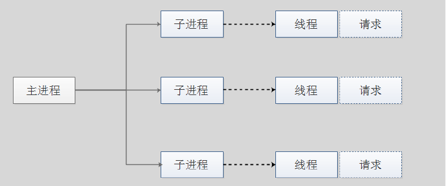

##### 1.2.1.2：Apache woker模型：

一种多进程和多线程混合的模型，有一个控制进程，启动多个子进程，每个子进程里面包含固定的线程，使用线程来处理请求，当线程不够使用的时候会再启动一个新的子进程，然后在进程里面再启动线程处理请求，由于其使用了线程处理请求，因此可以承受更高的并发。

优点：相比prefork占用的内存较少，可以同时处理更多的请求

缺点：使用keepalive的长连接方式，某个线程会一直被占据，即使没有传输数据，也需要一直等待到超时才会被释放。如果过多的线程被这样占据，也会导致在高并发场景下的无服务线程可用。（该问题在prefork模式下，同样会发生）
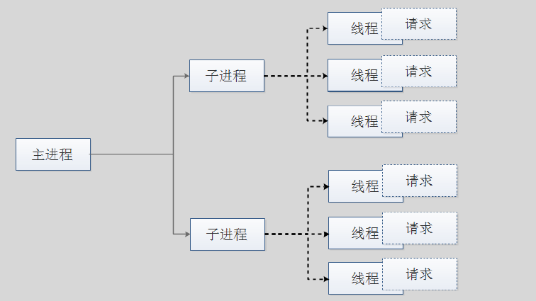

##### 1.2.1.3：Apache event模型：

Apache中最新的模式，2012年发布的apache 2.4.X系列正式支持event 模型，属于事件驱动模型(epoll)
，每个进程响应多个请求，在现在版本里的已经是稳定可用的模式。它和worker模式很像，最大的区别在于，它解决了keepalive场景下，长期被占用的线程的资源浪费问题（某些线程因为被keepalive，空挂在哪里等待，中间几乎没有请求过来，甚至等到超时）。event
MPM中，会有一个专门的线程来管理这些keepalive类型的线程，当有真实请求过来的时候，将请求传递给服务线程，执行完毕后，又允许它释放。这样增强了高并发场景下的请求处理能力。

优点：单线程响应多请求，占据更少的内存，高并发下表现更优秀，会有一个专门的线程来管理keep-alive类型的线程，当有真实请求过来的时候，将请求传递给服务线程，执行完毕后，又允许它释放

缺点：没有线程安全控制
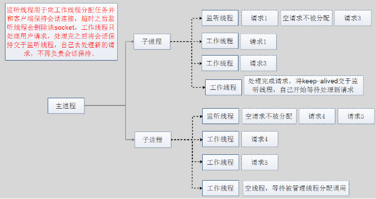

#### 1.2.2：Nginx-高性能的web服务端：

Nginx是由1994年毕业于俄罗斯国立莫斯科鲍曼科技大学的同学为俄罗斯rambler.ru公司开发的，开发工作最早从2002年开始，第一次公开发布时间是2004年10月4日，版本号是0.1.0，官网地址 www.nginx.org

Nginx历经十几年的迭代更新（https://nginx.org/en/CHANGES），
目前功能已经非常完善且运行稳定，另外Nginx的版本分为开发版、稳定版和过期版，nginx以功能丰富著称，它即可以作为http服务器，也可以作为反向代理服务器或者邮件服务器，能够快速的响应静态网页的请求，支持FastCGI/SSL/Virtual
Host/URLRwrite/Gzip/HTTP Basic Auth/http或者TCP的负载均衡(1.9版本以上且开启stream模块)等功能，并且支持第三方的功能扩展。

为什么使用Nginx： 天猫 淘宝 小米 163 京东新浪等一线互联网公司都在用Nginx或者进行二次开发

基于Nginx的访问流程如下：

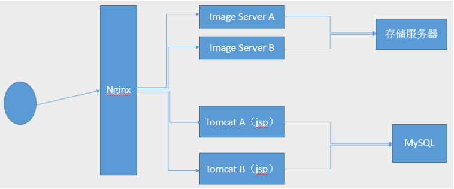

#### 1.2.3：用户访问体验统计：

互联网存在用户速度体验的1-3-10原则，即1秒最优，1-3秒较优，3~10秒比较慢，10秒以上用户无法接受。用户放弃一个产品的代价很低，只是换一个URL而已。

全球最大搜索引擎 Google：慢500ms = 20% 将放弃访问。 全球最大的电商零售网站 亚马逊：慢100ms = 1% 将放弃交易


#### 1.2.4：性能影响：

有很多研究都表明，性能对用户的行为有很大的影响： 79%的用户表示不太可能再次打开一个缓慢的网站 47%的用户期望网页能在2秒钟以内加载 40%的用户表示如果加载时间超过三秒钟，就会放弃这个网站
页面加载时间延迟一秒可能导致转换损失7%，页面浏览量减少11% 8秒定律：用户访问一个网站时，如果等待网页打开的时间超过8秒，会有超过30%的用户放弃等待

##### 1.2.4.1：影响用户体验的几个因素：

据说马云在刚开始创业在给客户演示时，打开一个网站花了两个多小时。

```
客户端硬件配置
客户端网络速率
客户端与服务端距离
服务端网络速率
服务端硬件配置
服务端架构设计
服务端应用程序工作模式
服务端并发数量
服务端响应文件大小及数量
服务端I/O压力
```

##### **1.2.4.2：应用程序工作模式：**

```
httpd MPM（Multi-Processing Module，多进程处理模块）模式：
  prefork：进程模型，两级结构，主进程master负责生成子进程，每个子进程负责响应一个请求
  worker：线程模型，三级结构，主进程master负责生成子进程，每个子进程负责生成多个线程，每个线程响应一个请求
  event：线程模型，三级结构,主进程master负责生成子进程，每个子进程生成多个线程，每个线程响应一个请求，但是增加了一个监听线程，用于解决在设置了keep-alived场景下线程的空等待问题。

Nginx（Master+Worker）模式：
  主进程
  工作进程 #直接处理客户的请求

线程验证方式：
## cat /proc/PID/status
## pstree -p PID
```

##### 1.2.4.3：服务端I/O：

I/O在计算机中指Input/Output，IOPS (Input/Output Per Second)即每秒的输入输出量(或读写次数)
，是衡量磁盘性能的主要指标之一。IOPS是指单位时间内系统能处理的I/O请求数量，一般以每秒处理的I/O请求数量为单位，I/O请求通常为读或写数据操作请求。

一次完整的I/O是用户空间的进程数据与内核空间的内核数据的报文的完整交换，但是由于内核空间与用户空间是严格隔离的，所以其数据交换过程中不能由用户空间的进程直接调用内核空间的内存数据，而是需要经历一次从内核空间中的内存数据copy到用户空间的进程内存当中，所以简单说I/O就是把数据从内核空间中的内存数据复制到用户空间中进程的内存当中。

而网络通信就是网络协议栈到用户空间进程的IO就是网络IO
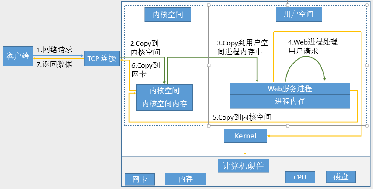

磁盘I/O是进程向内核发起系统调用，请求磁盘上的某个资源比如是文件或者是图片，然后内核通过相应的驱动程序将目标图片加载到内核的内存空间，加载完成之后把数据从内核内存再复制给进程内存，如果是比较大的数据也需要等待时间。

```
每次IO，都要经由两个阶段：
  第一步：将数据从文件先加载至内核内存空间（缓冲区），等待数据准备完成，时间较长
  第二步：将数据从内核缓冲区复制到用户空间的进程的内存中，时间较短
```

### 1.3：系统I/O模型：

同步/异步：关注的是消息通信机制，即在等待一件事情的处理结果时，被调用者是否提供完成通知。

同步：synchronous，调用者等待被调用者返回消息后才能继续执行，如果被调用者不提供消息返回则为同步，同步需要调用者主动询问事情是否处理完成。

异步：asynchronous，被调用者通过状态、通知或回调机制主动通知调用者被调用者的运行状态

```
同步：进程发出请求调用后，等内核返回响应以后才继续下一个请求，即如果内核一直不返回数据，那么进程就一直等。
异步：进程发出请求调用后，不等内核返回响应，接着处理下一个请求,Nginx是异步的。
```

阻塞/非阻塞：关注调用者在等待结果返回之前所处的状态

阻塞：blocking，指IO操作需要彻底完成后才返回到用户空间，调用结果返回之前，调用者被挂起，干不了别的事情。

非阻塞：nonblocking，指IO操作被调用后立即返回给用户一个状态值，无需等到IO操作彻底完成，最终的调用结果返回之前，调用者不会被挂起，可以去做别的事情。

### 1.4：网络I/O模型：

阻塞型、非阻塞型、复用型、信号驱动型、异步

#### 1.4.1：同步阻塞型IO模型（blocking IO）：

阻塞IO模型是最简单的IO模型，用户线程在内核进行IO操作时被阻塞

用户线程通过系统调用read发起IO读操作，由用户空间转到内核空间。内核等到数据包到达后，然后将接收的数据拷贝到用户空间，完成read操作

用户需要等待read将数据读取到buffer后，才继续处理接收的数据。整个IO请求的过程中，用户线程是被阻塞的，这导致用户在发起IO请求时，不能做任何事情，对CPU的资源利用率不够

优点：程序简单，在阻塞等待数据期间进程/线程挂起，基本不会占用 CPU 资源

缺点：每个连接需要独立的进程/线程单独处理，当并发请求量大时为了维护程序，内存、线程切换开销较大

==**apache 的preforck使用的是这种模式。**==

```
同步阻塞：程序向内核发送IO请求后一直等待内核响应，如果内核处理请求的IO操作不能立即返回,则进程将一直等待并不再接受新的请求，并由进程轮询查看IO是否完成，完成后进程将IO结果返回给Client，在IO没有返回期间进程不能接受其他客户的请求，而且是由进程自己去查看IO是否完成，这种方式简单，但是比较慢，用的比较少。
```

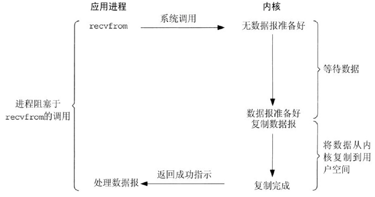

#### 1.4.2：同步非阻塞型I/O模型(nonblocking IO)：

用户线程发起IO请求时立即返回。但并未读取到任何数据，用户线程需要不断地发起IO请求，直到数据到达后，才真正读取到数据，继续执行。即
“轮询”机制存在两个问题：如果有大量文件描述符都要等，那么就得一个一个的read。这会带来大量的Context
Switch（read是系统调用，每调用一次就得在用户态和核心态切换一次）。轮询的时间不好把握。这里是要猜多久之后数据才能到。等待时间设的太长，程序响应延迟就过大；设的太短，就会造成过于频繁的重试，干耗CPU而已，是比较浪费CPU的方式，**
==一般很少直接使用这种模型，而是在其他IO模型中使用非阻塞IO这一特性。==**

```
同步非阻塞：程序向内核发送请IO求后一直等待内核响应，如果内核处理请求的IO操作不能立即返回IO结果，进程将不再等待，而且继续处理其他请求，但是仍然需要进程隔一段时间就要查看内核IO是否完成。
```


#### 1.4.3：IO多路复用型(IO multiplexing)：

IO multiplexing就是我们说的select，poll，epoll，有些地方也称这种IO方式为event driven
IO。select/epoll的好处就在于单个process就可以同时处理多个网络连接的IO。它的基本原理就是select，poll，epoll这个function会不断的轮询所负责的所有socket，当某个socket有数据到达了，就通知用户进程。
当用户进程调用了select，那么整个进程会被block，而同时，kernel会“监视”所有select负责的socket，当任何一个socket中的数据准备好了，select就会返回。这个时候用户进程再调用read操作，将数据从kernel拷贝到用户进程。

```
Apache prefork是此模式的select，work是poll模式。
```


#### 1.4.4：信号驱动式IO(signal-driven IO):

信号驱动IO：signal-driven I/O
用户进程可以通过sigaction系统调用注册一个信号处理程序，然后主程序可以继续向下执行，当有IO操作准备就绪时，由内核通知触发一个SIGIO信号处理程序执行，然后将用户进程所需要的数据从内核空间拷贝到用户空间
此模型的优势在于等待数据报到达期间进程不被阻塞。用户主程序可以继续执行，只要等待来自信号处理函数的通知。

优点：线程并没有在等待数据时被阻塞，内核直接返回调用接收信号，不影响进程继续处理其他请求因此可以提高资源的利用率

缺点：信号 I/O 在大量 IO 操作时可能会因为信号队列溢出导致没法通知

```
异步阻塞：程序进程向内核发送IO调用后，不用等待内核响应，可以继续接受其他请求，内核收到进程请求后进行的IO如果不能立即返回，就由内核等待结果，直到IO完成后内核再通知进程，**==apache event是此模式。==**
```

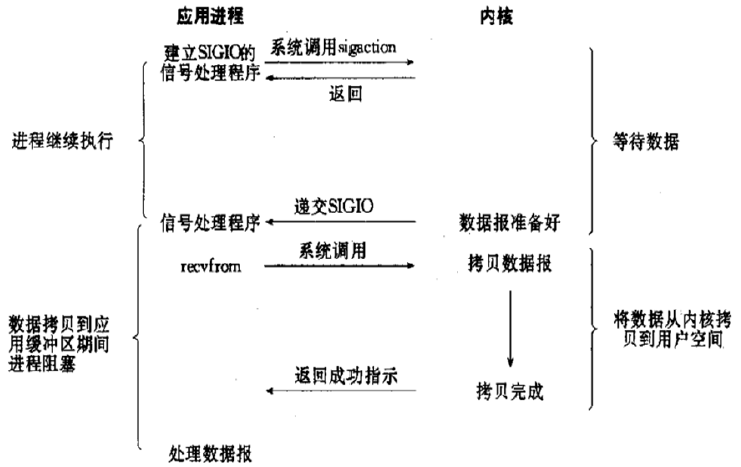

#### 1.4.5：异步(非阻塞) IO(asynchronous IO)：

相对于同步IO，异步IO不是顺序执行。用户进程进行aio_read系统调用之后，无论内核数据是否准备好，都会直接返回给用户进程，然后用户态进程可以去做别的事情。等到socket数据准备好了，内核直接复制数据给进程，然后从内核向进程发送通知。IO两个阶段，进程都是非阻塞的。

Linux提供了AIO库函数实现异步，但是用的很少。目前有很多开源的异步IO库，例如libevent、libev、libuv。异步过程如下图所示：

```
异步非阻塞：程序进程向内核发送IO调用后，不用等待内核响应，可以继续接受其他请求，内核调用的IO如果不能立即返回，内核会继续处理其他事物，直到IO完成后将结果通知给内核，内核在将IO完成的结果返回给进程，期间进程可以接受新的请求，内核也可以处理新的事物，因此相互不影响，可以实现较大的同时并实现较高的IO复用，因此异步非阻塞使用最多的一种通信方式。
```


#### 1.4.6：IO对比：

这五种I/O模型中，越往后，阻塞越少，理论上效率也是最优前四种属于同步I/O，因为其中真正的I/O操作(recvfrom)将阻塞进程/线程，只有异步I/O模型才与POSIX定义的异步I/O相匹配。


#### 1.4.7：实现方式：

Nginx支持在多种不同的操作系统实现不同的事件驱动模型，但是其在不同的操作系统甚至是不同的系统版本上面的实现方式不尽相同，主要有以下实现方式：

```
1、select：
select库是在linux和windows平台都基本支持的 事件驱动模型库，并且在接口的定义也基本相同，只是部分参数的含义略有差异，最大并发限制1024，是最早期的事件驱动模型。
2、poll：
在Linux 的基本驱动模型，windows不支持此驱动模型，是select的升级版，取消了最大的并发限制，在编译nginx的时候可以使用--with-poll_module和--without-poll_module这两个指定是否编译poll库。
3、epoll：
epoll是库是Nginx服务器支持的最高性能的事件驱动库之一，是公认的非常优秀的事件驱动模型，它和select和poll有很大的区别，epoll是poll的升级版，但是与poll的效率有很大的区别.
epoll的处理方式是创建一个待处理的事件列表，然后把这个列表发给内核，返回的时候在去轮训检查这个表，以判断事件是否发生，epoll支持一个进程打开的最大事件描述符的上限是系统可以打开的文件的最大数，同时epoll库的IO效率不随描述符数目增加而线性下降，因为它只会对内核上报的“活跃”的描述符进行操作。
4、rtsig：
不是一个常用事件驱动，最大队列1024，不是很常用
5、kqueue：
用于支持BSD系列平台的高校事件驱动模型，主要用在FreeBSD 4.1及以上版本、OpenBSD 2.0级以上版本，NetBSD级以上版本及Mac OS X 平台上，该模型也是poll库的变种，因此和epoll没有本质上的区别，都是通过避免轮训操作提高效率。
6、/dev/poll:
用于支持unix衍生平台的高效事件驱动模型，主要在Solaris 平台、HP/UX，该模型是sun公司在开发Solaris系列平台的时候提出的用于完成事件驱动机制的方案，它使用了虚拟的/dev/poll设备，开发人员将要见识的文件描述符加入这个设备，然后通过ioctl()调用来获取事件通知，因此运行在以上系列平台的时候请使用/dev/poll事件驱动机制。
7、eventport：
该方案也是sun公司在开发Solaris的时候提出的事件驱动库，只是Solaris 10以上的版本，该驱动库看防止内核崩溃等情况的发生。
8、Iocp：
Windows系统上的实现方式，对应第5种（异步I/O）模型。
```

#### 1.4.8：常用模型汇总：


#### 1.4.9：常用模型对比:

水平触发--单次通知

边缘触发--多次通知

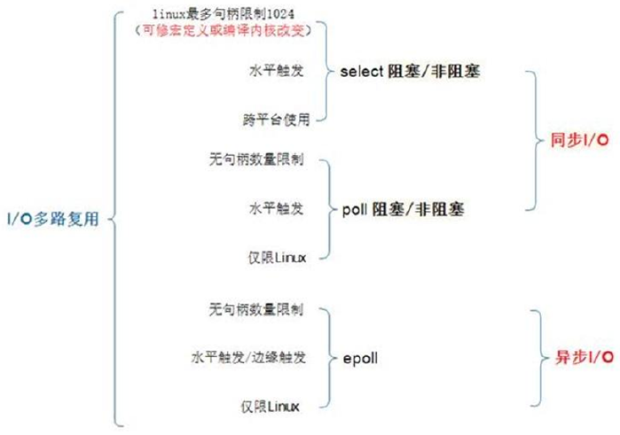

```
Select：
POSIX所规定，目前几乎在所有的平台上支持，其良好跨平台支持也是它的一个优点，本质上是通过设置或者检查存放fd标志位的数据结构来进行下一步处理
缺点
单个进程能够监视的文件描述符的数量存在最大限制，在Linux上一般为1024，可以通过修改宏定义FD_SETSIZE，再重新编译内核实现，但是这样也会造成效率的降低
单个进程可监视的fd数量被限制，默认是1024，修改此值需要重新编译内核
对socket是线性扫描，即采用轮询的方法，效率较低
select 采取了内存拷贝方法来实现内核将 FD 消息通知给用户空间，这样一个用来存放大量fd的数据结构，这样会使得用户空间和内核空间在传递该结构时复制开销大
```

```
poll：
本质上和select没有区别，它将用户传入的数组拷贝到内核空间，然后查询每个fd对应的设备状态
其没有最大连接数的限制，原因是它是基于链表来存储的
大量的fd的数组被整体复制于用户态和内核地址空间之间，而不管这样的复制是不是有意义
poll是“水平触发”，如果报告了fd后，没有被处理，那么下次poll时会再次报告该fd
select是水平触发即只通知一次
```

```
epoll：
在Linux 2.6内核中提出的select和poll的增强版本
支持水平触发LT和边缘触发ET，最大的特点在于边缘触发，它只告诉进程哪些fd刚刚变为就需态，并且只会通知一次
使用“事件”的就绪通知方式，通过epoll_ctl注册fd，一旦该fd就绪，内核就会采用类似callback的回调机制来激活该fd，epoll_wait便可以收到通知
优点:
没有最大并发连接的限制：能打开的FD的上限远大于1024(1G的内存能监听约10万个端口)，具体查看/proc/sys/fs/file-max，此值和系统内存大小相关
效率提升：非轮询的方式，不会随着FD数目的增加而效率下降；只有活跃可用的FD才会调用callback函数，即epoll最大的优点就在于它只管理“活跃”的连接，而跟连接总数无关
内存拷贝，利用mmap(Memory Mapping)加速与内核空间的消息传递；即epoll使用mmap减少复制开销
```

#### 1.4.10：MMAP介绍：

mmap()系统调用使得进程之间通过映射同一个普通文件实现共享内存。普通文件被映射到进程地址空间后，进程可以向访问普通内存一样对文件进行访问。

##### 1.4.10.1传统方式copy数据：


##### 1.4.10.2：mmap方式：


## 二：Nginx基础：

Nginx：engine X ，2002年，开源，商业版 Nginx是免费的、开源的、高性能的HTTP和反向代理服务器、邮件代理服务器、以及TCP/UDP代理服务器 解决C10K问题（10K
Connections），http://www.ideawu.net/blog/archives/740.html

Nginx官网：http://nginx.org

nginx的其它的二次发行版：

Tengine：由淘宝网发起的Web服务器项目。它在Nginx的基础上，针对大访问量网站的需求，添加了很多高级功能和特性。Tengine的性能和稳定性已经在大型的网站如淘宝网，天猫商城等得到了很好的检验。它的最终目标是打造一个高效、稳定、安全、易用的Web平台。从2011年12月开始，Tengine成为一个开源项目，官网 http://tengine.taobao.org/

OpenResty：基于 Nginx与 Lua 语言的高性能 Web 平台， 章亦春开发，官网：http://openresty.org/cn/

### 2.1：Nginx功能介绍：

静态的web资源服务器html，图片，js，css，txt等静态资源

结合FastCGI/uWSGI/SCGI等协议反向代理动态资源请求

http/https协议的反向代理

imap4/pop3协议的反向代理

tcp/udp协议的请求转发（反向代理）

#### 2.1.1：基础特性：

```
特性：
模块化设计，较好的扩展性
高可靠性
支持热部署：不停机更新配置文件，升级版本，更换日志文件
低内存消耗：10000个keep-alive连接模式下的非活动连接，仅需2.5M内存
event-driven,aio,mmap，sendfile

基本功能：
静态资源的web服务器
http协议反向代理服务器
pop3/imap4协议反向代理服务器
FastCGI(LNMP),uWSGI(python)等协议
模块化（非DSO），如zip，SSL模块
```

#### 2.1.2：和web服务相关的功能：

```
虚拟主机（server）
支持 keep-alive 和管道连接(利用一个连接做多次请求)
访问日志（支持基于日志缓冲提高其性能）
url rewirte
路径别名
基于IP及用户的访问控制
支持速率限制及并发数限制
重新配置和在线升级而无须中断客户的工作进程
```

### 2.2：Nginx组织结构：

web请求处理机制：

1、多进程方式：服务器每接收到一个客户端请求就有服务器的主进程生成一个子进程响应客户端，直到用户关闭连接，这样的优势是处理速度快，子进程之间相互独立，但是如果访问过大会导致服务器资源耗尽而无法提供请求。

2、多线程方式：与多进程方式类似，但是每收到一个客户端请求会有服务进程派生出一个线程来与客户方进行交互，一个线程的开销远远小于一个进程，因此多线程方式在很大程度减轻了web服务器对系统资源的要求，但是多线程也有自己的缺点，即当多个线程位于同一个进程内工作的时候，可以相互访问同样的内存地址空间，所以他们相互影响，一旦主进程挂掉则所有子线程都不能工作了，IIS服务器使用了多线程的方式，需要间隔一段时间就重启一次才能稳定。

#### 2.2.1：组织模型：

Nginx是多进程组织模型，而且是一个由Master主进程和Worker工作进程组成。
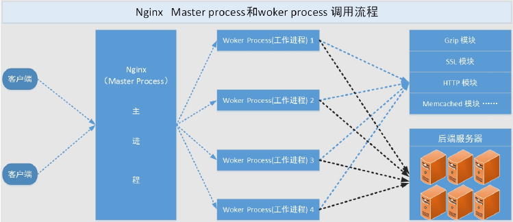

主进程(master process)的功能：

```
读取Nginx 配置文件并验证其有效性和正确性
建立、绑定和关闭socket连接
按照配置生成、管理和结束工作进程
接受外界指令，比如重启、升级及退出服务器等指令
不中断服务，实现平滑升级，重启服务并应用新的配置
开启日志文件，获取文件描述符
不中断服务，实现平滑升级，升级失败进行回滚处理
编译和处理perl脚本
```

工作进程（woker process）的功能：

```
接受处理客户的请求
将请求以此送入各个功能模块进行处理
IO调用，获取响应数据
与后端服务器通信，接收后端服务器的处理结果
缓存数据，访问缓存索引，查询和调用缓存数据
发送请求结果，响应客户的请求
接收主程序指令，比如重启、升级和退出等
```


#### 2.2.2：进程间通信：

工作进程是由主进程生成的，主进程使用fork()
函数，在Nginx服务器启动过程中主进程根据配置文件决定启动工作进程的数量，然后建立一张全局的工作表用于存放当前未退出的所有的工作进程，主进程生成工作进程后会将新生成的工作进程加入到工作进程表中，并建立一个单向的管道并将其传递给工作进程，该管道与普通的管道不同，它是由主进程指向工作进程的单向通道，包含了主进程向工作进程发出的指令、工作进程ID、工作进程在工作进程表中的索引和必要的文件描述符等信息。
主进程与外界通过信号机制进行通信，当接收到需要处理的信号时，它通过管道向相关的工作进程发送正确的指令，每个工作进程都有能力捕获管道中的可读事件，当管道中有可读事件的时候，工作进程就会从管道中读取并解析指令，然后采取相应的执行动作，这样就完成了主进程与工作进程的交互。

```
工作进程之间的通信原理基本上和主进程与工作进程之间的通信是一样的，只要工作进程之间能够取得彼此的信息，建立管道即可通信，但是由于工作进程之间是完全隔离的，因此一个进程想要知道另外一个进程的状态信息就只能通过主进程来设置了。
为了实现工作进程之间的交互，主进程在生成工作进程之后，在工作进程表中进行遍历，将该新进程的ID以及针对该进程建立的管道句柄传递给工作进程中的其他进程，为工作进程之间的通信做准备，当工作进程1向工作进程2发送指令的时候，首先在主进程给它的其他工作进程工作信息中找到2的进程ID，然后将正确的指令写入指向进程2的管道，工作进程2捕获到管道中的事件后，解析指令并进行相关操作，这样就完成了工作进程之间的通信。
```


### 2.3：Nginx模块介绍：

核心模块：是Nginx服务器正常运行必不可少的模块，提供错误日志记录、配置文件解析、事件驱动机制、进程管理等核心功能

标准HTTP模块：提供HTTP协议解析相关的功能，比如：端口配置、网页编码设置、HTTP响应头设置等等

可选HTTP模块：主要用于扩展标准的HTTP功能，让Nginx能处理一些特殊的服务，比如：Flash多媒体传输、解析GeoIP请求、网络传输压缩 、安全协议SSL支持等

邮件服务模块：主要用于支持Nginx的邮件服务，包括对POP3协议、IMAP协议和SMTP协议的支持

第三方模块：是为了扩展Nginx服务器应用，完成开发者自定义功能，比如：Json支持、Lua支持等

nginx高度模块化，但其模块早期不支持DSO机制；1.9.11版本支持动态装载和卸载

模块分类：

```
核心模块：core module
标准模块：
HTTP模块： ngx_http_*
    HTTP Core modules 默认功能
    HTTP Optional modules 需编译时指定
Mail模块 ngx_mail_*
Stream模块 ngx_stream_*
第三方模块
```


### 2.4：Nginx安装：

Nginx的安装版本分为开发版、稳定版和过期版，
Nginx安装可以使用yum或源码安装，但是推荐使用源码，一是yum的版本比较旧，二是编译安装可以更方便自定义相关路径，三是使用源码编译可以自定义相关功能，更方便业务上的使用，源码安装需要提前准备标准的编译器，GCC的全称是（GNU
Compiler collection），其有GNU开发，并以GPL即LGPL许可，是自由的类UNIX操作系统的标准编译器，因为GCC原本只能处理C语言，所以原名为GNU
C语言编译器，后来得到快速发展，可以处理C++,Fortran，pascal，objective-C，java以及Ada等其他语言，此外还需要Automake工具，以完成自动创建Makefile的工作，Nginx的一些模块需要依赖第三方库，比如pcre（支持rewrite），zlib（支持gzip模块）和openssl（支持ssl模块）等。

#### 2.4.1：Nginx yum安装：

需要提前配置好epel源

```
[root@c82 ~]# yum install nginx -y
[root@c82 ~]# rpm -ql nginx
/etc/logrotate.d/nginx
/etc/nginx/fastcgi.conf
/etc/nginx/fastcgi.conf.default
/etc/nginx/fastcgi_params
/etc/nginx/fastcgi_params.default
/etc/nginx/koi-utf
/etc/nginx/koi-win
/etc/nginx/mime.types
/etc/nginx/mime.types.default
/etc/nginx/nginx.conf
/etc/nginx/nginx.conf.default
...
/var/lib/nginx
/var/lib/nginx/tmp
/var/log/nginx
```

##### 2.4.1.1：检查安装：

查看nginx安装包信息

```
[root@c82 ~]# rpm -qi nginx
Name        : nginx
Epoch       : 1
Version     : 1.14.1
Release     : 9.module_el8.0.0+184+e34fea82
Architecture: x86_64
Install Date: Mon 24 Feb 2020 09:19:57 PM CST
Group       : System Environment/Daemons
Size        : 1734583
License     : BSD
Signature   : RSA/SHA256, Thu 10 Oct 2019 05:44:27 AM CST, Key ID 05b555b38483c65d
Source RPM  : nginx-1.14.1-9.module_el8.0.0+184+e34fea82.src.rpm
Build Date  : Tue 08 Oct 2019 05:17:55 AM CST
Build Host  : x86-02.mbox.centos.org
Relocations : (not relocatable)
Packager    : CentOS Buildsys <bugs@centos.org>
Vendor      : CentOS
URL         : http://nginx.org/
Summary     : A high performance web server and reverse proxy server
Description :
Nginx is a web server and a reverse proxy server for HTTP, SMTP, POP3 and
IMAP protocols, with a strong focus on high concurrency, performance and low
memory usage.
```

##### 2.4.1.2：查看帮助：

使用安装完成的二进制文件nginx

```
[root@c82 ~]# nginx -h
nginx version: nginx/1.14.1
Usage: nginx [-?hvVtTq] [-s signal] [-c filename] [-p prefix] [-g directives]

Options:
  -?,-h         : this help
  -v            : show version and exit
  -V            : show version and configure options then exit
  -t            : test configuration and exit
  -T            : test configuration, dump it and exit
  -q            : suppress non-error messages during configuration testing
  -s signal     : send signal to a master process: stop, quit, reopen, reload
  -p prefix     : set prefix path (default: /usr/share/nginx/)
  -c filename   : set configuration file (default: /etc/nginx/nginx.conf)
  -g directives : set global directives out of configuration file
```

##### 2.4.1.3：验证Nginx：

```
[root@c82 ~]# nginx -t
nginx: the configuration file /etc/nginx/nginx.conf syntax is ok
nginx: configuration file /etc/nginx/nginx.conf test is successful
[root@c82 ~]# nginx -V
nginx version: nginx/1.14.1
built by gcc 8.2.1 20180905 (Red Hat 8.2.1-3) (GCC) 
built with OpenSSL 1.1.1 FIPS  11 Sep 2018
TLS SNI support enabled
configure arguments: --prefix=/usr/share/nginx --sbin-path=/usr/sbin/nginx --modules-path=/usr/lib64/nginx/modules --conf-path=/etc/nginx/nginx.conf --error-log-path=/var/log/nginx/error.log --http-log-path=/var/log/nginx/access.log --http-client-body-temp-path=/var/lib/nginx/tmp/client_body --http-proxy-temp-path=/var/lib/nginx/tmp/proxy --http-fastcgi-temp-path=/var/lib/nginx/tmp/fastcgi --http-uwsgi-temp-path=/var/lib/nginx/tmp/uwsgi --http-scgi-temp-path=/var/lib/nginx/tmp/scgi --pid-path=/run/nginx.pid --lock-path=/run/lock/subsys/nginx --user=nginx --group=nginx --with-file-aio --with-ipv6 --with-http_ssl_module --with-http_v2_module --with-http_realip_module --with-http_addition_module --with-http_xslt_module=dynamic --with-http_image_filter_module=dynamic --with-http_sub_module --with-http_dav_module --with-http_flv_module --with-http_mp4_module --with-http_gunzip_module --with-http_gzip_static_module --with-http_random_index_module --with-http_secure_link_module --with-http_degradation_module --with-http_slice_module --with-http_stub_status_module --with-http_perl_module=dynamic --with-http_auth_request_module --with-mail=dynamic --with-mail_ssl_module --with-pcre --with-pcre-jit --with-stream=dynamic --with-stream_ssl_module --with-debug --with-cc-opt='-O2 -g -pipe -Wall -Werror=format-security -Wp,-D_FORTIFY_SOURCE=2 -Wp,-D_GLIBCXX_ASSERTIONS -fexceptions -fstack-protector-strong -grecord-gcc-switches -specs=/usr/lib/rpm/redhat/redhat-hardened-cc1 -specs=/usr/lib/rpm/redhat/redhat-annobin-cc1 -m64 -mtune=generic -fasynchronous-unwind-tables -fstack-clash-protection -fcf-protection' --with-ld-opt='-Wl,-z,relro -Wl,-z,now -specs=/usr/lib/rpm/redhat/redhat-hardened-ld -Wl,-E'
```

##### 2.4.1.4：Nginx启动脚本：

```
[root@c82 ~]# cat /usr/lib/systemd/system/nginx.service
[Unit]
Description=The nginx HTTP and reverse proxy server
After=network.target remote-fs.target nss-lookup.target

[Service]
Type=forking
PIDFile=/run/nginx.pid
### Nginx will fail to start if /run/nginx.pid already exists but has the wrong
### SELinux context. This might happen when running `nginx -t` from the cmdline.
### https://bugzilla.redhat.com/show_bug.cgi?id=1268621
ExecStartPre=/usr/bin/rm -f /run/nginx.pid
ExecStartPre=/usr/sbin/nginx -t
ExecStart=/usr/sbin/nginx
ExecReload=/bin/kill -s HUP $MAINPID
KillSignal=SIGQUIT
TimeoutStopSec=5
KillMode=mixed
PrivateTmp=true

[Install]
WantedBy=multi-user.target
[root@c82 ~]# 
```

##### 2.4.1.5：配置Nginx：

默认配置文件：/etc/nginx/nginx.conf，，默认配置如下：

```
[root@c82 ~]# grep -v "#" /etc/nginx/nginx.conf | grep -v "^$"
user nginx;
worker_processes auto;
error_log /var/log/nginx/error.log;
pid /run/nginx.pid;
include /usr/share/nginx/modules/*.conf;
events {
    worker_connections 1024;
}
http {
    log_format  main  '$remote_addr - $remote_user [$time_local] "$request" '
                      '$status $body_bytes_sent "$http_referer" '
                      '"$http_user_agent" "$http_x_forwarded_for"';
    access_log  /var/log/nginx/access.log  main;
    sendfile            on;
    tcp_nopush          on;
    tcp_nodelay         on;
    keepalive_timeout   65;
    types_hash_max_size 2048;
    include             /etc/nginx/mime.types;
    default_type        application/octet-stream;
    include /etc/nginx/conf.d/*.conf;
    server {
        listen       80 default_server;
        listen       [::]:80 default_server;
        server_name  _;
        root         /usr/share/nginx/html;
        include /etc/nginx/default.d/*.conf;
        location / {
        }
        error_page 404 /404.html;
            location = /40x.html {
        }
        error_page 500 502 503 504 /50x.html;
            location = /50x.html {
        }
    }
}
```

##### 2.4.1.6：启动Nginx：

```
[root@c82 ~]# systemctl start nginx
[root@c82 ~]# systemctl status nginx
● nginx.service - The nginx HTTP and reverse proxy server
   Loaded: loaded (/usr/lib/systemd/system/nginx.service; disabled; vendor preset: disabled)
   Active: active (running) since Mon 2020-02-24 21:24:34 CST; 4s ago
  Process: 12597 ExecStart=/usr/sbin/nginx (code=exited, status=0/SUCCESS)
  Process: 12595 ExecStartPre=/usr/sbin/nginx -t (code=exited, status=0/SUCCESS)
  Process: 12593 ExecStartPre=/usr/bin/rm -f /run/nginx.pid (code=exited, status=0/SUCCESS)
 Main PID: 12598 (nginx)
    Tasks: 3 (limit: 11363)
   Memory: 5.6M
   CGroup: /system.slice/nginx.service
           ├─12598 nginx: master process /usr/sbin/nginx
           ├─12599 nginx: worker process
           └─12600 nginx: worker process

Feb 24 21:24:34 c82.zsjshao.com systemd[1]: Starting The nginx HTTP and reverse proxy server...
Feb 24 21:24:34 c82.zsjshao.com nginx[12595]: nginx: the configuration file /etc/nginx/nginx.conf syntax is ok
Feb 24 21:24:34 c82.zsjshao.com nginx[12595]: nginx: configuration file /etc/nginx/nginx.conf test is successful
Feb 24 21:24:34 c82.zsjshao.com systemd[1]: Started The nginx HTTP and reverse proxy server.
[root@c82 ~]# ps -ef | grep nginx
root      12598      1  0 21:24 ?        00:00:00 nginx: master process /usr/sbin/nginx
nginx     12599  12598  0 21:24 ?        00:00:00 nginx: worker process
nginx     12600  12598  0 21:24 ?        00:00:00 nginx: worker process
root      12604   1262  0 21:24 pts/0    00:00:00 grep --color=auto nginx
```

##### 2.4.1.7：访问Nginx：


#### 2.4.2：Nginx 编译安装：

准备编译安装的基础环境：

```
[root@c82 ~]# yum install gcc pcre-devel openssl-devel zlib-devel perl-ExtUtils-Embed

gcc为GNU Compiler Collection的缩写，可以编译C和C++源代码等，它是GNU开发的C和C++以及其他很多种语言的编译器（最早的时候只能编译C，后来很快进化成一个编译多种语言的集合，如Fortran、Pascal、Objective-C、Java、Ada、 Go等。）

gcc 在编译C++源代码的阶段，只能编译 C++ 源文件，而不能自动和 C++ 程序使用的库链接（编译过程分为编译、链接两个阶段，注意不要和可执行文件这个概念搞混，相对可执行文件来说有三个重要的概念：编译（compile）、链接（link）、加载（load）。源程序文件被编译成目标文件，多个目标文件连同库被链接成一个最终的可执行文件，可执行文件被加载到内存中运行）。因此，通常使用 g++ 命令来完成 C++ 程序的编译和连接，该程序会自动调用 gcc 实现编译。

gcc-c++也能编译C源代码，只不过把会把它当成C++源代码，后缀为.c的，gcc把它当作是C程序，而g++当作是c++程序；后缀为.cpp的，两者都会认为是c++程序，注意，虽然c++是c的超集，但是两者对语法的要求是有区别的。

automake是一个从Makefile.am文件自动生成Makefile.in的工具。为了生成Makefile.in，automake还需用到perl，由于automake创建的发布完全遵循GNU标准，所以在创建中不需要perl。libtool是一款方便生成各种程序库的工具。

pcre pcre-devel：在Nginx编译需要 PCRE(Perl Compatible Regular Expression)，因为Nginx的Rewrite模块和HTTP核心模块会使用到PCRE正则表达式语法。
zlip zlib-devel：nginx启用压缩功能的时候，需要此模块的支持。
openssl openssl-devel：开启SSL的时候需要此模块的支持。
```

##### 2.4.2.1：安装Nginx：

官方源码包下载地址：
https://nginx.org/en/download.html

```
[root@c82 ~]# cd /usr/local/src/
[root@c82 src]# wget https://nginx.org/download/nginx-1.16.1.tar.gz
[root@c82 src]# tar xf nginx-1.16.1.tar.gz 
[root@c82 src]# cd nginx-1.16.1

编译是为了检查系统环境是否符合编译安装的要求，比如是否有gcc编译工具，是否支持编译参数当中的模块，
并根据开启的参数等生成Makefile文件为下一步做准备

[root@c82 nginx-1.16.1]# ./configure --prefix=/apps/nginx \
--user=nginx \
--group=nginx \
--with-http_ssl_module \
--with-http_v2_module \
--with-http_realip_module \
--with-http_stub_status_module \
--with-http_gzip_static_module \
--with-pcre \
--with-stream \
--with-stream_ssl_module \
--with-stream_realip_module
[root@c82 nginx-1.16.1]# useradd -r -s /sbin/nologin nginx
[root@c82 nginx-1.16.1]# make #编译步骤，根据Makefile文件生成相应的模块
[root@c82 nginx-1.16.1]# make install #创建目录，并将生成的模块和文件复制到相应的目录：
[root@c82 nginx-1.16.1]# chown nginx.nginx -R /apps/nginx/
```

备注：nginx完成安装以后，有四个主要的目录：

```
conf：保存nginx所有的配置文件，其中nginx.conf是nginx服务器的最核心最主要的配置文件，其他的.conf则是用来配置nginx相关的功能的，例如fastcgi功能使用的是fastcgi.conf和fastcgi_params两个文件，配置文件一般都有个样板配置文件，是文件名.default结尾，使用的使用将其复制为并将default去掉即可。
html：目录中保存了nginx服务器的web文件，但是可以更改为其他目录保存web文件,另外还有一个50x的web文件是默认的错误页面提示页面。
logs：用来保存nginx服务器的访问日志错误日志等日志，logs目录可以放在其他路径，比如/var/logs/nginx里面。
sbin：保存nginx二进制启动脚本，可以接受不同的参数以实现不同的功能。
```

##### 2.4.2.2：验证版本及编译参数：

```
[root@c82 nginx-1.16.1]# /apps/nginx/sbin/nginx -V
nginx version: nginx/1.16.1
built by gcc 8.3.1 20190507 (Red Hat 8.3.1-4) (GCC) 
built with OpenSSL 1.1.1c FIPS  28 May 2019
TLS SNI support enabled
configure arguments: --prefix=/apps/nginx --user=nginx --group=nginx --with-http_ssl_module --with-http_v2_module --with-http_realip_module --with-http_stub_status_modu
le --with-http_gzip_static_module --with-pcre --with-stream --with-stream_ssl_module --with-stream_realip_module
```

##### 2.4.2.3：访问编译安装的nginx web界面：

```
[root@c82 nginx-1.16.1]# /apps/nginx/sbin/nginx
```


##### 2.4.2.4：创建Nginx自启动脚本：

```
[root@c82 nginx-1.16.1]# cat /usr/lib/systemd/system/nginx.service
[Unit]
Description=The nginx HTTP and reverse proxy server
After=network.target remote-fs.target nss-lookup.target

[Service]
Type=forking
PIDFile=/apps/nginx/logs/nginx.pid
### Nginx will fail to start if /run/nginx.pid already exists but has the wrong
### SELinux context. This might happen when running `nginx -t` from the cmdline.
### https://bugzilla.redhat.com/show_bug.cgi?id=1268621
ExecStartPre=/usr/bin/rm -f /apps/nginx/logs/nginx.pid
ExecStartPre=/apps/nginx/sbin/nginx -t
ExecStart=/apps/nginx/sbin/nginx
ExecReload=/bin/kill -s HUP $MAINPID
KillSignal=SIGQUIT
TimeoutStopSec=5
KillMode=process
PrivateTmp=true

[Install]
WantedBy=multi-user.target
[root@c82 nginx-1.16.1]# 
```

##### 2.4.2.5：验证Nginx自启动脚本：

```
[root@c82 nginx-1.16.1]# systemctl daemon-reload
[root@c82 nginx-1.16.1]# systemctl start nginx
[root@c82 nginx-1.16.1]# systemctl enable nginx
Created symlink /etc/systemd/system/multi-user.target.wants/nginx.service → /usr/lib/systemd/system/nginx.service.
[root@c82 nginx-1.16.1]# systemctl status nginx
● nginx.service - The nginx HTTP and reverse proxy server
   Loaded: loaded (/usr/lib/systemd/system/nginx.service; enabled; vendor preset: disabled)
   Active: active (running) since Mon 2020-02-24 21:46:01 CST; 11s ago
 Main PID: 21339 (nginx)
    Tasks: 2 (limit: 11363)
   Memory: 2.4M
   CGroup: /system.slice/nginx.service
           ├─21339 nginx: master process /apps/nginx/sbin/nginx
           └─21340 nginx: worker process

Feb 24 21:46:01 c82.zsjshao.com systemd[1]: Starting The nginx HTTP and reverse proxy server...
Feb 24 21:46:01 c82.zsjshao.com nginx[21336]: nginx: the configuration file /apps/nginx/conf/nginx.conf syntax is ok
Feb 24 21:46:01 c82.zsjshao.com nginx[21336]: nginx: configuration file /apps/nginx/conf/nginx.conf test is successful
Feb 24 21:46:01 c82.zsjshao.com systemd[1]: Started The nginx HTTP and reverse proxy server.
```

##### 2.5.2.6：配置Nginx：

Nginx的配置文件的组成部分：主配置文件：nginx.conf，子配置文件 include conf.d/*.conf

```
fastcgi， uwsgi，scgi等协议相关的配置文件
mime.types：支持的mime类型，MIME(Multipurpose Internet Mail Extensions)多用途互联网邮件扩展类型，MIME消息能包含文本、图像、音频、视频以及其他应用程序专用的数据，是设定某种扩展名的文件用一种应用程序来打开的方式类型，当该扩展名文件被访问的时候，浏览器会自动使用指定应用程序来打开。多用于指定一些客户端自定义的文件名，以及一些媒体文件打开方式。
主配置文件的配置指令：
directive value [value2 ...];
注意：
(1) 指令必须以分号结尾
(2) 支持使用配置变量
    内建变量：由Nginx模块引入，可直接引用
    自定义变量：由用户使用set命令定义
        set variable_name value;
    引用变量：$variable_name
```

##### 2.5.2.7：默认配置文件：

```
[root@c82 ~]# grep -v "#" /apps/nginx/conf/nginx.conf | grep -v "^$"
###全局配置端，对全局生效，主要设置nginx的启动用户/组，启动的工作进程数量，工作模式，Nginx的PID路径，日志路径等。

user nginx nginx;
worker_processes 1; #启动工作进程数数量
events { 
    #events设置块，主要影响nginx服务器与用户的网络连接，比如是否允许同时接受多个网络连接，使用哪种事件驱动模型处理请求，每个工作进程可以同时支持的最大连接数，是否开启对多工作进程下的网络连接进行序列化等。
    worker_connections 1024; #设置单个nginx工作进程可以接受的最大并发，作为web服务器的时候最大并发数为worker_connections * worker_processes，作为反向代理的时候为(worker_connections * worker_processes)/2
}

http { 
###http块是Nginx服务器配置中的重要部分，缓存、代理和日志格式定义等绝大多数功能和第三方模块都可以在这设置，http块可以包含多个server块，而一个server块中又可以包含多个location块，server块可以配置文件引入、MIME-Type定义、日志自定义、是否启用sendfile、连接超时时间和单个链接的请求上限等。
    include mime.types;
    default_type application/octet-stream;
    sendfile on; 
        #作为web服务器的时候打开sendfile加快文件传输
    keepalive_timeout 65; 
    #长连接超时时间，单位是秒
	
    server { 
    #设置一个虚拟机主机，可以包含自己的全局快，同时也可以包含多个locating模块。比如本虚拟机监听的端口、本虚拟机的名称和IP配置，多个server 可以使用一个端口，比如都使用80端口提供web服务、
        listen 80; 
            #配置server监听的端口
        server_name localhost; 
            #本server的名称，当访问此名称的时候nginx会调用当前serevr内部的配置进程匹配。
		
        location / { 
            #location其实是server的一个指令，为nginx服务器提供比较多而且灵活的指令，都是在	location中提现的，主要是基于nginx接受到的请求字符串，对用户请求的ULI进行匹配，并对特定的指令进行处理，包括地址重定向、数据缓存和应答控制等功能都是在这部分实现，另外很多第三方模块的配置也是在location模块中配置。
            root html; #相当于默认页面的目录名称，默认是相对路径，可以使用绝对路径配置。
            index index.html index.htm; #默认的页面文件名称
            }
            error_page 500 502 503 504 /50x.html; #错误页面的文件名称
            location = /50x.html { #location处理对应的不同错误码的页面定义到/50x.html，这个跟对应其server中定义的目录下。
                root html; #定义默认页面所在的目录
            }
    }

###和邮件相关的配置
###mail {
### 		...
### } mail 协议相关配置段
###tcp代理配置，1.9版本以上支持
###stream {
### 		...
### 	} stream 服务器相关配置段
###导入其他路径的配置文件
###include /apps/nginx/conf.d/*.conf
}
```

## 三：Nginx 核心配置详解:

### 3.1：全局配置：

```
user nginx nginx; #启动Nginx工作进程的用户和组
worker_processes [number | auto]; #启动Nginx工作进程的数量
worker_cpu_affinity 00000001 00000010 00000100 00001000; #将Nginx工作进程绑定到指定的CPU核心，默认Nginx是不进行进程绑定的，绑定并不是意味着当前nginx进程独占以一核心CPU，但是可以保证此进程不会运行在其他核心上，这就极大减少了nginx的工作进程在不同的cpu核心上的来回跳转，减少了CPU对进程的资源分配与回收以及内存管理等，因此可以有效的提升nginx服务器的性能。
[root@c82 ~]# ps axo pid,cmd,psr | grep nginx
 21339 nginx: master process /apps   1
 21340 nginx: worker process         0
 21373 grep --color=auto nginx       0

###错误日志记录配置，语法：error_log file [debug | info | notice | warn | error | crit |alert | emerg]
###error_log logs/error.log;
###error_log logs/error.log notice;
error_log /apps/nginx/logs/error.log error;

###pid文件保存路径
pid /apps/nginx/logs/nginx.pid;

worker_priority 0; 
    #工作进程优先级，-20~19
worker_rlimit_nofile 65536; 
    #这个数字包括Nginx的所有连接（例如与代理服务器的连接等），而不仅仅是与客户端的连接,另一个考虑因素是实际的并发连接数不能超过系统级别的最大打开文件数的限制.

[root@c82 ~]# watch -n1 'ps -axo pid,cmd,nice | grep nginx #验证进程优先级

daemon off; 
    #前台运行Nginx服务用于测试、docker等环境。
master_process off|on; 
    #是否开启Nginx的master-woker工作模式。
events {
    worker_connections 65536;
    use epoll; 
        #使用epoll事件驱动，Nginx支持众多的事件驱动，比如select、poll、epoll，只能设置在events模块中设置。
    accept_mutex on; 
        #优化同一时刻只有一个请求而避免多个睡眠进程被唤醒的设置，on为防止被同时唤醒，默认为off，全部唤醒的过程也成为"惊群"，因此nginx刚安装完以后要进行适当的优化。
    multi_accept on; 
        Nginx服务器的每个工作进程可以同时接受多个新的网络连接，但是需要在配置文件中配置，此指令默认为关闭，即默认为一个工作进程只能一次接受一个新的网络连接，打开后几个同时接受多个，配置语法如下：
}
```

### 3.2：http详细配置：

```
http {
    include mime.types; #导入支持的文件类型
    default_type application/octet-stream; #设置默认的类型，会提示下载不匹配的类型文件

###日志配置部分
    #log_format main '$remote_addr - $remote_user [$time_local] "$request" '
    # '$status $body_bytes_sent "$http_referer" '
    # '"$http_user_agent" "$http_x_forwarded_for"';
    #access_log logs/access.log main;

###自定义优化参数
    sendfile on; 指定是否使用sendfile系统调用来传输文件,sendfile系统调用在两个文件描述符之间直接传递数据(完全在内核中操作)，从而避免了数据在内核缓冲区和用户缓冲区之间的拷贝，操作效率很高，被称之为零拷贝，硬盘 >> kernel buffer (快速拷贝到kernelsocket buffer) >>协议栈。
    #tcp_nopush on; 
        #在开启了sendfile的情况下，合并请求后统一发送给客户端。
    #tcp_nodelay off; 
        #在开启了keepalived模式下的连接是否启用TCP_NODELAY选项，当为off时，延迟0.2s发送，合并多个请求后再发送，默认On时，不延迟发送，立即发送用户相应报文。
    #keepalive_timeout 0;
    keepalive_timeout 65 65; 
        #设置会话保持时间
    #gzip on; 
        #开启文件压缩
	
    server {
        listen 80; 
            #设置监听地址和端口
        server_name localhost; 
            #设置server name，可以以空格隔开写多个并支持正则表达式，如*.magedu.com www.magedu.* ~^www\d+\.magedu\.com$
        #charset koi8-r; 
            #设置编码格式，默认是俄语格式，可以改为utf-8
        #access_log logs/host.access.log main;
        location / {
            root html;
            index index.html index.htm;
        }
        #error_page 404 /404.html;
        # redirect server error pages to the static page /50x.html
        #
        error_page 500 502 503 504 /50x.html; #定义错误页面
        location = /50x.html {
            root html;
        }
        # proxy the PHP scripts to Apache listening on 127.0.0.1:80
        #
        #location ~ \.php$ { #以http的方式转发php请求到指定web服务器
        #	proxy_pass http://127.0.0.1;
        #}
        # pass the PHP scripts to FastCGI server listening on 127.0.0.1:9000
        #
        #location ~ \.php$ { #以fastcgi的方式转发php请求到php处理
        #	root html;
        #	fastcgi_pass 127.0.0.1:9000;
        #	fastcgi_index index.php;
        #	fastcgi_param SCRIPT_FILENAME /scripts$fastcgi_script_name;
        #	include fastcgi_params;
        #}
      
        # deny access to .htaccess files, if Apache's document root
        # concurs with nginx's one
        #
        #location ~ /\.ht { #拒绝web形式访问指定文件，如很多的网站都是通过.htaccess文件来改变自己的重定向等功能。
        #	deny all;
        #}
        location ~ /passwd.html {
            deny all;
        }
    }
    # another virtual host using mix of IP-, name-, and port-based configuration
    #
    #server { #自定义虚拟server
    #	listen 8000;
    #	listen somename:8080;
    # server_name somename alias another.alias;
    # location / {
    # root html;
    # index index.html index.htm; #指定默认网页文件，此指令由
ngx_http_index_module模块提供

    # }
    #}
    # HTTPS server
    #
    #server { #https服务器配置
    #	listen 443 ssl;
    #	server_name localhost;
    #	ssl_certificate cert.pem;
    #	ssl_certificate_key cert.key;
    #	ssl_session_cache shared:SSL:1m;
    #	ssl_session_timeout 5m;
    #	ssl_ciphers HIGH:!aNULL:!MD5;
    #	ssl_prefer_server_ciphers on;
    #	location / {
    #		root html;
    #		index index.html index.htm;
    #	}
    #}
```

### 3.3：核心配置示例：

基于不同的IP、不同的端口以及不同的域名实现不同的虚拟主机，依赖于核心模块ngx_http_core_module实现。

#### 3.3.1：新建一个PC web站点：

```
[root@c82 ~]# mkdir /apps/nginx/conf/conf.d
[root@c82 ~]# vim /apps/nginx/conf/conf.d/pc.conf
[root@c82 ~]# cat /apps/nginx/conf/conf.d/pc.conf
server {
    listen 80;
    server_name www.zsjshao.net;
    location / {
      root /data/nginx/html/pc;
    }
}
[root@c82 ~]# mkdir /data/nginx/html/pc -p
[root@c82 ~]# echo "pc web page" > /data/nginx/html/pc/index.html
[root@c82 ~]# vim /apps/nginx/conf/nginx.conf
  include  /apps/nginx/conf/conf.d/*.conf;
[root@c82 ~]# systemctl reload nginx
[root@c82 ~]# curl http://www.zsjshao.net
pc web page
```

#### 3.3.2：新建一个Mobile web站点：

```
[root@c82 ~]# cat /apps/nginx/conf/conf.d/mobile.conf
server {
    listen 80;
    server_name mobile.zsjshao.net;
    location / {
        root /data/nginx/html/mobile;
    }
}
[root@c82 ~]# mkdir /data/nginx/html/mobile -p
[root@c82 ~]# echo "mobile web page" > /data/nginx/html/mobile/index.html
[root@c82 ~]# systemctl reload nginx
[root@c82 ~]# curl http://mobile.zsjshao.net
mobile web page
```

#### 3.3.3：root与alias：

root：指定web的家目录，在定义location的时候，文件的绝对路径等于 root+location，如：

```
[root@c82 ~]# cat /apps/nginx/conf/conf.d/pc.conf
server {
    listen 80;
    server_name www.zsjshao.net;
    location / {
        root /data/nginx/html/pc;
    }
    location /about {
        root /data/nginx/html/pc; #必须要在html目录中创建一个about目录才可以访问，否则报错。
    }
}
[root@c82 ~]# mkdir /data/nginx/html/pc/about
[root@c82 ~]# echo /data/nginx/html/pc/about/index.html > /data/nginx/html/pc/about/index.html
[root@c82 ~]# systemctl reload nginx
[root@c82 ~]# curl http://www.zsjshao.net/about/
/data/nginx/html/pc/about/index.html
```

alias：定义路径别名，会把访问的路径重新定义到其指定的路径，如：

```
[root@c82 ~]# cat /apps/nginx/conf/conf.d/pc.conf
server {
    listen 80;
    server_name www.zsjshao.net;
    location / {
        root /data/nginx/html/pc;
    }
    location /about {
        alias /data/nginx/html/pc;
    }
}
[root@c82 ~]# systemctl reload nginx
[root@c82 ~]# curl http://www.zsjshao.net
pc web page
[root@c82 ~]# curl http://www.zsjshao.net/about/
pc web page
```

#### 3.3.4：location的详细使用：

在没有使用正则表达式的时候，nginx会先在server中的多个location选取匹配度最高的一个uri，uri是用户请求的字符串，即域名后面的web文件路径，然后使用该location处理此请求。或使用正则表达式匹配字符串，如果匹配成功就结束搜索，并使用此location处理此请求。

```
语法规则： location [=|~|~*|^~] /uri/ { … }

=     #用于标准uri前，需要请求字串与uri精确匹配，如果匹配成功就停止向下匹配并立即处理请求。
~     #表示包含正则表达式并且区分大小写
~*    #表示包含正则表达式并且不区分大写
!~    #表示包含正则表达式并且区分大小写不匹配
!~*   #表示包含正则表达式并且不区分大小写不匹配
^~    #表示包含正则表达式并且匹配以什么开头
$     #表示包含正则表达式并且匹配以什么结尾
\     #表示包含正则表达式并且转义字符。可以转. * ?等
*     #表示包含正则表达式并且代表任意长度的任意字符
```

##### 3.3.4.1：匹配案例-精确匹配：

在server部分使用location配置一个web界面，要求：当访问nginx服务器的index.html的时候要显示指定html文件的内容：

```
[root@c82 ~]# cat /apps/nginx/conf/conf.d/pc.conf
server {
    listen 80;
    server_name www.zsjshao.net;
    location  /index.html  {
        root /data/nginx/html/pc;
    }
    location = /index.html {
        root /data/nginx/html/mobile;
    }
}
[root@c82 ~]# nginx -s reload
[root@c82 ~]# curl http://www.zsjshao.net
mobile web page
```

##### 3.3.4.2：匹配案例-区分大小写：

```
[root@c82 ~]# cat /apps/nginx/conf/conf.d/pc.conf 
server {
    listen 80;
    server_name www.zsjshao.net;
    location / {
        root /data/nginx/html/pc;
    }
    location ~ /*.html {
        root /data/nginx/html/pc;
    }
}
[root@c82 ~]# echo /data/nginx/html/pc/alpha.html > /data/nginx/html/pc/alpha.html
[root@c82 ~]# systemctl reload nginx
[root@c82 ~]# curl http://www.zsjshao.net/alpha.html
/data/nginx/html/pc/alpha.html
[root@c82 ~]# curl http://www.zsjshao.net/Alpha.html
<html>
<head><title>404 Not Found</title></head>
<body>
<center><h1>404 Not Found</h1></center>
<hr><center>nginx/1.16.1</center>
</body>
</html>
[root@c82 ~]# 
```

注：Linux文件系统区分字符大小写

##### 3.3.4.3：匹配案例-不区分大小写：

```
[root@c82 ~]# cat /apps/nginx/conf/conf.d/pc.conf
server {
    listen 80;
    server_name www.zsjshao.net;
    location / {
        root /data/nginx/html/pc;
    }
    location ~* /*.html {
        root /data/nginx/html/pc;
    }
}
[root@c82 ~]# nginx -s reload
[root@c82 ~]# curl http://www.zsjshao.net/alpha.html
/data/nginx/html/pc/alpha.html
[root@c82 ~]# curl http://www.zsjshao.net/Alpha.html
<html>
<head><title>404 Not Found</title></head>
<body>
<center><h1>404 Not Found</h1></center>
<hr><center>nginx/1.16.1</center>
</body>
</html>
[root@c82 ~]#
```

注：Linux文件系统区分字符大小写

##### 3.3.4.4：匹配案例-URI开始：

```
[root@c82 ~]# cat /apps/nginx/conf/conf.d/pc.conf
server {
    listen 80;
    server_name www.zsjshao.net;
    location  /image1 {
        alias /data/nginx/html/pc;
    }
    location ^~ /image {
        alias /data/nginx/html/mobile;
    }
}
重启Nginx并访问测试，实现效果是访问images和images1返回不同的结果
[root@c82 ~]# nginx -s reload
[root@c82 ~]# curl http://www.zsjshao.net/image/
mobile web page
[root@c82 ~]# curl http://www.zsjshao.net/image1/
pc web page
[root@c82 ~]#
```

##### 3.3.4.5：匹配案例-文件名后缀：

```
[root@c82 ~]# cat /apps/nginx/conf/conf.d/pc.conf
server {
    listen 80;
    server_name www.zsjshao.net;
    location  / {
        root /data/nginx/html/pc;
    }
    location ~* \.(gif|jpg|jpeg|bmp|png|tiff|tif|ico|wmf|js)$ {
        root /data/nginx/html/mobile;
    }
}
[root@c82 ~]# echo /data/nginx/html/mobile/mobile.js > /data/nginx/html/mobile/mobile.js
[root@c82 ~]# echo /data/nginx/html/pc/mobile.js > /data/nginx/html/pc/mobile.js
[root@c82 ~]# nginx -s reload
[root@c82 ~]# curl http://www.zsjshao.net/mobile.js
/data/nginx/html/mobile/mobile.js
[root@c82 ~]# curl http://www.zsjshao.net/
pc web page
[root@c82 ~]# 
```

##### 3.3.4.6：匹配案例-优先级：

```
[root@c82 ~]# cat /apps/nginx/conf/conf.d/pc.conf
server {
    listen 80;
    server_name www.zsjshao.net;
    location  / {
        root /data/nginx/html/pc;
    }
    location = /mobile.js {
        root /data/nginx/html/pc;
    }
    location ~* \.(gif|jpg|jpeg|bmp|png|tiff|tif|ico|wmf|js)$ {
        root /data/nginx/html/mobile;
    }
}
[root@c82 ~]# nginx -s reload
[root@c82 ~]# curl http://www.zsjshao.net/mobile.js
/data/nginx/html/pc/mobile.js
[root@c82 ~]# 

匹配优先级：=, ^~, ～/～*，/
location优先级：(location =) > (location 完整路径) > (location ^~ 路径) > (location
~,~* 正则顺序) > (location 部分起始路径) > (/)
```

##### 3.3.4.7：生产使用案例:

```
直接匹配网站根会加速Nginx访问处理:
location = / {
	......;
}
location / {
......;
}

静态资源配置：
location ^~ /static/ {
	......;
}
### 或者
location ~* \.(gif|jpg|jpeg|png|css|js|ico)$ {
	......;
}

多应用配置
location ~* /app1 {
	......;
}
location ~* /app2 {
	......;
}
```

#### 3.3.5：Nginx 四层访问控制：

访问控制基于模块ngx_http_access_module实现，可以通过匹配客户端源IP地址进行限制。

```
allow
   Syntax:	allow address | CIDR | unix: | all;
   Default:	—
   Context:	http, server, location, limit_except
deny
   Syntax:	deny address | CIDR | unix: | all;
   Default:	—
   Context:	http, server, location, limit_except
```

```
[root@c82 ~]# cat /apps/nginx/conf/conf.d/pc.conf 
server {
    listen 80;
    server_name www.zsjshao.net;
    location  / {
        root /data/nginx/html/pc;
    }
    location = /status {
        stub_status;
        allow 172.16.0.0/24;
        deny all;
    }
}
[root@c82 ~]# nginx -s reload
[root@c82 ~]# curl http://www.zsjshao.net/status
Active connections: 1 
server accepts handled requests
 39 39 41 
Reading: 0 Writing: 1 Waiting: 0 
[root@c82 ~]# 
```

#### 3.3.6：Nginx账户认证功能：

账户认证功能基于模块ngx_http_auth_basic_module实现，使用basic机制进行用户认证

```
auth_basic string
   Syntax:	auth_basic string | off;
   Default:	
   auth_basic off;
   Context:	http, server, location, limit_except
auth_basic_user_file
   Syntax:	auth_basic_user_file file;
   Default:	—
   Context:	http, server, location, limit_except
```

```
[root@c82 ~]# yum install httpd-tools -y
[root@c82 ~]# htpasswd -cbm /apps/nginx/conf/.htpasswd tom 123456
Adding password for user tom
[root@c82 ~]# htpasswd -bm /apps/nginx/conf/.htpasswd jerry 123456
Adding password for user jerry
[root@c82 ~]# tail /apps/nginx/conf/.htpasswd 
tom:$apr1$6RebB8Q2$EWZXdLq.qMg11uVs9MBNG/
jerry:$apr1$TRkySel9$E8MDyVFKet2mC05n9LEq61

[root@c82 ~]# cat /apps/nginx/conf/conf.d/pc.conf
server {
    listen 80;
    server_name www.zsjshao.net;
    root /data/nginx/html/pc;
    location / {
    }
    location /login {
        auth_basic "login password";
        auth_basic_user_file /apps/nginx/conf/.htpasswd;
    }
}
[root@c82 ~]# nginx -s reload
[root@c82 ~]# mkdir /data/nginx/html/pc/login -p
[root@c82 ~]# echo /data/nginx/html/pc/login/index.html > /data/nginx/html/pc/login/index.html
[root@c82 ~]# curl http://www.zsjshao.net/login/
<html>
<head><title>401 Authorization Required</title></head>
<body>
<center><h1>401 Authorization Required</h1></center>
<hr><center>zsjshao/1.0</center>
</body>
</html>
[root@c82 ~]# curl -u tom:123456 http://www.zsjshao.net/login/
/data/nginx/html/pc/login/index.html
```

#### 3.3.7：自定义错误页面：

```
error_page
   Syntax:	error_page code ... [=[response]] uri;
   Default:	—
   Context:	http, server, location, if in location
```

```
[root@c82 ~]# cat /apps/nginx/conf/conf.d/pc.conf
server {
    listen 80;
    server_name www.zsjshao.net;
    root /data/nginx/html/pc;
    error_page 403 404 /40X.html;
    location  / {
    }
    location /40X.html {
        root /data/nginx/html/error;
    }
}
[root@c82 ~]# mkdir /data/nginx/html/error -p
[root@c82 ~]# echo /data/nginx/html/error/40X.html > /data/nginx/html/error/40X.html

重启nginx并访问不存在的页面进行测试
[root@c82 ~]# nginx -s reload
[root@c82 ~]# curl http://www.zsjshao.net/nofile.html
/data/nginx/html/error/40X.html
[root@c82 ~]# 
```

#### 3.3.8：自定义访问日志：

```
[root@c82 ~]# cat /apps/nginx/conf/conf.d/pc.conf
server {
    listen 80;
    server_name www.zsjshao.net;
    root /data/nginx/html/pc;
    access_log /apps/nginx/logs/www-zsjshao-net_access.log;
    error_log /apps/nginx/logs/www-zsjshao-net_error.log;
    location  / {
    }
}
[root@c82 ~]# nginx -s reload
[root@c82 ~]# ls /apps/nginx/logs/
access.log  error.log  nginx.pid  www-zsjshao-net_access.log  www-zsjshao-net_error.log
[root@c82 ~]# 
```

#### 3.3.9：监测文件是否存在：

try_files会按顺序检查文件是否存在，返回第一个找到的文件或文件夹（结尾加斜线表示为文件夹），如果所有文件或文件夹都找不到，会进行一个内部重定向到最后一个参数。只有最后一个参数可以引起一个内部重定向，之前的参数只设置内部URI的指向。最后一个参数是回退URI且必须存在，否则会出现内部500错误。

```
try_files
   Syntax:	try_files file ... uri;
   			try_files file ... =code;
   Default:	—
   Context:	server, location
```

```
[root@c82 ~]# cat /apps/nginx/conf/conf.d/pc.conf
server {
    listen 80;
    server_name www.zsjshao.net;
    root /data/nginx/html/pc;
    access_log /apps/nginx/logs/www-zsjshao-net_access.log;
    error_log /apps/nginx/logs/www-zsjshao-net_error.log;
    location  / {
        try_files $uri $uri/index.html $uri.html /default.html @error;
    }
    location @error {
       root /data/nginx/html/mobile;
    }
}
[root@c82 ~]# echo /data/nginx/html/pc/default.html > /data/nginx/html/pc/default.html
[root@c82 ~]# echo /data/nginx/html/mobile/mobile.html > /data/nginx/html/mobile/mobile.html
[root@c82 ~]# nginx -s reload
[root@c82 ~]# curl http://www.zsjshao.net
pc web page
[root@c82 ~]# curl http://www.zsjshao.net/index
pc web page
[root@c82 ~]# curl http://www.zsjshao.net/indexs
/data/nginx/html/pc/default.html
[root@c82 ~]# rm -f /data/nginx/html/pc/default.html
[root@c82 ~]# curl http://www.zsjshao.net/mobile.html
/data/nginx/html/mobile/mobile.html
[root@c82 ~]# echo /data/nginx/html/pc/mobile.html > /data/nginx/html/pc/mobile.html
[root@c82 ~]# curl http://www.zsjshao.net/mobile.html
/data/nginx/html/pc/mobile.html
```

#### 3.3.10：长连接配置：

keepalive_timeout number; #设定保持连接超时时长，0表示禁止长连接，默认为75s，通常配置在http字段作为站点全局配置

keepalive_requests number; #在一次长连接上所允许请求的资源的最大数量，默认为100

```
keepalive_requests 3;
keepalive_timeout 65 65;
    开启长连接后，返回客户端的会话保持时间为60s，单次长连接累计请求达到指定次数请求或65秒就会被断开，后面的60为发送给客户端应答报文头部中显示的超时时间设置为60s：如不设置客户端将不显示超时时间。

Keep-Alive:timeout=60 #浏览器收到的服务器返回的报文

如果设置为0表示关闭会话保持功能，将如下显示：
    Connection:close #浏览器收到的服务器返回的报文
使用命令测试：
[root@c82 ~]# telnet www.zsjshao.net 80
Trying 172.16.0.130...
Connected to www.zsjshao.net.
Escape character is '^]'.
GET / HTTP/1.1
HOST: www.zsjshao.net

HTTP/1.1 200 OK
Server: nginx/1.16.1
Date: Tue, 25 Feb 2020 13:13:39 GMT
Content-Type: text/html
Content-Length: 12
Last-Modified: Mon, 24 Feb 2020 16:06:13 GMT
Connection: keep-alive
ETag: "5e53f475-c"
Accept-Ranges: bytes

pc web page
```

#### 3.3.11：作为下载服务器配置：

ngx_http_autoindex_module模块提供文件索引功能

```
autoindex on | off;
    自动文件索引功能，默为off
autoindex_exact_size on | off;
    计算文件确切大小（单位bytes），off 显示大概大小（单位K、M)，默认on
autoindex_localtime on | off ;
    显示本机时间而非GMT(格林威治)时间，默认off
autoindex_format html | xml | json | jsonp;
    显示索引的页面文件风格，默认html
```

```
[root@c82 ~]# cat /apps/nginx/conf/conf.d/pc.conf
server {
    listen 80;
    server_name www.zsjshao.net;
    root /data/nginx/html/pc;
    access_log /apps/nginx/logs/www-zsjshao-net_access.log;
    error_log /apps/nginx/logs/www-zsjshao-net_error.log;
    location  / {
    }
    location /download {
        autoindex on;
        autoindex_exact_size off;
        autoindex_localtime on;
        limit_rate 10k;
        root /data/nginx/html/pc;
    }
}
[root@c82 ~]# mkdir /data/nginx/html/pc/download
[root@c82 ~]# cp /etc/fstab /data/nginx/html/pc/download
[root@c82 ~]# cp /etc/issue /data/nginx/html/pc/download
[root@c82 ~]# nginx -s reload
[root@c82 ~]# curl http://www.zsjshao.net/download/
<html>
<head><title>Index of /download/</title></head>
<body>
<h1>Index of /download/</h1><hr><pre><a href="../">../</a>
<a href="fstab">fstab</a>                          25-Feb-2020 21:17     655
<a href="issue">issue</a>                          25-Feb-2020 21:18      23
</pre><hr></body>
</html>
```

```
limit_rate rate; #限制响应给客户端的传输速率，单位是bytes/second，默认值0表示无限制
   Syntax:	limit_rate rate;
   Default:	
   limit_rate 0;
   Context:	http, server, location, if in location

	limit_rate 10k;
```

#### 3.3.12：作为上传服务器：

```
client_max_body_size 1m； 
    #设置允许客户端上传单个文件的最大值，默认值为1m
client_body_buffer_size size; 
    #用于接收每个客户端请求报文的body部分的缓冲区大小；默认16k；超出此大小时，其将被暂存到磁盘上的由下面client_body_temp_path指令所定义的位置
client_body_temp_path path [level1 [level2 [level3]]];
    #设定存储客户端请求报文的body部分的临时存储路径及子目录结构和数量，目录名为16进制的数字，使用hash之后的值从后往前截取1位、2位、2位作为文件名：
[root@s3 ~]# md5sum /data/nginx/html/pc/index.html
95f6f65f498c74938064851b1bb 96 3d 4 /data/nginx/html/pc/index.html
1级目录占1位16进制，即2^4=16个目录 0-f
2级目录占2位16进制，即2^8=256个目录 00-ff
3级目录占2位16进制，即2^8=256个目录 00-ff
配置示例：
   client_max_body_size 10m；
   client_body_buffer_size 16k;
   client_body_temp_path /apps/nginx/temp 1 2 2; 
   #reload Nginx会自动创建temp目录
```

#### 3.3.13：其他配置：

```
keepalive_disable none | browser ...;
###对哪种浏览器禁用长连接
```

```
limit_except method ... { ... }，仅用于location
限制客户端使用除了指定的请求方法之外的其它方法
    method:GET, HEAD, POST, PUT, DELETE，MKCOL, COPY, MOVE, OPTIONS, PROPFIND,PROPPATCH, LOCK, UNLOCK, PATCH

    limit_except GET {
        allow 192.168.0.0/24;
        allow 192.168.7.101;
        deny all;
    }
```

```
aio on | off #是否启用asynchronous file I/O(AIO)功能，需要编译开启
linux 2.6以上内核提供以下几个系统调用来支持aio：
1、SYS_io_setup：建立aio 的context
2、SYS_io_submit: 提交I/O操作请求
3、SYS_io_getevents：获取已完成的I/O事件
4、SYS_io_cancel：取消I/O操作请求
5、SYS_io_destroy：毁销aio的context
```

```
directio size | off; #操作完全和aio相反，aio是读取文件而directio是写文件到磁盘，启用直接I/O，默认为关闭，当文件大于等于给定大小时，例如directio 4m，同步（直接）写磁盘，而非写缓存。
```

```
open_file_cache off; #是否缓存打开过的文件信息
open_file_cache max=N [inactive=time];
   nginx可以缓存以下三种信息：
   (1) 文件元数据：文件的描述符、文件大小和最近一次的修改时间
   (2) 打开的目录结构
   (3) 没有找到的或者没有权限访问的文件的相关信息
   max=N：可缓存的缓存项上限数量；达到上限后会使用LRU(Least recently used，最近最少使用)算法实现管理
   inactive=time：缓存项的非活动时长，在此处指定的时长内未被命中的或命中的次数少于open_file_cache_min_uses指令所指定的次数的缓存项即为非活动项，将被删除

open_file_cache_errors on | off;
    是否缓存查找时发生错误的文件一类的信息
    默认值为off

open_file_cache_min_uses number;
    open_file_cache指令的inactive参数指定的时长内，至少被命中此处指定的次数方可被归类为活动项
    默认值为1

open_file_cache_valid time;
    缓存项有效性的检查验证频率，默认值为60s

open_file_cache max=10000 inactive=60s; #最大缓存10000个文件，非活动数据超时时长60s
open_file_cache_valid 60s; #每间隔60s检查一下缓存数据有效性
open_file_cache_min_uses 5; #60秒内至少被命中访问5次才被标记为活动数据
open_file_cache_errors on; #缓存错误信息
```

```
server_tokens off;  #隐藏Nginx server版本。
```

## 四：Nginx 高级配置：

### 4.1：Nginx 状态页：

基于nginx模块ngx_http_auth_basic_module实现，在编译安装nginx的时候需要添加编译参数--withhttp_stub_status_module，否则配置完成之后监测会是提示语法错误。

```
配置示例：
location /nginx_status {
   stub_status;
   allow 192.168.0.0/16;
   allow 127.0.0.1;
   deny all;
}
状态页用于输出nginx的基本状态信息：
	输出信息示例：
Active connections: 291
server accepts handled requests
   16630948 16630948 31070465
   上面三个数字分别对应accepts,handled,requests三个值
Reading: 6 Writing: 179 Waiting: 106

Active connections： 当前处于活动状态的客户端连接数，包括连接等待空闲连接数。
accepts：统计总值，Nginx自启动后已经接受的客户端请求的总数。
handled：统计总值，Nginx自启动后已经处理完成的客户端请求的总数，通常等于accepts，除非有因worker_connections限制等被拒绝的连接。
requests：统计总值，Nginx自启动后客户端发来的总的请求数。
Reading：当前状态，正在读取客户端请求报文首部的连接的连接数。
Writing：当前状态，正在向客户端发送响应报文过程中的连接数。
Waiting：当前状态，正在等待客户端发出请求的空闲连接数，开启 keep-alive的情况下,这个值等于active – (reading+writing),
```

### 4.2：Nginx 第三方模块：

第三模块是对nginx 的功能扩展，第三方模块需要在编译安装Nginx
的时候使用参数--add-module=PATH指定路径添加，有的模块是由公司的开发人员针对业务需求定制开发的，有的模块是开源爱好者开发好之后上传到github进行开源的模块，nginx支持第三方模块需要从源码重新编译支持，比如开源的echo模块 https://github.com/openresty/echo-nginx-module：

```
[root@c82 ~]# cat /apps/nginx/conf/conf.d/pc.conf
server {
    listen 80;
    server_name www.zsjshao.net;
    root /data/nginx/html/pc;
    access_log /apps/nginx/logs/www-zsjshao-net_access.log;
    error_log /apps/nginx/logs/www-zsjshao-net_error.log;
    location  / {
    }
    location /main {
        index index.html;
        default_type text/html;
        echo "hello world,main-->";
        echo_reset_timer;
        echo_location /sub1;
        echo_location /sub2;
        echo "took $echo_timer_elapsed sec for total.";
    }
    location /sub1 {
        echo_sleep 1;
        echo sub1;
    }
    location /sub2 {
        echo_sleep 1;
        echo sub2;
    }
}
[root@c82 ~]# nginx -t
nginx: [emerg] unknown directive "echo" in /apps/nginx/conf/conf.d/pc.conf:12
nginx: configuration file /apps/nginx/conf/nginx.conf test failed

###添加echo第三方模块
[root@c82 src]# yum install git -y
[root@c82 src]# git clone https://github.com/openresty/echo-nginx-module.git
[root@c82 nginx-1.16.1]# ./configure \
--prefix=/apps/nginx \
--user=nginx --group=nginx \
--with-http_ssl_module \
--with-http_v2_module \
--with-http_realip_module \
--with-http_stub_status_module \
--with-http_gzip_static_module \
--with-pcre \
--with-stream \
--with-stream_ssl_module \
--with-stream_realip_module \
--with-http_perl_module \
--add-module=/usr/local/src/echo-nginx-module
[root@c82 nginx-1.16.1]# make && make install

[root@c82 ~]# nginx -t
nginx: the configuration file /apps/nginx/conf/nginx.conf syntax is ok
nginx: configuration file /apps/nginx/conf/nginx.conf test is successful

[root@c82 ~]# systemctl restart nginx
[root@c82 ~]# curl http://www.zsjshao.net/main
hello world,main-->
sub1
sub2
took 2.003 sec for total.
[root@c82 ~]#
```

### 4.3：Nginx 变量使用：

nginx的变量可以在配置文件中引用，作为功能判断或者日志等场景使用，变量可以分为内置变量和自定义变量，内置变量是由nginx模块自带，通过变量可以获取到众多的与客户端访问相关的值。

#### 4.3.1：内置变量：

```
$remote_addr;
###存放了客户端的地址，注意是客户端的公网IP，也就是一家人访问一个网站，则会显示为路由器的公网IP。

$args；
###变量中存放了URL中的指令，例如http://www.magedu.net/main/index.do?id=20190221&partner=search中的id=20190221&partner=search

$document_root；
###保存了针对当前资源的请求的系统根目录，如/apps/nginx/html。

$document_uri；
###保存了当前请求中不包含指令的URI，注意是不包含请求的指令，比如http://www.magedu.net/main/index.do?id=20190221&partner=search会被定义为/main/index.do。

$host；
###存放了请求的host名称。

$http_user_agent；
###客户端浏览器的详细信息

$cookie_name;
###表示key为 name 的cookie值

$http_cookie；
###客户端的cookie信息。

limit_rate 10240;
echo $limit_rate;
###如果nginx服务器使用limit_rate配置了显示网络速率，则会显示，如果没有设置， 则显示0。

$remote_port；
###客户端请求Nginx服务器时随机打开的端口，这是每个客户端自己的端口。

$remote_user；
###已经经过Auth Basic Module验证的用户名。

$request_body_file；
###做反向代理时发给后端服务器的本地资源的名称。

$request_method；
###请求资源的方式，GET/PUT/DELETE等

$request_filename；
###当前请求的资源文件的路径名称，由root或alias指令与URI请求生成的文件绝对路径，如/apps/nginx/html/main/index.html

$request_uri；
###包含请求参数的原始URI，不包含主机名，如：/main/index.do?id=20190221&partner=search。

$scheme；
###请求的协议，如ftp，https，http等。

$server_protocol；
###保存了客户端请求资源使用的协议的版本，如HTTP/1.0，HTTP/1.1，HTTP/2.0等。

$server_addr；
###保存了服务器的IP地址。

$server_name；
###请求的服务器的主机名。

$server_port；
###请求的服务器的端口号。
```

#### 4.3.2：自定义变量：

假如需要自定义变量名称和值，使用指令set $variable value;，则方法如下：

```
Syntax: set $variable value; 
Default: — 
Context: server, location, if
```

```
set $name magedu;
echo $name;
set $my_port $server_port;
echo $my_port;
echo "$server_name:$server_port";
```

### 4.4：Nginx 自定义访问日志：

访问日志是记录客户端即用户的具体请求内容信息，全局配置模块中的error_log是记录nginx服务器运行时的日志保存路径和记录日志的level，因此有着本质的区别，而且Nginx的错误日志一般只有一个，但是访问日志可以在不同server中定义多个，定义一个日志需要使用access_log指定日志的保存路径，使用log_format指定日志的格式，格式中定义要保存的具体日志内容。

#### 4.4.1：自定义默认格式日志：

如果是要保留日志的源格式，只是添加相应的日志内容，则配置如下：

```
log_format  main  '$remote_addr - $remote_user [$time_local] "$request" '
						'$status $body_bytes_sent "$http_referer"
						'"$http_user_agent" "$http_x_forwarded_for" "$server_name"';
access_log  logs/access.log  main;

### nginx日志格式
172.16.0.130 - - [25/Feb/2020:23:58:05 +0800] "GET / HTTP/1.1" 200 12 "-" "curl/7.61.1" "-" "www.zsjshao.net"
```

#### 4.4.2：自定义json格式日志：

Nginx 的默认访问日志记录内容相对比较单一，默认的格式也不方便后期做日志统计分析，生产环境中通常将nginx日志转换为json日志，然后配合使用ELK做日志收集-统计-分析。

```
    log_format access_json '{"@timestamp":"$time_iso8601",'
                           '"host":"$server_addr",'
                           '"clientip":"$remote_addr",'
                           '"size":$body_bytes_sent,'
                           '"responsetime":$request_time,'
                           '"upstreamtime":"$upstream_response_time",'
                           '"upstreamhost":"$upstream_addr",'
                           '"http_host":"$host",'
                           '"uri":"$uri",'
                           '"domain":"$host",'
                           '"xff":"$http_x_forwarded_for",'
                           '"referer":"$http_referer",'
                           '"tcp_xff":"$proxy_protocol_addr",'
                           '"http_user_agent":"$http_user_agent",'
                           '"status":"$status"}';

    access_log /apps/nginx/logs/access_json.log access_json;

###重启Nginx并访问测试日志格式
{"@timestamp":"2020-02-25T23:48:02+08:00","host":"172.16.0.130","clientip":"172.16.0.130","size":16,"responsetime":0.000,"upstreamtime":"-","upstreamhost":"-","http_host":"mobile.zsjshao.net","uri":"/index.html","domain":"mobile.zsjshao.net","xff":"-","referer":"-","tcp_xff":"","http_user_agent":"curl/7.61.1","status":"200"}
```

#### 4.4.3：json格式的日志访问统计：

```
[root@c82 logs]# cat /root/log.py
###!/usr/bin/env python
###coding:utf-8
###Author:zsjshao
status_200= []
status_404= []
with open("access_json.log") as f:
    for line in f.readlines():
        line = eval(line)
        if line.get("status") == "200":
            status_200.append(line.get)
        elif line.get("status") == "404":
            status_404.append(line.get)
        else:
            print("状态码 ERROR")
f.close()
print ("状态码200的有--:",len(status_200))
print ("状态码404的有--:",len(status_404))

[root@c82 logs]# python3 /root/log.py 
状态码200的有--: 2
状态码404的有--: 0
```

### 4.5：Nginx 压缩功能：

Nginx支持对指定类型的文件进行压缩然后再传输给客户端，而且压缩还可以设置压缩比例，压缩后的文件大小将比源文件显著变小，这样有助于降低出口带宽的利用率，降低企业的IT支出，不过会占用相应的CPU资源。Nginx对文件的压缩功能是依赖于模块ngx_http_gzip_module，官方文档： https://nginx.org/en/docs/http/ngx_http_gzip_module.html，
配置指令如下：

```
###启用或禁用gzip压缩，默认关闭
gzip on | off;

###压缩比由低到高从1到9，默认为1
gzip_comp_level level;

###禁用IE6 gzip功能
gzip_disable "MSIE [1-6]\.";

###gzip压缩的最小文件，小于设置值的文件将不会压缩
gzip_min_length 1k;

###启用压缩功能时，协议的最小版本，默认HTTP/1.1
gzip_http_version 1.0 | 1.1;

###指定Nginx服务需要向服务器申请的缓存空间的个数*大小，默认32 4k|16 8k;
gzip_buffers number size;

###指明仅对哪些类型的资源执行压缩操作；默认为gzip_types text/html，不用显示指定，否则出错
gzip_types mime-type ...;

###如果启用压缩，是否在响应报文首部插入“Vary: Accept-Encoding”
gzip_vary on | off;

[root@c82 ~]# vim /apps/nginx/conf/nginx.conf
    gzip on;
    gzip_comp_level 5;
    gzip_min_length 1k;
    gzip_types text/plain application/javascript application/x-javascript
                text/cssapplication/xml text/javascript application/x-httpd-php image/jpeg
                image/gif image/png;
    gzip_vary on;

[root@c82 ~]# cp /apps/nginx/logs/access.log /data/nginx/html/pc/access.html
[root@c82 ~]# nginx -s reload

[root@c82 ~]# curl -I --compressed http://www.zsjshao.net
HTTP/1.1 200 OK
Server: nginx/1.16.1
Date: Tue, 25 Feb 2020 18:42:49 GMT
Content-Type: text/html
Content-Length: 12
Last-Modified: Mon, 24 Feb 2020 16:06:13 GMT
Connection: keep-alive
ETag: "5e53f475-c"
Accept-Ranges: bytes

[root@c82 ~]# curl -I --compressed http://www.zsjshao.net/access.html
HTTP/1.1 200 OK
Server: nginx/1.16.1
Date: Tue, 25 Feb 2020 18:42:22 GMT
Content-Type: text/html
Last-Modified: Tue, 25 Feb 2020 18:42:06 GMT
Connection: keep-alive
Vary: Accept-Encoding
ETag: W/"5e556a7e-1f74"
Content-Encoding: gzip
```

### 4.6：https 功能：

Web网站的登录页面都是使用https加密传输的，加密数据以保障数据的安全，HTTPS能够加密信息，以免敏感信息被第三方获取，所以很多银行网站或电子邮箱等等安全级别较高的服务都会采用HTTPS协议，HTTPS其实是有两部分组成：HTTP +
SSL/TLS，也就是在HTTP上又加了一层处理加密信息的模块。服务端和客户端的信息传输都会通过TLS进行加密，所以传输的数据都是加密后的数据。

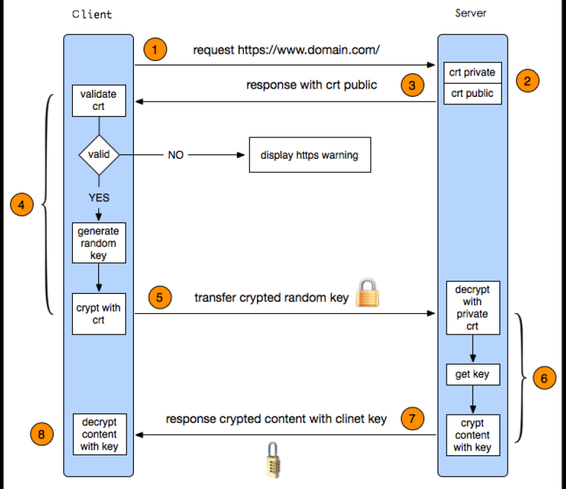

```
https 实现过程如下：
1.客户端发起HTTPS请求：
客户端访问某个web端的https地址，一般都是443端口

2.服务端的配置：
采用https协议的服务器必须要有一套证书，可以通过一些组织申请，也可以自己制作，目前国内很多网站都自己做的，当你访问一个网站的时候提示证书不可信任就表示证书是自己做的，公钥和私钥，就像一把锁和钥匙，正常情况下只有你的钥匙可以打开你的锁，你可以把证书送给别人让他锁住一个箱子，里面放满了钱或秘密，别人不知道里面放了什么而且别人也打不开，只有你的钥匙（私钥）是可以打开的。服务器端保存着私钥，不能将其泄露，公钥（证书）可以发送给任何人。

3.传送证书：
服务端给客户端传递证书，其实就是公钥，里面包含了很多信息，例如证书的颁发机构、过期时间等等。

4.客户端解析证书：
这部分工作是由客户端完成的，首先会验证公钥的有效性，比如颁发机构、过期时间等等，如果发现异常则会弹出一个警告框提示证书可能存在问题，如果证书没有问题就生成一个随机值（对称密钥），然后用证书对该随机值进行非对称加密，就像2步骤所说把随机值锁起来，不让别人看到。

5.传送4步骤的加密数据：
将用证书加密后的随机值传递给服务器，目的就是为了让服务器得到这个随机值（对称密钥），以后客户端和服务端的通信就可以通过这个随机值进行加密解密了。

6.服务端解密信息：
服务端用私钥解密5步骤加密后的随机值之后，得到了客户端传过来的随机值(对称密钥)，然后把内容通过该值进行对称加密，这样除非你知道对称密钥，不然是无法获取其内部的内容，而正好客户端和服务端都知道这个对称密钥，所以只要加密算法够复杂就可以保证数据的安全性。

7.传输加密后的信息:
服务端将用对称密钥加密后的数据传递给客户端，在客户端可以被还原出原数据内容。

8.客户端解密信息：
客户端用之前生成的对称密钥解密服务端传递过来的数据，由于数据一直是加密的，因此即使第三方获取到数据也无法知道其详细内容。
```

#### 4.6.1：ssl 配置参数：

nginx 的https
功能基于模块ngx_http_ssl_module实现，因此如果是编译安装的nginx要使用参数ngx_http_ssl_module开启ssl功能，但是作为nginx的核心功能，yum安装的nginx默认就是开启的，编译安装的nginx需要指定编译参数--with-http_ssl_module开启，官方文档： https://nginx.org/en/docs/http/ngx_http_ssl_module.html，配置参数如下：

```
ssl on | off;
    #为指定的虚拟主机配置是否启用ssl功能，此功能在1.15.0废弃，使用listen [ssl]替代。

ssl_certificate /path/to/file;
    #当前虚拟主机使用使用的公钥文件，一般是crt文件

ssl_certificate_key /path/to/file;
    #当前虚拟主机使用的私钥文件，一般是key文件

ssl_protocols [SSLv2] [SSLv3] [TLSv1] [TLSv1.1] [TLSv1.2];
    #支持ssl协议版本，早期为ssl现在是TSL，默认为后三个

ssl_session_cache off | none | [builtin[:size]] [shared:name:size];
    #配置ssl缓存
        off： 关闭缓存
        none: 通知客户端支持ssl session cache，但实际不支持
        builtin[:size]：使用OpenSSL内建缓存，为每worker进程私有
        [shared:name:size]：在各worker之间使用一个共享的缓存，需要定义一个缓存名称和缓存空间大小，一兆可以存储4000个会话信息，多个虚拟主机可以使用相同的缓存名称。

ssl_session_timeout time;
    #客户端连接可以复用ssl session cache中缓存的有效时长，默认5m
```

#### 4.6.2：自签名 证书：

```
###自签名CA证书
[root@c82 ~]# cd /apps/nginx/
[root@c82 nginx]# mkdir certs
[root@c82 nginx]# cd certs
[root@c82 certs]# openssl req -newkey rsa:4096 -nodes -sha256 -keyout ca.key -x509 -days 3650 -out ca.crt	#自签名CA证书
Generating a RSA private key
.................................................................................++++
..............................................................................
............++++writing new private key to 'ca.key'
-----
You are about to be asked to enter information that will be incorporated
into your certificate request.
What you are about to enter is what is called a Distinguished Name or a DN.
There are quite a few fields but you can leave some blank
For some fields there will be a default value,
If you enter '.', the field will be left blank.
-----
Country Name (2 letter code) [XX]:CN	#国家代码
State or Province Name (full name) []:GD	#省份
Locality Name (eg, city) [Default City]:GZ	#城市名称
Organization Name (eg, company) [Default Company Ltd]:zsjshao.Ltd	#公司名称
Organizational Unit Name (eg, section) []:zsjshao	#部门
Common Name (eg, your name or your server's hostname) []:zsjshao.ca	#通用名称
Email Address []:admin@zsjshao.org	#邮箱

[root@c82 certs]# ll
total 8
-rw-r--r--. 1 root root 2118 Feb 26 02:59 ca.crt
-rw-------. 1 root root 3268 Feb 26 02:57 ca.key
[root@c82 certs]#

###自制key和csr文件
[root@c82 certs]# openssl req -newkey rsa:4096 -nodes -sha256 -keyout www.zsjshao.net.key -out www.zsjshao.net.csr
Generating a RSA private key
.....................................................................................
....++++.................................................++++
writing new private key to 'www.zsjshao.net.key'
-----
You are about to be asked to enter information that will be incorporated
into your certificate request.
What you are about to enter is what is called a Distinguished Name or a DN.
There are quite a few fields but you can leave some blank
For some fields there will be a default value,
If you enter '.', the field will be left blank.
-----
Country Name (2 letter code) [XX]:CN
State or Province Name (full name) []:GD
Locality Name (eg, city) [Default City]:GZ
Organization Name (eg, company) [Default Company Ltd]:zsjshao.net
Organizational Unit Name (eg, section) []:zsjshao.net
Common Name (eg, your name or your server's hostname) []:www.zsjshao.net 
Email Address []:admin@zsjshao.net

Please enter the following 'extra' attributes
to be sent with your certificate request
A challenge password []:
An optional company name []:

[root@c82 certs]# ll
total 16
-rw-r--r--. 1 root root 2118 Feb 26 02:59 ca.crt
-rw-------. 1 root root 3268 Feb 26 02:57 ca.key
-rw-r--r--. 1 root root 1752 Feb 26 03:23 www.zsjshao.net.csr
-rw-------. 1 root root 3272 Feb 26 03:17 www.zsjshao.net.key

###签发证书
[root@c82 certs]# openssl x509 -req -days 3650 -in www.zsjshao.net.csr -CA ca.crt -CAkey ca.key -CAcreateserial -out www.zsjshao.net.crt
Signature ok
subject=C = CN, ST = GD, L = GZ, O = zsjshao.net, OU = zsjshao.net, CN = www.zsjshao.net, emailAddress = admin@zsjshao.net
Getting CA Private Key

###验证证书内容
[root@c82 certs]# openssl x509 -in www.zsjshao.net.crt -noout -text
Certificate:
    Data:
        Version: 1 (0x0)
        Serial Number:
            08:87:f5:bc:09:f7:58:a5:2c:1a:a4:18:59:a1:2d:05:46:19:00:9e
        Signature Algorithm: sha256WithRSAEncryption
        Issuer: C = CN, ST = GD, L = GZ, O = zsjshao.Ltd, OU = zsjshao, CN = zsjshao.ca, emailAddress = admin@zsjshao.org
        Validity
            Not Before: Feb 25 19:39:39 2020 GMT
            Not After : Feb 22 19:39:39 2030 GMT
        Subject: C = CN, ST = GD, L = GZ, O = zsjshao.net, OU = zsjshao.net, CN = www.zsjshao.net, emailAddress = admin@zsjshao.net        
        Subject Public Key Info:
            Public Key Algorithm: rsaEncryption
                RSA Public-Key: (4096 bit)
```

#### 4.6.3：Nginx证书配置：

```
[root@c82 certs]# cat /apps/nginx/conf/conf.d/pc.conf 
server {
    listen 80;
    listen 443 ssl;
    server_name www.zsjshao.net;
    root /data/nginx/html/pc;
    ssl_certificate /apps/nginx/certs/www.zsjshao.net.crt;
    ssl_certificate_key /apps/nginx/certs/www.zsjshao.net.key;
    ssl_session_cache shared:sslcache:20m;
    ssl_session_timeout 10m;
    access_log /apps/nginx/logs/www-zsjshao-net_access.log main;
    error_log /apps/nginx/logs/www-zsjshao-net_error.log;
    location  / {
    }
}
[root@c82 certs]# systemctl restart nginx

[root@c82 certs]# cat /apps/nginx/certs/ca.crt >> /etc/pki/tls/certs/ca-bundle.crt 
[root@c82 certs]# curl https://www.zsjshao.net
pc web page
```

#### 4.6.4：实现多域名HTTPS：

Nginx支持基于单个IP实现多域名的功能，并且还支持单IP多域名的基础之上实现HTTPS，其实是基于Nginx的SNI（Server Name
Indication）功能实现，SNI是为了解决一个Nginx服务器内使用一个IP绑定多个域名和证书的功能，其具体功能是客户端在连接到服务器建立SSL链接之前先发送要访问站点的域名（Hostname），这样服务器再根据这个域名返回给客户端一个合适的证书。

```
[root@c82 certs]# openssl req -newkey rsa:4096 -nodes -sha256 -keyout mobile.zsjshao.net.key -out mobile.zsjshao.net.csr
Generating a RSA private key
..........++++
..................................................................
................++++writing new private key to 'mobile.zsjshao.net.key'
-----
You are about to be asked to enter information that will be incorporated
into your certificate request.
What you are about to enter is what is called a Distinguished Name or a DN.
There are quite a few fields but you can leave some blank
For some fields there will be a default value,
If you enter '.', the field will be left blank.
-----
Country Name (2 letter code) [XX]:CN
State or Province Name (full name) []:GD
Locality Name (eg, city) [Default City]:GZ
Organization Name (eg, company) [Default Company Ltd]:zsjshao.net
Organizational Unit Name (eg, section) []:zsjshao.net
Common Name (eg, your name or your server's hostname) []:mobile.zsjshao.net
Email Address []:admin@zsjshao.net

Please enter the following 'extra' attributes
to be sent with your certificate request
A challenge password []:
An optional company name []:

[root@c82 certs]# openssl x509 -req -days 3650 -in mobile.zsjshao.net.csr -CA ca.crt -CAkey ca.key -CAcreateserial -out mobile.zsjshao.net.crt
Signature ok
subject=C = CN, ST = GD, L = GZ, O = zsjshao.net, OU = zsjshao.net, CN = mobile.zsjshao.net, emailAddress = admin@zsjshao.net
Getting CA Private Key

[root@c82 certs]# openssl x509 -in mobile.zsjshao.net.crt -noout -text
Certificate:
    Data:
        Version: 1 (0x0)
        Serial Number:
            08:87:f5:bc:09:f7:58:a5:2c:1a:a4:18:59:a1:2d:05:46:19:00:9f
        Signature Algorithm: sha256WithRSAEncryption
        Issuer: C = CN, ST = GD, L = GZ, O = zsjshao.Ltd, OU = zsjshao, CN = zsjshao.ca, emailAddress = admin@zsjshao.org
        Validity
            Not Before: Feb 26 08:25:15 2020 GMT
            Not After : Feb 23 08:25:15 2030 GMT
        Subject: C = CN, ST = GD, L = GZ, O = zsjshao.net, OU = zsjshao.net, CN = mobile.zsjshao.net, emailAddress = admin@zsjshao.net        
        Subject Public Key Info:
            Public Key Algorithm: rsaEncryption
                RSA Public-Key: (4096 bit)

[root@c82 certs]# cat /apps/nginx/conf/conf.d/mobile.conf 
server {
    listen 80;
    listen 443 ssl;
    server_name mobile.zsjshao.net;
    ssl_certificate /apps/nginx/certs/mobile.zsjshao.net.crt;
    ssl_certificate_key /apps/nginx/certs/mobile.zsjshao.net.key;
    ssl_session_cache shared:sslcache:20m;
    ssl_session_timeout 10m;
    location / {
        root /data/nginx/html/mobile;
    }
}
[root@c82 certs]# nginx -s reload

[root@c82 certs]# curl https://mobile.zsjshao.net
mobile web page
```

### 4.7：关于favicon.ico：

favicon.ico
文件是浏览器收藏网址时显示的图标，当客户端使用浏览器问页面时，浏览器会自己主动发起请求获取页面的favicon.ico文件，但是当浏览器请求的favicon.ico文件不存在时，服务器会记录404日志，而且浏览器也会显示404报错。

解决办法：

```
###一：服务器不记录访问日志：
   #location = /favicon.ico {
   	#log_not_found off;
   	#access_log off;
   #}
###二：将图标保存到指定目录访问：
   #location ~ ^/favicon\.ico$ {
   location = /favicon.ico {
   	root /data/nginx/html/pc/images;
   }
```

### 4.8：自定义nginx版本信息：

修改并重新编译nginx源码文件，自定义nginx版本信息，

```
如果server_tokens on，修改 src/core/nginx.h 修改第13-14行，如下示例
    #define NGINX_VERSION "1.68.9"
    #define NGINX_VER "zsjshao/" NGINX_VERSION
如果server_tokens off，修改 src/http/ngx_http_header_filter_module.c 第49行，如下示例：
    static char ngx_http_server_string[] = "Server: nginx" CRLF;
    把其中的nginx改为自己想要的文字即可,如：zsjshao
```

## 五：Nginx Rewrite相关功能：

Nginx服务器利用ngx_http_rewrite_module 模块解析和处理rewrite请求，所以说此功能依靠 PCRE(perl compatible regular expression)
，因此编译之前要安装PCRE库，rewrite是nginx服务器的重要功能之一，用于实现URL的重写，URL的重写是非常有用的功能，比如它可以在我们改变网站结构之后，不需要客户端修改原来的书签，也无需其他网站修改我们的链接，就可以正常访问，另外还可以在一定程度上提高网站的安全性。

### 5.1：ngx_http_rewrite_module模块指令：

https://nginx.org/en/docs/http/ngx_http_rewrite_module.html

#### 5.1.1：if指令：

用于条件匹配判断，并根据条件判断结果选择不同的Nginx配置，可以配置在server或location块中进行配置，Nginx的if语法仅能使用if做单次判断，不支持使用if else或者if elif这样的多重判断，用法如下：

```
if （条件匹配） {
    action
}
```

使用正则表达式对变量进行匹配，匹配成功时if指令认为条件为true，否则认为false，变量与表达式之间使用以下符号链接：

```
=： #比较变量和字符串是否相等，相等时if指令认为该条件为true，反之为false。
!=: #比较变量和字符串是否不相等，不相等时if指令认为条件为true，反之为false。

~： #表示在匹配过程中区分大小写字符，（可以通过正则表达式匹配），满足匹配条件为真，不满足为假。
!~：#区分大小写不匹配，不满足为真，满足为假，不满足为真。

~*: #表示在匹配过程中不区分大小写字符，（可以通过正则表达式匹配），满足匹配条件为真，不满足问假。
!~*:#为不区分大小写不匹配，满足为假，不满足为真。

-f 和 !-f: #判断请求的文件是否存在和是否不存在
-d 和 !-d: #判断请求的目录是否存在和是否不存在。
-x 和 !-x: #判断文件是否可执行和是否不可执行。
-e 和 !-e: #判断请求的文件或目录是否存在和是否不存在(包括文件，目录，软链接)。

###实例-1：
   location /main {
      index index.html;
      default_type text/html;
      if ( $scheme = http ){
      	echo "if-----> $scheme";
      }
      if ( $scheme = https ){
      	echo "if ----> $scheme";
      }
      if ( !-f $request_filename ) {
         echo "$request_filename is not exist";
      }
   }
```

注： 如果$变量的值为空字符串或是以0开头的任意字符串，则if指令认为该条件为false，其他条件为true。

#### 5.1.2：set指令：

指定key并给其定义一个变量，变量可以调用Nginx内置变量赋值给key，另外set定义格式为set $key $value，及无论是key还是value都要加$符号。

```
   location /main {
      root /data/nginx/html/pc;
      index index.html;
      default_type text/html;
      set $name zsjshao;
      echo $name;
      set $my_port $server_port;
      echo $my_port;
   }
```

#### 5.1.3：break指令：

用于中断当前相同作用域(location)
中的其他Nginx配置，与该指令处于同一作用域的Nginx配置中，位于它前面的配置生效，位于后面的指令配置就不再生效了，Nginx服务器在根据配置处理请求的过程中遇到该指令的时候，回到上一层作用域继续向下读取配置，该指令可以在server块和location块以及if块中使用，使用语法如下：

```
   location /main {
      root /data/nginx/html/pc;
      index index.html;
      default_type text/html;
      set $name zsjshao;
      echo $name;
      break;
      set $my_port $server_port;
      echo $my_port;
   }
```

#### 5.1.4：return指令：

从nginx版本0.8.2开始支持，return用于完成对请求的处理，并直接向客户端返回响应状态码，比如其可以指定重定向URL(对于特殊重定向状态码，301/302等) 或者是指定提示文本内容(对于特殊状态码403/500等)
，处于此指令后的所有配置都将不被执行，return可以在server、if和location块进行配置，用法如下：

```
return code; #返回给客户端指定的HTTP状态码
return code (text); #返回给客户端的状态码及响应体内容，可以调用变量
return code URL； #返回给客户端的URL地址

例如：
   location /main {
      root /data/nginx/html/pc;
      default_type text/html;
      index index.html;
      if ( $scheme = http ){
         #return 666;
         #return 666 "not allow http";
         #return 301 http://www.baidu.com;
         return 500 "service error";
         echo "if-----> $scheme"; #return后面的将不再执行
      }
      if ( $scheme = https ){
      	echo "if ----> $scheme";
      }
      if ( !-f $request_filename ) {
         return 301 http://www.zsjshao.net;
      }
   }
```

#### 5.1.5：rewrite_log指令：

设置是否开启记录ngx_http_rewrite_module模块日志记录到error_log日志文件当中，可以配置在http、server、location或if当中，需要日志级别为notice 。

```
   location /main {
      index index.html;
      default_type text/html;
      set $name zsjshao;
      echo $name;
      rewrite_log on;
      break;
      set $my_port $server_port;
      echo $my_port;
   }
```

### 5.2：rewrite指令：

通过正则表达式的匹配来改变URI，可以同时存在一个或多个指令，按照顺序依次对URI进行匹配，rewrite主要是针对用户请求的URL或者是URI做具体处理，以下是URL和URI的具体介绍：

```
URI(universal resource identifier)：通用资源标识符，标识一个资源的路径，可以不带协议。
URL(uniform resource location):统一资源定位符，是用于在Internet中描述资源的字符串，是URI的子集，主要包括传输协议(scheme)、主机(IP、端口号或者域名)和资源具体地址(目录和文件名)等三部分，一般格式为 scheme://主机名[:端口号][/资源路径],如：http://www.a.com:8080/path/file/index.html就是一个URL路径，URL必须带访问协议。
每个URL都是一个URI，但是URI不都是URL。

例如：
http://example.org/path/to/resource.txt #URI/URL
ftp://example.org/resource.txt #URI/URL
/absolute/path/to/resource.txt #URI
```

rewrite的官方介绍地址：https://nginx.org/en/docs/http/ngx_http_rewrite_module.html#rewrite，
rewrite可以配置在server、location、if，其具体使用方式为：

```
rewrite regex replacement [flag];
```

rewrite将用户请求的URI基于regex所描述的模式进行检查，匹配到时将其替换为表达式指定的新的URI。
注意：如果在同一级配置块中存在多个rewrite规则，那么会自上而下逐个检查；被某条件规则替换完成后，会重新一轮的替换检查，隐含有循环机制,但不超过10次；如果超过，提示500响应码，[flag]
所表示的标志位用于控制此循环机制，如果替换后的URL是以http://或https://开头，则替换结果会直接以重定向返回给客户端, 即永久重定向301或临时重定向302

#### 5.2.1：rewrite flag使用介绍：

利用nginx的rewrite的指令，可以实现url的重新跳转，rewrtie有四种不同的flag，分别是redirect(临时重定向)、permanent(永久重定向)
、break和last。其中前两种是跳转型的flag，后两种是代理型，跳转型是指有客户端浏览器重新对新地址进行请求，代理型是在WEB服务器内部实现跳转的。

Syntax: rewrite regex replacement [flag]; #通过正则表达式处理用户请求并返回替换后的数据包。

Default: —

Context: server, location, if

```
redirect；
    #临时重定向，重写完成后以临时重定向方式直接返回重写后生成的新URL给客户端，由客户端重新发起请求；使用相对路径,或者http://或https://开头，状态码：302

permanent；
    #重写完成后以永久重定向方式直接返回重写后生成的新URL给客户端，由客户端重新发起请求，状态码：301

last；
    #重写完成后停止对当前URI在当前location中后续的其它重写操作，而后对新的URL启动新一轮重写检查，会再次匹配当前location，不建议在location中使用

break；
    #重写完成后停止对当前URL在当前location中后续的其它重写操作，不会再次匹配当前location，而后直接跳转至当前location配置块之外的其它配置；建议在location中使用
```

#### 5.2.2：rewrite案例-域名永久与临时重定向：

要求：因业务需要，将访问源域名 www.zsjshao.net 的请求永久重定向到www.zsjshao.com。临时重定向不会缓存域名解析记录(A记录)，但是永久重定向会缓存。

```
   location / {
      root /data/nginx/html/pc;
      index index.html;
      rewrite / http://www.zsjshao.com permanent;
      #rewrite / http://www.zsjshao.com redirect;
   }
###重启Nginx并访问域名www.zsjshao.net进行测试
[root@c82 ~]# curl -I http://www.zsjshao.net
HTTP/1.1 301 Moved Permanently
Server: zsjshao/1.0
Date: Wed, 26 Feb 2020 15:28:04 GMT
Content-Type: text/html
Content-Length: 168
Connection: keep-alive
Location: http://www.zsjshao.com
```

##### 5.2.2.1：永久重定向：

域名永久重定向，京东早期的域名 www.360buy.com 由于与360公司类似，于是后期永久重定向到了 www.jd.com ，永久重定向会缓存DNS解析记录。


##### 5.2.2.2：临时重定向：

域名临时重定向，告诉浏览器域名不是固定重定向到当前目标域名，后期可能随时会更改，因此浏览器不会缓存当前域名的解析记录，而浏览器会缓存永久重定向的DNS解析记录，这也是临时重定向与永久重定向最大的本质区别。


#### 5.2.3：rewrite案例--URI 重定向：

要求：访问about中text后缀的请求被转发至txt，而访问txt传递请求再次被转发至html，以此测试last和break分别有什么区别：

##### 5.2.3.1：last与break：

```
last：last会重写URL并且会再次匹配当前location
[root@c82 ~]# cat /apps/nginx/conf/conf.d/pc.conf
server {
    listen 80;
    server_name www.zsjshao.net;
    root /data/nginx/html/pc;
    rewrite_log on;
    location  /about {
        rewrite ^/about/(.*)\.text /about/$1.txt last;
        rewrite ^/about/(.*)\.txt /about/$1.html last;
    }
    location / {
    }
}
[root@c82 ~]# echo /data/nginx/html/pc/about/index.text > /data/nginx/html/pc/about/index.text
[root@c82 ~]# echo /data/nginx/html/pc/about/index.txt > /data/nginx/html/pc/about/index.txt
[root@c82 ~]# echo /data/nginx/html/pc/about/index.html > /data/nginx/html/pc/about/index.html

[root@c82 ~]# nginx -s reload
[root@c82 ~]# curl http://www.zsjshao.net/about/index.text
/data/nginx/html/pc/about/index.html
[root@c82 ~]# 

break: break会重写URL并且不再匹配当前location
[root@c82 ~]# cat /apps/nginx/conf/conf.d/pc.conf
server {
    listen 80;
    server_name www.zsjshao.net;
    root /data/nginx/html/pc;
    rewrite_log on;
    location  /about  {
        rewrite ^/about/(.*)\.text /about/$1.txt break;
        rewrite ^/about/(.*)\.txt /about/$1.html break;
    }
    location / {
    }
}

[root@c82 ~]# nginx -s reload
[root@c82 ~]# curl http://www.zsjshao.net/about/index.text
/data/nginx/html/pc/about/index.txt
[root@c82 ~]# 
```

#### 5.2.4：rewrite案例-自动跳转https:

要求：基于通信安全考虑公司网站要求全站https，因此要求将在不影响用户请求的情况下将http请求全部自动跳转至https，另外也可以实现部分location跳转。

```
[root@c82 ~]# cat /apps/nginx/conf/conf.d/pc.conf
server {
    listen 80;
    listen 443 ssl;
    server_name www.zsjshao.net;
    root /data/nginx/html/pc;
    ssl_certificate /apps/nginx/certs/www.zsjshao.net.crt;
    ssl_certificate_key /apps/nginx/certs/www.zsjshao.net.key;
    ssl_session_cache shared:sslcache:20m;
    ssl_session_timeout 10m;
    rewrite_log on;
    access_log /apps/nginx/logs/www-zsjshao-net_access.log main;
    error_log /apps/nginx/logs/www-zsjshao-net_error.log;
    location  / {
        if ( $scheme = http ) {
            rewrite /(.*) https://www.zsjshao.net/$1 permanent;
        }
    }
}

[root@c82 ~]# nginx -s reload
[root@c82 ~]# curl -LI http://www.zsjshao.net/about/
HTTP/1.1 301 Moved Permanently
Server: zsjshao/1.0
Date: Wed, 26 Feb 2020 15:39:20 GMT
Content-Type: text/html
Content-Length: 168
Connection: keep-alive
Location: https://www.zsjshao.net/about/

HTTP/1.1 200 OK
Server: zsjshao/1.0
Date: Wed, 26 Feb 2020 15:39:20 GMT
Content-Type: text/html
Content-Length: 37
Last-Modified: Tue, 25 Feb 2020 08:10:03 GMT
Connection: keep-alive
ETag: "5e54d65b-25"
Accept-Ranges: bytes
```

如果是因为规则匹配问题导致的陷入死循环，则报错如下：


#### 5.2.5：rewrite案例-判断文件是否存在：

要求：当用户访问到公司网站的时输入了一个错误的URL，可以将用户重定向至官网首页。

```
[root@c82 ~]# cat /apps/nginx/conf/conf.d/pc.conf
server {
    listen 80;
    listen 443 ssl;
    server_name www.zsjshao.net;
    root /data/nginx/html/pc;
    ssl_certificate /apps/nginx/certs/www.zsjshao.net.crt;
    ssl_certificate_key /apps/nginx/certs/www.zsjshao.net.key;
    ssl_session_cache shared:sslcache:20m;
    ssl_session_timeout 10m;
    rewrite_log on;
    access_log /apps/nginx/logs/www-zsjshao-net_access.log main;
    error_log /apps/nginx/logs/www-zsjshao-net_error.log;
    location = / {
    }
    location  / {
        if ( $scheme = http ) {
            rewrite /(.*) https://www.zsjshao.net/$1 permanent;
        }
        if ( !-f $request_filename ) {
            rewrite /(.*) https://www.zsjshao.net/index.html permanent;
        }
    }
}

[root@c82 ~]# nginx -s reload
[root@c82 ~]# curl -L http://www.zsjshao.net/nofile.html
pc web page
```

### 5.3：Nginx防盗链：

防盗链基于客户端携带的referer实现，referer是记录打开一个页面之前记录是从哪个页面跳转过来的标记信息，如果别人只链接了自己网站图片或某个单独的资源，而不是打开了网站的整个页面，这就是盗链，referer就是之前的那个网站域名，正常的referer信息有以下几种：

```
none：请求报文首部没有referer首部，比如用户直接在浏览器输入域名访问web网站，就没有referer信息。
blocked：请求报文有referer首部，但无有效值，比如为空。
server_names：referer首部中包含本主机名及即nginx 监听的server_name。
arbitrary_string：自定义指定字符串，但可使用*作通配符。
regular expression：被指定的正则表达式模式匹配到的字符串,要使用~开头，例如：~.*\.magedu\.com。
```

正常通过搜索引擎搜索web 网站并访问该网站的referer信息如下：

```
[root@c82 ~]# curl -L -e www.baidu.com http://www.zsjshao.net
pc web page
[root@c82 ~]# tail -1 /apps/nginx/logs/www-zsjshao-net_access.log 
172.16.0.130 - - [27/Feb/2020:01:10:02 +0800] "GET /index.html HTTP/1.1" 200 12 "www.baidu.com" "curl/7.61.1" "-" "www.zsjshao.net" 
[root@c82 ~]# 
```

#### 5.3.1：实现web盗链（引用）：

在一个web 站点盗链另一个站点的资源信息，比如图片、视频等。

```
[root@s2 conf.d]# cat /data/nginx/html/pc/index.html
<!DOCTYPE html>
<html lang="en">
<head>
   <meta charset="UTF-8">
   <title>盗链页面</title>
</head>
<body>
<a href="http://www.zsjshao.net">测试盗链</a>

</body>
</html>
```

#### 5.3.2：实现防盗链：

基于访问安全考虑，nginx支持通过ungx_http_referer_module模块 https://nginx.org/en/docs/http/ngx_http_referer_module.html#valid_referers
检查访问请求的referer信息是否有效实现防盗链功能，定义方式如下：

```
[root@s2 ~]# vim /apps/nginx/conf/conf.d/pc.conf
   location /images {
      root /data/nginx/html/pc;
      index index.html;
      valid_referers none blocked server_names
      					*.example.com example.* www.example.org/galleries/
      					~\.google\.;
      if ($invalid_referer) {
      	return 403;
   }
```

## 六：Nginx 反向代理功能：

反向代理：反向代理也叫reverse proxy，指的是代理外网用户的请求到内部的指定web服务器，并将数据返回给用户的一种方式，这是用的比较多的一种方式。

Nginx除了可以在企业提供高性能的web服务之外，另外还可以将本身不具备的请求通过某种预定义的协议转发至其它服务器处理，不同的协议就是Nginx服务器与其他服务器进行通信的一种规范，主要在不同的场景使用以下模块实现不同的功能：

```
ngx_http_proxy_module： 将客户端的请求以http协议转发至指定服务器进行处理。
ngx_stream_proxy_module：将客户端的请求以tcp协议转发至指定服务器处理。
ngx_http_fastcgi_module：将客户端对php的请求以fastcgi协议转发至指定服务器处理。
ngx_http_uwsgi_module：将客户端对Python的请求以uwsgi协议转发至指定服务器处理。
```

逻辑调用关系：


### 6.1：实现http反向代理：

要求：将用户对域 www.zsjshao.net 的请求转发至后端服务器处理，官方文档： https://nginx.org/en/docs/http/ngx_http_proxy_module.html，

环境准备：

```
172.16.0.129 #Nginx代理服务器
172.16.0.130 #后端web A，Apache部署
172.16.0.131 #后端web B，Apache部署
```

访问逻辑图：


#### 6.1.1：部署后端Apache服务器：

```
[root@c82 ~]# yum install httpd -y
[root@c82 ~]# echo "web1 172.16.0.130" > /var/www/html/index.html
[root@c82 ~]# systemctl start httpd && systemctl enable httpd

[root@c83 ~]# yum install httpd -y
[root@c83 ~]# echo "web2 172.16.0.131" > /var/www/html/index.html
[root@c83 ~]# systemctl start httpd && systemctl enable httpd

###访问测试
[root@c81 ~]# curl http://172.16.0.130
web1 172.16.0.130
[root@c81 ~]# curl http://172.16.0.131
web2 172.16.0.131
```

#### 6.1.2：Nginx http 反向代理入门：

官方文档：https://nginx.org/en/docs/http/ngx_http_proxy_module.html#proxy_pass

##### 6.2.1.1：反向代理配置参数：

```
proxy_pass；
    #用来设置将客户端请求转发给后端服务器的主机，可以是主机名、IP地址:端口的方式，也可以代理到预先设置的主机群组，需要模块ngx_http_upstream_module支持。
   location /web {
        index index.html;
        proxy_pass http://172.16.0.130:80;
        #不带斜线将访问的/web,等于访问后端服务器 http://172.16.0.130:80/web/index.html，即后端服务器配置的站点根目录要有web目录才可以被访问，这是一个追加/web到后端服务器http://servername:port/WEB/INDEX.HTML的操作
        proxy_pass http://172.16.0.130:80/;
        #带斜线，等于访问后端服务器的http://172.16.0.130:80/index.html 内容返回给客户端
   }

###重启Nginx测试访问效果：
### curl -L http://www.zsjshao.net/web/index.html
```

```
proxy_set_header；
    #可以更改或添加客户端的请求头部信息内容并转发至后端服务器，比如在后端服务器想要获取客户端的真实IP的时候，就要更改每一个报文的头部，如下：
    proxy_set_header X-Forwarded-For $proxy_add_x_forwarded_for;
    #proxy_set_header HOST $remote_addr;
    #添加HOST到报文头部，如果客户端为NAT上网那么其值为客户端的共用的公网IP地址。主要用于后端服务器记录日志

proxy_hide_header field;
    #用于隐藏后端服务器特定的响应首部，默认nginx在响应报文中不传递后端服务器的首部字段Date, Server, XPad,X-Accel等
   location /web {
   	index index.html;
   	proxy_pass http://192.168.7.103:80;
		proxy_hide_header ETag;
	}
```

```
proxy_pass_request_body on | off；
    #是否向后端服务器发送HTTP包体部分,可以设置在http/server或location块，默认即为开启
proxy_pass_request_headers on | off；
    #是否将客户端的请求头部转发给后端服务器，可以设置在http/server或location块，默认即为开启

proxy_connect_timeout time；
    #配置nginx服务器与后端服务器尝试建立连接的超时时间，默认为60秒，用法如下：
    
    proxy_connect_timeout 60s；
    #60s为自定义nginx与后端服务器建立连接的超时时间

proxy_read_time time；
    #配置nginx服务器向后端服务器或服务器组发起read请求后，等待的超时时间，默认60s
proxy_send_time time；
    #配置nginx向后端服务器或服务器组发起write请求后，等待的超时时间，默认60s

proxy_http_version 1.0；
    #用于设置nginx提供代理服务的HTTP协议的版本，默认http 1.0

proxy_ignore_client_abort off；
    #当客户端网络中断请求时，nginx服务器中断其对后端服务器的请求。即如果此项设置为on开启，则服务器会忽略客户端中断并一直等着代理服务执行返回，如果设置为off，则客户端中断后Nginx也会中断客户端请求并立即记录499日志，默认为off。

proxy_headers_hash_bucket_size 64；
    #当配置了 proxy_hide_header和proxy_set_header的时候，用于设置nginx保存HTTP报文头的hash表的上限。
proxy_headers_hash_max_size 512；
    #设置proxy_headers_hash_bucket_size的最大可用空间
server_namse_hash_bucket_size 512;
    #server_name hash表申请空间大小
server_names_hash_max_szie 512;
    #设置服务器名称hash表的上限大小
```

##### 6.1.2.2：反向代理示例--单台web服务器：

```
[root@c81 ~]# cat /apps/nginx/conf/conf.d/pc.conf
server {
    listen 80;
    server_name www.zsjshao.net;
    root /data/nginx/html/pc;
    location / {
    }
    location /web {
        proxy_pass http://172.16.0.130:80/;
    }
}
###重启Nginx并访问测试
```

##### 6.1.2.3：反向代理示例--指定location：

```
[root@c81 ~]# cat /apps/nginx/conf/conf.d/pc.conf
server {
    listen 80;
    server_name www.zsjshao.net;
    root /data/nginx/html/pc;
    location / {
    }
    location /web {
        #proxy_pass http://172.16.0.130:80/; #注意有后面的/
        proxy_pass http://172.16.0.130:80;
    }
}

[root@c82 ~]# mkdir /var/www/html/web
[root@c82 ~]# echo "web1 page for apache" > /var/www/html/web/index.html
[root@c83 ~]# mkdir /var/www/html/web
[root@c83 ~]# echo "web2 page for apache" > /var/www/html/web/index.html

###重启Nginx并访问测试：
[root@c81 ~]# curl http://www.zsjshao.net/web/
web1 page for apache
```

##### 6.1.2.4：反向代理示例--缓存功能：

缓存功能默认关闭状态

```
proxy_cache zone | off; 默认off
    #指明调用的缓存，或关闭缓存机制；Context:http, server, location

proxy_cache_key string;
    #缓存中用于“键”的内容，默认值：proxy_cache_key $scheme$proxy_host$request_uri;

proxy_cache_valid [code ...] time;
    #定义对特定响应码的响应内容的缓存时长，定义在http{...}中
   示例:
   proxy_cache_valid 200 302 10m;
   proxy_cache_valid 404 1m;

proxy_cache_path;
    定义可用于proxy功能的缓存；Context:http
    proxy_cache_path path [levels=levels] [use_temp_path=on|off] keys_zone=name:size [inactive=time] [max_size=size] [manager_files=number] [manager_sleep=time] [manager_threshold=time] [loader_files=number] [loader_sleep=time] [loader_threshold=time] [purger=on|off] [purger_files=number] [purger_sleep=time] [purger_threshold=time];

    示例：在http配置定义缓存信息
        proxy_cache_path /var/cache/nginx/proxy_cache #定义缓存保存路径，proxy_cache会自动创      建
        levels=1:2:2 #定义缓存目录结构层次，1:2:2可以生成2^4x2^8x2^8=1048576个目录
        keys_zone=proxycache:20m #指内存中缓存的大小，主要用于存放key和metadata（如：使用次数）
        inactive=120s； #缓存有效时间
        max_size=1g; #最大磁盘占用空间，磁盘存入文件内容的缓存空间最大值

###调用缓存功能，需要定义在相应的配置段，如server{...}；或者location等
   proxy_cache proxycache;
   proxy_cache_key $request_uri;
   proxy_cache_valid 200 302 301 1h;
   proxy_cache_valid any 1m;

proxy_cache_use_stale;
    #在被代理的后端服务器出现哪种情况下，可直接使用过期的缓存响应客户端，
    proxy_cache_use_stale error | timeout | invalid_header | updating | http_500 | http_502 | http_503 | http_504 | http_403 | http_404 | off ; #默认是off

proxy_cache_methods GET | HEAD | POST ...;
    #对哪些客户端请求方法对应的响应进行缓存，GET和HEAD方法总是被缓存

proxy_set_header field value;
    #设定发往后端主机的请求报文的请求首部的值
    Context: http, server, location
    proxy_set_header X-Real-IP $remote_addr;
    proxy_set_header X-Forwarded-For $proxy_add_x_forwarded_for;
        请求报文的标准格式如下：
        X-Forwarded-For: client1, proxy1, proxy2
```

###### # 6.1.2.4.1：非缓存场景压测：

```
[root@c81 ~]# scp /apps/nginx/logs/access.log 172.16.0.130:/var/www/html/log.html
[root@c81 ~]# ab -n 2000 -c 200 http://www.zsjshao.net/web/log.html
   Total transferred:      19646933892 bytes
   HTML transferred:       19646415231 bytes
   Requests per second:    12.80 [#/sec] (mean)
   Time per request:       15622.518 [ms] (mean)
   Time per request:       78.113 [ms] (mean, across all concurrent requests)
   Transfer rate:          122812.85 [Kbytes/sec] received
```

###### # 6.1.2.4.2：准备缓存配置：

```
[root@c81 ~]# vim /apps/nginx/conf/nginx.conf
    proxy_cache_path /data/nginx/proxy_cache levels=1:2:2 keys_zone=proxycache:20m inactive=120s max_size=1g;

[root@c81 ~]# cat /apps/nginx/conf/conf.d/pc.conf
server {
    listen 80;
    server_name www.zsjshao.net;
    root /data/nginx/html/pc;
    location / {
    }
    location /web {
        proxy_pass http://172.16.0.130:80;
        proxy_cache proxycache;
        proxy_cache_key $request_uri;
        proxy_cache_valid 200 302 301 1h;
        proxy_cache_valid any 1m;
    }
}
[root@c81 ~]# mkdir /data/nginx/ -p 
[root@c81 ~]# chown nginx.nginx /data/nginx/
[root@c81 ~]# nginx -s reload
```

###### # 6.2.1.4.3：访问并验证缓存文件：

```
###访问web并验证缓存目录
[root@c81 ~]# curl http://172.16.0.130/web/log.html
[root@c81 ~]# ab -n 2000 -c 200 http://www.zsjshao.net/web/log.html
   Total transferred:      19779162000 bytes
   HTML transferred:       19778642000 bytes
   Requests per second:    57.37 [#/sec] (mean)
   Time per request:       3486.110 [ms] (mean)
   Time per request:       17.431 [ms] (mean, across all concurrent requests)
   Transfer rate:          554072.88 [Kbytes/sec] received

###验证缓存目录结构及文件大小
[root@c81 ~]# tree /data/nginx/proxycache/
/data/nginx/proxycache/
└── f
    └── 60
        └── b0
            └── 50b643197ae7d66aaaa5e7e1961b060f

3 directories, 1 file
[root@c81 ~]#
[root@c81 ~]# ll -h /data/nginx/proxycache/f/60/b0/50b643197ae7d66aaaa5e7e1961b060f 
-rw-------. 1 nginx nginx 9.5M Feb 27 22:24 /data/nginx/proxycache/f/60/b0/50b643197ae7d66aaaa5e7e1961b060f

###验证文件内容：
[root@c81 ~]# head -20 /data/nginx/proxycache/f/60/b0/50b643197ae7d66aaaa5e7e1961b060f
³ޗ^¶ϗ^£З^牤r"96e629-59f8f7479f22d"
KEY: /web/log.html
HTTP/1.1 200 OK
Date: Thu, 27 Feb 2020 14:26:43 GMT
Server: Apache/2.4.37 (centos)
Last-Modified: Thu, 27 Feb 2020 14:22:46 GMT
ETag: "96e629-59f8f7479f22d"
Accept-Ranges: bytes
Content-Length: 9889321
Connection: close
Content-Type: text/html; charset=UTF-8

172.16.0.1 - - [21/Feb/2020:23:32:43 +0800] "GET /echo HTTP/1.1" 200 38 "-" "Mozilla/5.0 (Windows NT 10.0; Win64; x64) AppleWebKit/537.36 (KHTML, lik
e Gecko) Chrome/79.0.3945.88 Safari/537.36 chrome-extension"
```

##### 6.1.2.5：添加头部报文信息：

nginx基于模块ngx_http_headers_module可以实现对头部报文添加指定的key与值， https://nginx.org/en/docs/http/ngx_http_headers_module.html，

```
Syntax: add_header name value [always];
Default: —
Context: http, server, location, if in location

###添加自定义首部，如下：
   add_header name value [always];
   add_header X-Via $server_addr;
   add_header X-Cache $upstream_cache_status;
   add_header X-Accel $server_name;
   add_trailer name value [always];
   添加自定义响应信息的尾部， 1.13.2版后支持
```

###### # 6.1.2.5.1：Nginx配置：

```
    location /web {
        proxy_pass http://172.16.0.130:80;
        proxy_cache proxycache;
        proxy_cache_key $request_uri;
        proxy_cache_valid 200 302 301 1h;
        proxy_cache_valid any 1m;
        add_header X-Via $server_addr;
        add_header X-Cache $upstream_cache_status;
        add_header X-Accel $server_name;
    }
```

###### # 6.1.2.5.2：验证头部信息：

```
[root@c81 ~]# curl -I http://www.zsjshao.net/web/index.html
HTTP/1.1 200 OK
Server: nginx/1.16.1
Date: Thu, 27 Feb 2020 14:33:51 GMT
Content-Type: text/html; charset=UTF-8
Content-Length: 21
Connection: keep-alive
Last-Modified: Thu, 27 Feb 2020 14:00:54 GMT
ETag: "15-59f8f264447a1"
X-Via: 172.16.0.129
X-Cache: MISS
X-Accel: www.zsjshao.net
Accept-Ranges: bytes

[root@c81 ~]# curl -I http://www.zsjshao.net/web/index.html
HTTP/1.1 200 OK
Server: nginx/1.16.1
Date: Thu, 27 Feb 2020 14:33:55 GMT
Content-Type: text/html; charset=UTF-8
Content-Length: 21
Connection: keep-alive
Last-Modified: Thu, 27 Feb 2020 14:00:54 GMT
ETag: "15-59f8f264447a1"
X-Via: 172.16.0.129
X-Cache: HIT
X-Accel: www.zsjshao.net
Accept-Ranges: bytes
```

#### 6.1.3：Nginx http 反向代理高级应用：

在上一个章节中Nginx可以将客户端的请求转发至单台后端服务器但是无法转发至特定的一组的服务器，而且不能对后端服务器提供相应的服务器状态监测，但是Nginx可以基于ngx_http_upstream_module模块提供服务器分组转发、权重分配、状态监测、调度算法等高级功能，官方文档：https://nginx.org/en/docs/http/ngx_http_upstream_module.html

##### 6.1.3.1：http upstream配置参数：

```
upstream name {
}
      #自定义一组服务器，配置在http内
server address [parameters];
      #配置一个后端web服务器，配置在upstream内，至少要有一个server服务器配置。
      #server支持的parameters如下：
      weight=number #设置权重，默认为1。
      max_conns=number #给当前server设置最大活动链接数，默认为0表示没有限制。
      max_fails=number #对后端服务器连续监测失败多少次就标记为不可用。
      fail_timeout=time #对后端服务器的单次监测超时时间，默认为10秒。
      backup #设置为备份服务器，当所有服务器不可用时将重新启用次服务器。
      down #标记为down状态。
      resolve #当server定义的是主机名的时候，当A记录发生变化会自动应用新IP而不用重启Nginx。
```

```
hash KEY consistent；
    #基于指定key做hash计算，使用consistent参数，将使用ketama一致性hash算法，适用于后端是Cache服务器（如varnish）时使用，consistent定义使用一致性hash运算，一致性hash基于取模运算。
所谓取模运算，就是计算两个数相除之后的余数，比如10%7=3, 7%4=3
hash $request_uri consistent; 
    #基于用户请求的uri做hash
```


```
ip_hash；
    #源地址hash调度方法，基于的客户端的remote_addr(源地址)做hash计算，以实现会话保持，

least_conn;
    #最少连接调度算法，优先将客户端请求调度到当前连接最少的后端服务器
```

##### 6.1.3.2：反向代理示例--多台web服务器：

```
[root@c81 ~]# cat /apps/nginx/conf/conf.d/pc.conf
upstream websrvs {
    #hash $request_uri consistent;	#consistent 一致性hash算法
    server 172.16.0.130:80 weight=1 fail_timeout=5s max_fails=3;
    server 172.16.0.131:80 weight=1 fail_timeout=5s max_fails=3;
    server 127.0.0.1:80 weight=1 fail_timeout=5s max_fails=3 backup;
}

server {
    listen 127.0.0.1:80;
    root /data/nginx/sorry;
    location / {
    }
}

server {
    listen 80;
    server_name www.zsjshao.net;
    root /data/nginx/html/pc;
    location / {
        proxy_pass http://websrvs;
        proxy_set_header X-Forwarded-For $proxy_add_x_forwarded_for; #添加客户端IP到报文头
部
    }
}

[root@c81 ~]# mkdir /data/nginx/sorry
[root@c81 ~]# echo /data/nginx/sorry/index.html > /data/nginx/sorry/index.html
[root@c81 ~]# nginx -s reload

[root@c81 ~]# curl http://www.zsjshao.net/web/
web1 page for apache
[root@c81 ~]# curl http://www.zsjshao.net/web/
web2 page for apache

关闭后端172.16.0.130和172.16.0.131的apache服务
[root@c81 ~]# curl http://www.zsjshao.net
/data/nginx/sorry/index.html
```

##### 6.1.3.3：反向代理示例--客户端IP透传：

```
[root@c81 ~]# cat /apps/nginx/conf/conf.d/pc.conf
upstream websrvs {
    #hash $request_uri consistent;	#consistent 一致性hash算法
    server 172.16.0.130:80 weight=1 fail_timeout=5s max_fails=3;
    server 172.16.0.131:80 weight=1 fail_timeout=5s max_fails=3;
    server 127.0.0.1:80 weight=1 fail_timeout=5s max_fails=3 backup;
}

server {
    listen 127.0.0.1:80;
    root /data/nginx/sorry;
    location / {
    }
}

server {
    listen 80;
    server_name www.zsjshao.net;
    root /data/nginx/html/pc;
    location / {
        proxy_pass http://websrvs;
        proxy_set_header X-Forwarded-For $proxy_add_x_forwarded_for; #添加客户端IP到报文头部
    }
}

[root@c81 ~]# nginx -s reload

###后端web服务器配置
1、Apache:
[root@c82 ~]# vim /etc/httpd/conf/httpd.conf
LogFormat "%{X-Forwarded-For}i %h %l %u %t \"%r\" %>s %b \"%{Referer}i\" \"%{User-Agent}i\"" combined
###重启apache访问web界面并验证apache日志：
172.16.0.1 172.16.0.129 - - [27/Feb/2020:23:54:16 +0800] "GET /index.html HTTP/1.0" 200 18 "-" "Mozilla/5.0 (Windows NT 10.0; Win64; x64) AppleWebKit/537.36 (KHTML, like Gecko) Chrome/79.0.3945.88 Safari/537.36 chrome-extension"

2、Nginx：
[root@c82 ~]# cat /apps/nginx/conf/nginx.conf
"$http_x_forwarded_for"' #默认日志格式就有此配置

重启nginx访问web界面并验证日志格式：
172.16.0.129 - - [28/Feb/2020:00:03:06 +0800] "GET /index.html HTTP/1.0" 304 0 "-" "Mozilla/5.0 (Windows NT 10.0; Win64; x64) AppleWebKit/537.36 (KHT
ML, like Gecko) Chrome/79.0.3945.88 Safari/537.36 chrome-extension" "172.16.0.1"
```

#### 6.1.4：实现动静分离：

要求：将客户端对静态文件的请求直接由nginx响应，其他文件转给后端服务器。

```
[root@c81 ~]# cat /apps/nginx/conf/conf.d/pc.conf
upstream websrvs {
    #hash $request_uri consistent;
    server 172.16.0.130:80 weight=1 fail_timeout=5s max_fails=3;
    server 172.16.0.131:80 weight=1 fail_timeout=5s max_fails=3;
    server 127.0.0.1:80 weight=1 fail_timeout=5s max_fails=3 backup;
}

server {
    listen 127.0.0.1:80;
    root /data/nginx/sorry;
    location / {
    }
}

server {
    listen 80;
    server_name www.zsjshao.net;
    root /data/nginx/html/pc;
    location / {
        proxy_pass http://websrvs;
        proxy_set_header X-Forwarded-For $proxy_add_x_forwarded_for; #添加客户端IP到报文头部
    }
    location ~* \.(gif|jpg|jpeg|bmp|png|tiff|tif|ico|wmf|js)$ {
        root /data/nginx/html/image/static;
    }
}

[root@c81 ~]# mkdir /data/nginx/html/image/static -p
[root@c81 ~]# echo /data/nginx/html/image/static/ds.js > /data/nginx/html/image/static/ds.js
[root@c81 ~]# nginx -s reload
[root@c81 ~]# curl http://www.zsjshao.net/ds.js
/data/nginx/html/image/static/ds.js
[root@c81 ~]# curl http://www.zsjshao.net/index.html
web1 172.16.0.130
[root@c81 ~]# curl http://www.zsjshao.net/index.html
web2 172.16.0.131
```

### 6.2：实现Nginx tcp负载均衡：

Nginx在1.9.0版本开始支持tcp模式的负载均衡，在1.9.13版本开始支持udp协议的负载，udp主要用于DNS的域名解析，其配置方式和指令和http
代理类似，其基于ngx_stream_proxy_module模块实现tcp负载，另外基于模块ngx_stream_upstream_module实现后端服务器分组转发、权重分配、状态监测、调度算法等高级功能。

官方文档：https://nginx.org/en/docs/stream/ngx_stream_core_module.html

#### 6.2.1：tcp负载均衡配置参数：

```
stream {					#定义stream
   upstream backend {				#定义后端服务器
      hash $remote_addr consistent;		#定义调度算法
      server backend1.example.com:12345 weight=5; #定义具体server
      server 127.0.0.1:12345 max_fails=3 fail_timeout=30s;
      server unix:/tmp/backend3;
   }
   upstream dns {			#定义后端服务器
      server 192.168.0.1:53535; 	#定义具体server
      server dns.example.com:53;
   }
   server {					#定义server
      listen 12345;				#监听IP:PORT
      proxy_connect_timeout 1s;	#连接超时时间
      proxy_timeout 3s;				#转发超时时间
      proxy_pass backend;			#转发到具体服务器组
   }
   server {
      listen 127.0.0.1:53 udp reuseport;
      proxy_timeout 20s;
      proxy_pass dns;
   }
   server {
      listen [::1]:12345;
      proxy_pass unix:/tmp/stream.socket;
   }
}
```

#### 6.2.2：负载均衡实例--Redis：

服务器安装redis

```
[root@c82 ~]# yum install redis -y
[root@c82 ~]# vim /etc/redis.conf
bind 0.0.0.0
......
[root@c82 ~]# systemctl start redis && systemctl enable redis
[root@c82 ~]# redis-cli -h 172.16.0.130
172.16.0.130:6379> set name jack
OK
172.16.0.130:6379> get name
"jack"
172.16.0.130:6379> quit

[root@c83 ~]# yum install redis -y
[root@c83 ~]# vim /etc/redis.conf
bind 0.0.0.0
......
[root@c83 ~]# systemctl start redis && systemctl enable redis
[root@c83 ~]# redis-cli -h 172.16.0.131
172.16.0.131:6379> set name rose
OK
172.16.0.131:6379> get name
"rose"
172.16.0.131:6379>
```

nginx配置：

```
[root@c82 ~]# mkdir /apps/nginx/conf/tcp
[root@c82 ~]# cat /apps/nginx/conf/tcp/redis.conf
stream {
    upstream redis_srv {
        server 172.16.0.130:6379 max_fails=3 fail_timeout=30s;
        server 172.16.0.131:6379 max_fails=3 fail_timeout=30s;
    }

    server {
        listen 6379;
        proxy_connect_timeout 3s;
        proxy_timeout 3s;
        proxy_pass redis_srv;
    }
}
[root@c81 ~]# vim /apps/nginx/conf/nginx.conf
    include /apps/nginx/conf/tcp/*.conf;	#注意此处的include与http模块平级
[root@c81 ~]# nginx -s reload

###测试通过nginx 负载连接redis：
[root@c81 ~]# yum install redis -y
[root@c81 ~]# redis-cli -h 172.16.0.129
172.16.0.129:6379> get name
"rose"
172.16.0.129:6379> quit
[root@c81 ~]# redis-cli -h 172.16.0.129
172.16.0.129:6379> get name
"jack"
172.16.0.129:6379>
```

### 6.3：实现FastCGI：

CGI的由来：

最早的Web服务器只能简单地响应浏览器发来的HTTP请求，并将存储在服务器上的HTML文件返回给浏览器，也就是静态html文件，但是后期随着网站功能增多网站开发也越来越复杂，以至于出现动态技术，比如像php(1995年)、java(
1995)、python(1991)语言开发的网站，但是nginx/apache服务器并不能直接运行
php、java这样的文件，apache实现的方式是打补丁，但是nginx通过与第三方基于协议实现，即通过某种特定协议将客户端请求转发给第三方服务处理，第三方服务器会新建新的进程处理用户的请求，处理完成后返回数据给Nginx并回收进程，最后nginx在返回给客户端，那这个约定就是通用网关接口(
common gateway interface，简称CGI)，CGI（协议）是web服务器和外部应用程序之间的接口标准，是cgi程序和web服务器之间传递信息的标准化接口。


为什么FastCGI？

CGI协议虽然解决了语言解析器和seb server之间通讯的问题，但是它的效率很低，因为web
server每收到一个请求都会创建一个CGI进程，PHP解析器都会解析php.ini文件，初始化环境，请求结束的时候再关闭进程，对于每一个创建的CGI进程都会执行这些操作，所以效率很低，而FastCGI是用来提高CGI性能的，FastCGI每次处理完请求之后不会关闭掉进程，而是保留这个进程，使这个进程可以处理多个请求。这样的话每个请求都不用再重新创建一个进程了，大大提升了处理效率。

什么是PHP-FPM？

PHP-FPM(FastCGI Process Manager：FastCGI进程管理器)
是一个实现了Fastcgi的程序，并且提供进程管理的功能。进程包括master进程和worker进程。master进程只有一个，负责监听端口，接受来自webserver的请求。worker进程一般会有多个，每个进程中会嵌入一个PHP解析器，进行PHP代码的处理。

#### 6.3.1：FastCGI配置指令：

Nginx基于模块ngx_http_fastcgi_module实现通过fastcgi协议将指定的客户端请求转发至php-fpm处理，其配置指令如下：

```
fastcgi_pass address;
    #转发请求到后端服务器，address为后端的fastcgi server的地址，可用位置：location, if in location

fastcgi_index name;
    #fastcgi默认的主页资源，示例：fastcgi_index index.php;

fastcgi_param parameter value [if_not_empty];
    #设置传递给FastCGI服务器的参数值，可以是文本，变量或组合，可用于将Nginx的内置变量赋值给自定义key
   fastcgi_param REMOTE_ADDR $remote_addr; #客户端源IP
   fastcgi_param REMOTE_PORT $remote_port; #客户端源端口
   fastcgi_param SERVER_ADDR $server_addr; #请求的服务器IP地址
   fastcgi_param SERVER_PORT $server_port; #请求的服务器端口
   fastcgi_param SERVER_NAME $server_name; #请求的server name

Nginx默认配置示例：
   location ~ \.php$ {
      root html;
      fastcgi_pass 127.0.0.1:9000;
      fastcgi_index index.php;
      fastcgi_param SCRIPT_FILENAME /scripts$fastcgi_script_name; #默认脚本路径
      include fastcgi_params;
   }
```

缓存定义指令：

```
fastcgi_cache_path path [levels=levels] [use_temp_path=on|off] keys_zone=name:size [inactive=time] [max_size=size] [manager_files=number] [manager_sleep=time] [manager_threshold=time] [loader_files=number] [loader_sleep=time] [loader_threshold=time] [purger=on|off] [purger_files=number] [purger_sleep=time] [purger_threshold=time];
定义fastcgi的缓存；
   path					#缓存位置为磁盘上的文件系统路径
   max_size=size 		#磁盘path路径中用于缓存数据的缓存空间上限
   levels=levels		#缓存目录的层级数量，以及每一级的目录数量，levels=ONE:TWO:THREE，示例：   leves=1:2:2
   keys_zone=name:size	#设置缓存名称及k/v映射的内存空间的名称及大小
   inactive=time		#缓存有效时间，默认10分钟，需要在指定时间满足fastcgi_cache_min_uses 次数被   视为活动缓存。
```

```
fastcgi_cache zone | off;
    #调用指定的缓存空间来缓存数据，可用位置：http, server, location

fastcgi_cache_key string;
    #定义用作缓存项的key的字符串，示例：fastcgi_cache_key $request_uri;

fastcgi_cache_methods GET | HEAD | POST ...;
    #为哪些请求方法使用缓存

fastcgi_cache_min_uses number;
    #缓存空间中的缓存项在inactive定义的非活动时间内至少要被访问到此处所指定的次数方可被认作活动项

fastcgi_keep_conn on | off;
    #收到后端服务器响应后，fastcgi服务器是否关闭连接，建议启用长连接

fastcgi_cache_valid [code ...] time;
    #不同的响应码各自的缓存时长

fastcgi_hide_header field;
    #隐藏响应头指定信息
fastcgi_pass_header field;
    #返回响应头指定信息，默认不会将Status、X-Accel-...返回
```

#### 6.3.2：FastCGI示例--Nginx与php-fpm在同一服务器：

php安装可以通过yum或者编译安装，使用yum安装相对比较简单，编译安装更方便自定义参数或选项。

##### 6.3.2.1：php环境准备：

使用base源自带的php版本

```
[root@c81 ~]# yum install php-fpm php-mysql -y	#CentOS 8连接mysql的php程序包名为php-mysqlnd
[root@c81 ~]# systemctl start php-fpm && systemctl enable php-fpm
[root@c81 ~]# ps -ef | grep php-fpm
root      14461      1  0 02:08 ?        00:00:00 php-fpm: master process (/etc/php-fpm.conf)
apache    14462  14461  0 02:08 ?        00:00:00 php-fpm: pool www
apache    14463  14461  0 02:08 ?        00:00:00 php-fpm: pool www
apache    14464  14461  0 02:08 ?        00:00:00 php-fpm: pool www
apache    14465  14461  0 02:08 ?        00:00:00 php-fpm: pool www
apache    14466  14461  0 02:08 ?        00:00:00 php-fpm: pool www
root      14489  10998  0 02:08 pts/0    00:00:00 grep --color=auto php-fpm
```

##### 6.3.2.2：php相关配置优化：

```
[root@c81 ~]# grep "^[a-Z]" /etc/php-fpm.conf
include=/etc/php-fpm.d/*.conf
pid = /run/php-fpm/php-fpm.pid
error_log = /var/log/php-fpm/error.log
daemonize = yes #是否后台启动

[root@c81 ~]# cat /etc/php-fpm.d/www.conf
[www]
listen = 127.0.0.1:9000 #监听地址及IP
listen.allowed_clients = 127.0.0.1 #允许客户端从哪个源IP地址访问，要允许所有行首加 ;注释即可
user = nginx #php-fpm启动的用户和组，会涉及到后期文件的权限问题
group = nginx
pm = dynamic #动态模式进程管理
pm.max_children = 500 #静态方式下开启的php-fpm进程数量，在动态方式下他限定php-fpm的最大进程数
pm.start_servers = 100 #动态模式下初始进程数，必须大于等于pm.min_spare_servers和小于等于pm.max_children的值。
pm.min_spare_servers = 100 #最小空闲进程数
pm.max_spare_servers = 200 #最大空闲进程数
pm.max_requests = 500000 #进程累计请求回收值，会重启
pm.status_path = /pm_status #状态访问URL
ping.path = /ping #ping访问动地址
ping.response = ping-pong #ping返回值
slowlog = /var/log/php-fpm/www-slow.log #慢日志路径
php_admin_value[error_log] = /var/log/php-fpm/www-error.log #错误日志
php_admin_flag[log_errors] = on
php_value[session.save_handler] = files #phpsession保存方式及路径
php_value[session.save_path] = /var/lib/php/session #当时使用file保存session的文件路径
```

注意：CentOS 8的php-fpm默认监听在unix套接字上。

修改配置文件后记得重启php-fpm

[root@c81 ~]# systemctl restart php-fpm

##### 6.3.2.3：准备php测试页面：

```
[root@c81 ~]# mkdir /data/nginx/php
[root@c81 ~]# cat /data/nginx/php/index.php
<?php
    phpinfo();
?>
```

##### 6.3.2.4：Nginx配置转发：

Nginx安装完成之后默认生成了与fastcgi的相关配置文件，一般保存在nginx的安装路径的conf目录当中，比如/apps/nginx/conf/fastcgi.conf、/apps/nginx/conf/fastcgi_params。

```
    location ~ \.php$ {
        root /data/nginx/php; #$document_root调用root目录
        fastcgi_pass 127.0.0.1:9000;
        fastcgi_index index.php;
        #fastcgi_param SCRIPT_FILENAME /data/nginx/php$fastcgi_script_name;
        fastcgi_param SCRIPT_FILENAME $document_root$fastcgi_script_name;
        #如果SCRIPT_FILENAME是绝对路径则可以省略root /data/nginx/php;
        include fastcgi_params;
    }

###重启Nginx并访问web测试
systemctl restart nginx
```

##### 6.3.2.5：访问验证php测试页面：

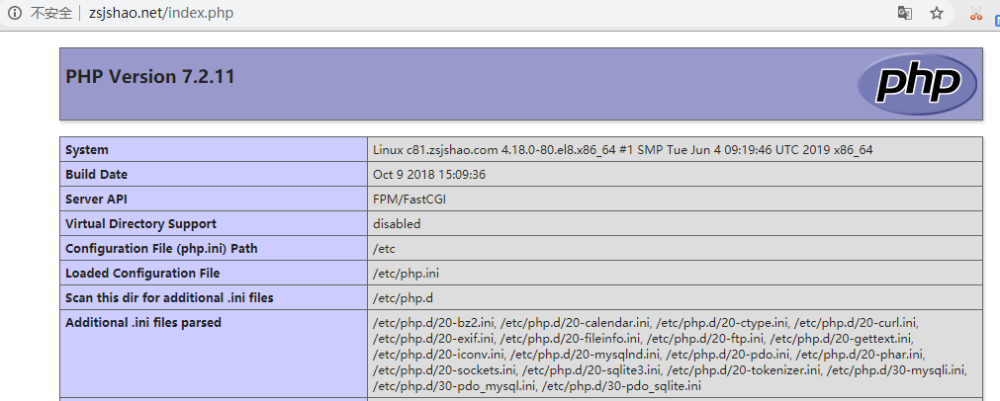

```
常见的错误：
    File not found. #路径不对
    502： php-fpm处理超时、服务停止运行等原因导致的无法连接或请求超时
```

##### 6.3.2.6：php-fpm 的运行状态页面：

访问配置文件里面指定的路径，会返回php-fpm的当前运行状态。

Nginx配置：

```
    location ~ ^/(pm_status|ping)$ {
        #access_log off;
        #allow 127.0.0.1;
        #deny all;
        include fastcgi_params;
        fastcgi_pass 127.0.0.1:9000;
        fastcgi_param PATH_TRANSLATED /data/nginx/php$fastcgi_script_name;
    }
```

重启Nginx并测试：

```
[root@c81 ~]# curl http://www.zsjshao.net/pm_status
pool:                 www
process manager:      dynamic
start time:           28/Feb/2020:02:38:09 +0800
start since:          2
accepted conn:        1
listen queue:         0
max listen queue:     0
listen queue len:     128
idle processes:       99
active processes:     1
total processes:      100
max active processes: 1
max children reached: 0
slow requests:        0
```

#### 6.3.3：FastCGI示例--Nginx与php不在同一个服务器：

nginx会处理静态请求，但是会转发动态请求到后端指定的php-fpm服务器，因此代码也需要放在后端的php-fpm服务器，即静态页面放在Nginx上而动态页面放在后端php-fpm服务器，正常情况下，一般都是采用6.3.2的部署方式。

##### 6.3.3.1：yum安装php-fpm：

php-fpm默认监听在127.0.0.1的9000端口，也就是无法远程连接，因此要做相应的修改。

注意：CentOS 8的php-fpm默认监听在unix套接字上。

```
[root@c82 ~]# yum install php-fpm -y
[root@c82 ~]# vim /etc/php-fpm.d/www.conf
    listen = 192.168.7.104:9000 #指定监听IP
    #listen.allowed_clients = 127.0.0.1 #注释仅允许访问的客户端
[root@c82 ~]# systemctl start php-fpm && systemctl enable php-fpm
```

##### 6.3.3.2：准备php测试页面：

```
[root@c82 ~]# mkdir /data/nginx/php
[root@c82 ~]# cat /data/nginx/php/index.php
<?php
    phpinfo();
?>
```

##### 6.3.3.3：Nginx配置转发：

```
    location ~ \.php$ {
        root /data/nginx/php;
        fastcgi_pass 172.16.0.130:9000;
        fastcgi_index index.php;
        #fastcgi_param SCRIPT_FILENAME /data/nginx/php$fastcgi_script_name;
        fastcgi_param SCRIPT_FILENAME $document_root$fastcgi_script_name;
        include fastcgi_params;
    }

###重载nginx
[root@c81 ~]# nginx -s reload
```

##### 6.3.3.4：访问验证php测试页面：

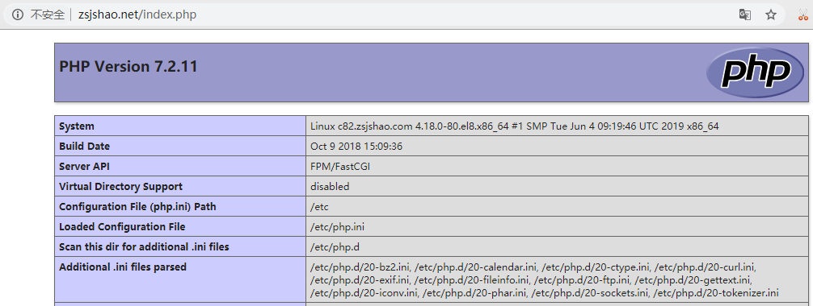

## 七：系统参数优化：

### 7.1：系统参数优化：

```
默认的Linux内核参数考虑的是最通用场景，不符合用于支持高并发访问的Web服务器的定义，根据业务特点来进行调整，当Nginx作为静态web内容服务器、反向代理或者提供压缩服务器的服务器时，内核参数的调整都是不同的，此处针对最通用的、使Nginx支持更多并发请求的TCP网络参数做简单的配置,修改/etc/sysctl.conf来更改内核参数

fs.file-max = 1000000
    #表示单个进程较大可以打开的句柄数

net.ipv4.tcp_tw_reuse = 1
    #参数设置为 1 ，表示允许将TIME_WAIT状态的socket重新用于新的TCP链接，这对于服务器来说意义重大，因为总有大量TIME_WAIT状态的链接存在

net.ipv4.tcp_keepalive_time = 600
    #当keepalive启动时，TCP发送keepalive消息的频度；默认是2小时，将其设置为10分钟，可更快的清理无效链接

net.ipv4.tcp_fin_timeout = 30
    #当服务器主动关闭链接时，socket保持在FIN_WAIT_2状态的较大时间

net.ipv4.tcp_max_tw_buckets = 5000
    #表示操作系统允许TIME_WAIT套接字数量的较大值，如超过此值，TIME_WAIT套接字将立刻被清除并打印警告信息,默认为8000，过多的TIME_WAIT套接字会使Web服务器变慢

net.ipv4.ip_local_port_range = 1024 65000
    #定义UDP和TCP链接的本地端口的取值范围

net.ipv4.tcp_rmem = 10240 87380 12582912
    #定义了TCP接受缓存的最小值、默认值、较大值

net.ipv4.tcp_wmem = 10240 87380 12582912
    #定义TCP发送缓存的最小值、默认值、较大值

net.core.netdev_max_backlog = 8096
    #当网卡接收数据包的速度大于内核处理速度时，会有一个列队保存这些数据包。这个参数表示该列队的较大值

net.core.rmem_default = 6291456
    #表示内核套接字接受缓存区默认大小

net.core.wmem_default = 6291456
    #表示内核套接字发送缓存区默认大小

net.core.rmem_max = 12582912
    #表示内核套接字接受缓存区较大大小

net.core.wmem_max = 12582912
    #表示内核套接字发送缓存区较大大小
    注意：以上的四个参数，需要根据业务逻辑和实际的硬件成本来综合考虑

net.ipv4.tcp_syncookies = 1
    #与性能无关。用于解决TCP的SYN攻击

net.ipv4.tcp_max_syn_backlog = 8192
    #这个参数表示TCP三次握手建立阶段接受SYN请求列队的较大长度，默认1024，将其设置的大一些可使出现Nginx繁忙来不及accept新连接时，Linux不至于丢失客户端发起的链接请求

net.ipv4.tcp_tw_recycle = 1
    #这个参数用于设置启用timewait快速回收

net.core.somaxconn=262114
    #选项默认值是128，这个参数用于调节系统同时发起的TCP连接数，在高并发的请求中，默认的值可能会导致链接超时或者重传，因此需要结合高并发请求数来调节此值。
 
net.ipv4.tcp_max_orphans=262114
    #选项用于设定系统中最多有多少个TCP套接字不被关联到任何一个用户文件句柄上。如果超过这个数字，孤立链接将立即被复位并输出警告信息。这个限制指示为了防止简单的DOS攻击，不用过分依靠这个限制甚至认为的减小这个值，更多的情况是增加这个值
```


